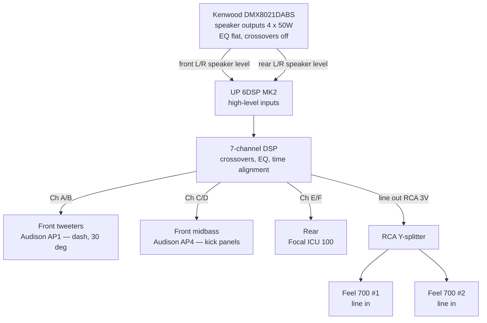
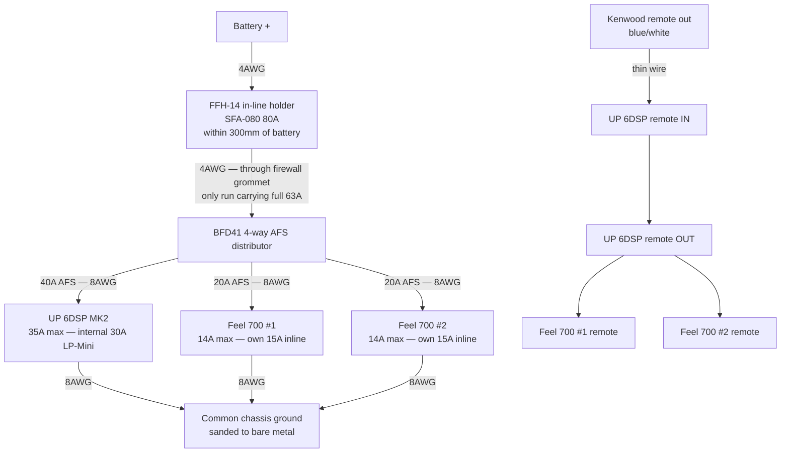

# Audio Upgrade — Plan Review

Technical review of [AUDIO-UPGRADE.md](AUDIO-UPGRADE.md) for the Suzuki Jimny JB43 (2015).
Reviewed 12 September 2026. All specs verified against manufacturer sources — see [Sources](#sources).

---

## Verdict

The **MATCH UP 6DSP is a good choice** for this build. But the plan has one architectural error
that makes the documented signal path physically impossible, one safety contradiction in the
wiring diagram, and a shopping list with enough gaps to stop you mid-install.

Fix those and the plan is sound.

| | |
|---|---|
| **Amp choice** | Good — keep it. Buy the MK2. |
| **Blocking errors** | 4 (signal path, sub power loop, sub daisy-chain, channel allocation) |
| **Safety / damage risks** | 2 (tweeter protection, fuse ratings) |
| **Missing from shopping list** | 8 categories, ~£90–120 |
| **Factual corrections** | 6 |

---

## Vehicle electrical baseline

Both charging components are now confirmed, which changes the power analysis materially.

| Component | Confirmed spec |
|---|---|
| **Alternator** | DENSO **DAN1007** — 14V, **75A**, Poly-V 4-rib, ØA 55mm, B+ M6 stud, PL06 connector (C/IG/L) |
| **Battery** | Yuasa **HSB057** Silver (= YBX5057) — 12V, **50Ah**, **450A CCA**, flooded SMF, 238 × 129 × 223mm |

### Current budget

| Load | Current |
|---|---|
| MATCH UP 6DSP (max) | 35A |
| HK Feel 700 #1 (max) | 14A |
| HK Feel 700 #2 (max) | 14A |
| **Audio worst case** | **63A** |
| Alternator rated output | 75A |

### Engine running — fine

75A is better than the 60A base spec often quoted for the JB43 and gives workable headroom.
Realistic continuous audio draw at normal listening is more like 10–20A; the 63A figure assumes
every device simultaneously at maximum, which music does not do. The 50Ah battery buffers
transients adequately.

**The real constraint is idle, not rated output.** A 75A Denso produces roughly half its rating at
~700rpm. At idle at night with headlights, blower and wipers running, there is not much left over.
The UP 6DSP shuts down below 10.5V, so the failure mode to watch for is the amp muting on bass
peaks while stationary.

### Engine off — this is your actual limitation

The HSB057 is a **flooded starter battery**, not AGM or leisure. Two consequences:

1. **Capacity.** 50Ah, of which only ~25Ah is usable before you risk a no-start. At a realistic
   15A audio draw that is well under two hours — and voltage will sag enough to bother the amp
   long before the battery is actually flat.
2. **Cycle life.** Starter batteries degrade quickly under repeated partial discharge. Using this
   one for engine-off listening will shorten its life noticeably, and a 5-year guarantee will not
   cover that pattern of use.

**If engine-off listening matters to you** (camping, green-laning, waiting around), the fix is a
battery change, not a wiring change. An AGM in the 057 footprint would tolerate the cycling far
better — but 057 is not a common AGM size, so check availability before planning around it. The
alternative is a dedicated auxiliary battery, which is a bigger job in a JB43's cramped engine bay.

**If you only listen with the engine running**, the HSB057 is perfectly adequate and nothing needs
to change.

### Actions

- Check battery health first. A 450A CCA flooded battery that is already a few years old will sag
  under this load, and you will blame the amp. Measure rested voltage (12.6V+ healthy) and get a
  load test before you install anything.
- Measure voltage **at the amp position**, at idle, with lights, blower and wipers on. If you see
  below ~12V, act; if not, don't.
- A **"Big 3" upgrade** — alternator B+ to battery +, alternator case to chassis, battery − to
  chassis — is now a *nice to have* rather than a requirement. It is worth doing while you already
  have 4AWG, lugs and a crimper out. Note the alternator B+ is an **M6 stud**, so size the ring
  terminal accordingly.
- With only 50Ah and 450A CCA behind the system, the ground path matters more than it would on a
  bigger car. If you do only one part of the Big 3, do the grounds.

---

## Amp assessment: MATCH UP 6DSP

### Why it fits

| Requirement | UP 6DSP |
|---|---|
| Must hide behind the glovebox | 130 × 130 × 46 mm — genuinely tiny |
| Front active (mid + tweeter per side) | Channels A–D, 4 × 65W @ 4Ω |
| Rear fill | Channels E–F, 2 × 75W @ 4Ω (125W @ 2Ω) |
| Sub feed | 1 × RCA line out, 3V RMS |
| Time alignment for kick panels + dash tweeters | 7-channel 64-bit DSP |

Channel count maps **exactly** onto this build: 4 active front + 2 rear + 1 sub line-out = all
7 DSP channels, nothing wasted, nothing short. For a front stage split between footwell kick
panels and a 30° dash tweeter, the time alignment is the entire justification for a DSP amp —
this is the right tool.

### Buy the MK2

The Crown Customs listing at **£549.99 is confirmed as the MK2** — and the MK2 is the *newer*
model, not an older variant. It adds USB-C and the Extension Card 2.0 slot; power output is
effectively unchanged. So the cheapest price is also the current model.

**This closes the open question in the plan — buy from Crown Customs.**

| Retailer | Version | Price |
|---|---|---|
| **Crown Customs** | **MK2 (current)** | **£549.99** |
| Dav-Tec | original | £559.00 |
| CEN | original | £559.99 |

Confirmed: Car Audio Direct does not stock either version. The UP 8DSP (£699.99) is out of stock
and the M 5.4DSP (£519.99, in stock) has only 5 channels and the same high-level-only input
design — no advantage.

### Alternatives considered

No better option found. The MATCH M 5.4DSP is also high-level-input-only (4 × high level,
1 × optical, sensitivity 5–11V), so switching within the MATCH range does not solve the RCA
problem below — that is a family-wide design characteristic of the OEM-upgrade line, not a
fault of this model.

---

## Blocking errors

### 1. The UP 6DSP has no RCA inputs — the plan's signal path does not exist

The plan's electrical topology step 4 reads *"RCA from Kenwood DMX8021DABS preouts → Match UP
6DSP inputs"*. There are no such inputs.

**Official input list:** 6 × high-level speaker inputs (ADEP.3), 1 × optical SPDIF,
1 × extension card slot, 1 × remote in. That is all. Same on the MK2.

You also cannot bodge it with RCA-to-bare-wire adapters: the high-level inputs present **9–33Ω**,
which would heavily load a 4V preout designed for a >1kΩ input and distort badly.

**Fix — use the Kenwood's speaker outputs into the amp's high-level inputs.** This is exactly what
the UP range is designed for and it is sonically fine. Practical notes:

- Feed 4 channels (front L/R, rear L/R) into 4 of the 6 high-level inputs. Two spare.
- Set the Kenwood **flat**: EQ off, loudness off, crossovers full-range, fader/balance centred.
  Every filter you leave on is a filter the DSP has to fight.
- Pick a fixed reference volume (e.g. 3/4 of max) and set amp gains there.
- Your three 4V preouts are simply unused. That is the cost of this amp; it's an acceptable one.

The **MEC ANALOG IN** card is not a workaround — Audiotec Fischer lists it as compatible with the
UP 7BMW and UP 7DSP only, and the MK2's Extension Card 2.0 slot is a different format again.

### 2. ~~The power loop-through in the wiring diagram is unsafe and impossible~~ — WITHDRAWN

**This finding was wrong.** Photographic evidence of the Feel 700's rear panel shows a labelled
**POWER OUT** multi-pin block carrying GND/GND/+12V/+12V and REM, alongside separate SPEAKER IN
and SPEAKER OUT, with a 15A fuse on each unit's own panel. HK does provide a daisy-chain and the
original plan was right. I reached the opposite conclusion from a retailer page summary rather
than the manual.

Harman's spec sheet ([reference/feel-700-spec-sheet-harman.pdf](reference/feel-700-spec-sheet-harman.pdf))
confirms 15A fuse, 14A max draw and two 300mm harnesses per unit, but does not cover feed fusing
or the harness pin-out, and documents chaining to **a second** unit only. The residual question —
whether the tap is upstream or downstream of sub 1's fuse — is answered in the OM that ships in
the box. See the plan.

The superseded reasoning follows.

The mermaid diagram shows `SUB1PWR --POWER OUT loop-through--> SUB2PWR`, but the plan's own
table above it correctly gives each sub its own branch fuse. These contradict each other, and
the diagram is the wrong one.

**Each Feel 700 draws up to 14A and ships with a 15A fuse.** Two units on one 15A-fused path is
28A through a 15A fuse. It cannot work and should not be attempted.

**Fix: each sub gets its own fused branch from the distribution block.** Signal can be shared;
power cannot.

### 3. ~~The sub-to-sub signal daisy-chain is unconfirmed~~ — WITHDRAWN

**Also wrong.** Signal and power both chain: RCA and power go into sub 1, and sub 1 feeds sub 2
through the labelled link. No Y-splitter and no second RCA run needed. The superseded reasoning
follows.

The plan carries an open question with a "try RCA, fall back to SPEAKER OUT + POWER OUT" plan.
Car Audio Direct's own product page states there is **no dedicated output for a second
subwoofer**. Do not build a plan on an unverified connector.

**Fix: Y-split the amp's line output into both subs.**

- The UP 6DSP line out is a single RCA pair carrying DSP channel 7.
- Each Feel 700 has its own RCA line-level input, its own level control and its own
  variable crossover — so they stay independently adjustable, which is what the daisy-chain
  was supposed to give you anyway.
- Splitting one 3V output into two high-impedance inputs is electrically trivial.

This deletes the entire open question from the plan. Cheaper too.

### 4. Channel allocation in the diagram is wrong

The diagram routes `Ch A-D` to **both** front and rear. Correct allocation:

| Channels | Rating | Feeds |
|---|---|---|
| A, B | 65W @ 4Ω | Front tweeters — Audison AP1, L + R |
| C, D | 65W @ 4Ω | Front midbass — Audison AP4, L + R |
| E, F | 75W @ 4Ω | Rear — Focal ICU 100, L + R |
| DSP ch 7 → line out | 3V RMS | Both Feel 700 subs via Y-splitter |

---

## Safety and damage risks

### 5. Confirm the AP1 tweeters are actually protected

The plan records the tweeters as *"connected to the front speaker wires"*, with no mention of a
crossover, and then: *"Working, but not yet tested at volume."*

**The Audison AP1 ships with an APCX TW passive crossover** — high-pass at 3.5kHz, 12dB/octave,
with a 0dB/+2dB attenuation switch. If that is not in circuit, the tweeters are currently running
full-range off the Kenwood's 50W channels. That is the exact state in which tweeters die, and
"not yet tested at volume" means you have not yet found out.

**Check this before you turn it up.** Then decide:

- **Going active** (recommended, and what the 6 channels are for): remove the APCX, run a
  separate speaker cable pair to each tweeter, and let the DSP do the crossover. Requires new
  cable runs to the dash — see missing items.
- **Staying passive for now**: keep the APCX in circuit, feed mid+tweeter from one channel per
  side, and leave channels C/D spare until you go active later.

### 6. Fuse ratings are wrong in the plan

The plan states each sub needs a **"20A branch fuse (HK spec, mandatory)"**. That is not the HK
spec. Verified: the Feel 700 draws **14A max** and **ships with a 15A fuse**.

A 20A AFS branch fuse at the distribution block is still *acceptable* — but as cable protection
for the branch run, with each sub's own supplied 15A inline fuse doing the real work. Keep the
supplied 15A fuses in circuit.

**Sourcing note:** the Connection by Audison AFS range at Car Audio Direct starts at 40A —
they stock 40/60/80/100/150/300A only. There is no 15A or 20A Connection AFS available there.
Use **Phonocar 4/462.2 20A AFS** (£4.99) in the BFD41 instead; AFS is a standard form factor and
mixes fine. The BFD41 itself accepts AFS from 15A to 300A.

---

## Corrected diagrams

### Signal

Note: the Kenwood's three 4V preouts are unused in this topology.

### Power, ground and remote

Three things changed from the original: **no power loop-through between subs**, a
**remote turn-on chain** that was absent entirely, and **8AWG branches**.

**On gauge:** 4AWG is only needed for battery → distributor, the single run carrying the full
63A. The branches are 35A (amp) and 14A (each sub) over short runs — 8AWG gives ~0.07V drop on
the amp branch and ~0.09V on a sub branch, which is nothing. 8AWG is chosen as much for fit as
for current: the BFD41's outputs are sized for 2AWG/4AWG, so 8AWG with a ferrule fills the port
properly where 10 or 12AWG would flop around. Grounds match their feed gauge.

Check what gauge power pigtail the amp and the Feel 700s ship with, and match rather than
step up and back down.

Ground all three devices to **one** chassis point where practical. Grounding the under-seat subs
to a different point from the behind-dash amp is the classic recipe for alternator whine.

---

## Missing from the shopping list

| Missing | Why it matters | Est. |
|---|---|---|
| **Speaker cable** | Nothing at all in the list. Front and rear factory runs can be cut at the head unit and joined to the amp — it sits right there behind the glovebox, so those are easy. But **active front needs two new runs to the dash tweeters**: the existing pair per side carries mid and tweeter together. ~10m of 16AWG OFC. | £18 |
| **Remote turn-on wire** | Kenwood blue/white → amp REM in; amp REM out → both subs. ~5m of 0.75mm². Not mentioned anywhere in the plan. | £5 |
| **Sub branch fuses** | The plan buys one 40A fuse and zero for the subs. 2 × Phonocar 4/462.2 20A AFS. | £9.98 |
| **Branch wire** | The 3m estimate covers battery→block only. The three branch runs (block→amp, block→sub 1, block→sub 2) are uncosted. 8AWG, ~4m total. | £24 |
| **Ground wire quantity** | 1.5m across three devices is short. ~3m of 8AWG, matching the branch feeds. | £18 |
| **Firewall grommet / gland** | Passing 4AWG through the bulkhead is entirely unaddressed. Plus split loom to protect the run. | £16 |
| **Heat shrink, butt splices, cable ties** | Only PVC tape is listed. Crimping tool and tape are already owned. | £16 |
| **Ferrules** | BFD41 outputs are 1 × 2AWG + 3 × 4AWG. Running 8AWG branches means ferrules or reducers to fill the ports. | £6 |
| **Tuning kit** | "Tune the system" is one line in the plan. DSP PC-Tool 5 is **Windows only** (USB cable included with the amp). For a kick-panel front stage, a measurement mic + REW is close to essential. The DIRECTOR remote lets you trim sub level from the driver's seat. | see below |
| **Deadening consumables** | Roller and panel wipe/degreaser for the material you already own. | £12 |

---

## Factual corrections to the plan

| Plan says | Actually |
|---|---|
| "RCA from Kenwood preouts → UP 6DSP inputs" | No RCA inputs exist. High-level only. |
| Feel 700 needs "20A fuse (HK spec, mandatory)" | 14A max draw, 15A fuse supplied. 20A is acceptable as branch protection, not as HK spec. |
| Combined worst case "~75A" | 63A (35 + 14 + 14). The 80A main fuse remains correct. |
| 4AWG throughout | Generous — 8AWG carries 63A comfortably. Keep 4AWG for low voltage drop if you like, but it is a choice, not a requirement. |
| Crown Customs listing "confirm it's not the MK2" | It **is** the MK2, and the MK2 is the newer model. Buy it. |
| Cheap alternative: 4/483 block + 4/497 **2-way** holder | You need **three** branches. Use the 4/499 **4-way** AFS holder (£11.99). |
| 1m RCA, amp → sub | Behind-glovebox to under-seat is likely ~2.5m. Measure before ordering. |
| Diagram: "Ch A-D" to front **and** rear | A–D front, E–F rear. See allocation table above. |

Arithmetic in the original running total checks out — £1,009.11 is correct for the items listed.
The items are what's wrong, not the sums.

---

## Revised budget

### Phase 1 — amp, wiring, deadening (buy now)

| Item | Source | Est. |
|---|---|---|
| MATCH UP 6DSP MK2 | Crown Customs | £549.99 |
| 4AWG power wire, 3m — battery → distributor only | caraudiodirect, £10.99/m | £32.97 |
| Stinger SSK8 8AWG kit — branches, remote wire, part of the grounds | caraudiodirect | £24.99 |
| Additional ~2m 8AWG ground — the kit only supplies 3ft | — | ~£12.00 |
| Connection FFH-14 in-line holder | caraudiodirect | £17.99 |
| Connection SFA-080 80A AFS (main) | caraudiodirect | £7.99 |
| Connection BFD41 4-way distributor | caraudiodirect | £69.99 |
| Connection SFA-040 40A AFS (amp branch) | caraudiodirect | £7.99 |
| Phonocar 4/462.2 20A AFS × 2 (sub branches) | caraudiodirect | £9.98 |
| Connection FRT4 ring terminals | caraudiodirect | £7.99 |
| RCA Y-splitter (amp line out → 2 subs) | — | £8 |
| RCA 2.5m × 2 (amp → each sub) — **measure first** | — | £30 |
| Speaker cable, 16AWG OFC, ~10m | — | £18 |
| Remote wire, 0.75mm², ~5m | — | £5 |
| Firewall grommet + split loom | — | £16 |
| Heat shrink + cable ties | — | £13 |
| **Phase 1 total** | | **≈ £881** |

Savings available: swap the BFD41 for a Phonocar 4/483 block (£14.99) + 4/499 4-way AFS holder
(£11.99) and phase 1 drops to **≈ £838**. Dropping the HU→amp RCA the original plan listed saves
a further £9.99 — it is no longer needed.

### Phase 2 — after tuning, only if wanted

| Item | Est. |
|---|---|
| Harman Kardon Feel 700 #2 | £254.99 |
| Extra branch wiring already covered in phase 1 | — |

### Optional — tuning quality

| Item | Est. |
|---|---|
| Measurement mic (miniDSP UMIK-1) + REW (free) | ~£90 |
| MATCH DIRECTOR remote (sub level from driver's seat) | ~£90 |

**All-in ceiling: ~£1,316.** Phase 1 alone: ~£881.

AUDIO-UPGRADE.md carries the linked, itemised version of this list — treat it as authoritative.

---

## Revised sequencing

The plan's own Plan/Sequence section says deaden at step 2 — but the shopping list buys the
second sub up front. Flip it.

1. **Deaden first.** You are pulling panels to run cable anyway, the material is already bought,
   and it is the cheapest dB in the car. Doing it after the amp means doing the trim twice.
2. **Verify the tweeter crossover situation** (issue 5) before any high-volume testing.
3. **Install the amp** with high-level input from the Kenwood, one sub, active front if you run
   the new tweeter cable runs.
4. **Tune.** Crossovers, time alignment, EQ. This is where the money you spent on a DSP amp
   actually gets spent.
5. **Then decide on sub two.** In a cabin as small as a JB43, one Feel 700 at 125W RMS may well
   be enough. You will know after step 4, and not before. This is also the step where 75A of
   alternator either proves fine or doesn't.

This matches the intent of the original plan's steps 1–4 — the shopping list just got ahead of it.

---

## Verify before ordering

- [ ] **Tweeter crossover** — are the APCX TW units in circuit on the installed AP1s?
- [ ] **Under-seat space** — each Feel 700 is 260 × 195 × 58 mm. Measure under *both* JB43 front
      seats before committing to two. Check seat travel, belt buckle brackets, and rear passenger
      foot room.
- [ ] **Glovebox space + airflow** — 130 × 130 × 46 mm fits, but it dissipates heat. Mount to
      metal where possible, not against trim foam.
- [ ] **Cable run lengths** — every wire and RCA length in this document is an estimate. Run a
      piece of string along the actual route before cutting.
- [ ] **Battery health** — rested voltage and a load test on the HSB057 before install.
- [ ] **Voltage at idle** — measure at the amp position with lights, blower and wipers on.
- [ ] **Windows machine available** for DSP PC-Tool 5.

---

## Standing decisions confirmed

- 10cm mids throughout — the UP 6DSP's 65W A–D channels suit the AP4's 40W RMS and the
  ICU 100's 40W RMS fine. Set gains conservatively; there is more amp than speaker here,
  which is the right way round but needs discipline at gain-setting time.
- Kick panel front stage + 30° dash tweeters — asymmetric by nature, which is precisely
  what the DSP's time alignment exists to fix. Good pairing.

---

## Sources

- [Audiotec Fischer — MATCH UP 6DSP](https://www.audiotec-fischer.de/en/match/amplifiers/up-6dsp)
- [Audiotec Fischer — MATCH UP 6DSP MK2](https://www.audiotec-fischer.de/en/match/amplifiers/up-6dsp-mk2)
- [Audiotec Fischer — MATCH MEC ANALOG IN](https://www.audiotec-fischer.de/en/match/accessories/mec-analog-in)
- [Crown Customs — UP 6DSP MK2 listing](https://www.crowncustomscaraudio.co.uk/products/match-up-6dsp-6-channel-amplifier-with-integrated-7-channel-dsp)
- [Car Audio Direct — Harman Kardon Feel 700](https://caraudiodirect.co.uk/products/harmon-kardon-feel-700-active-underseat-car-subwoofer)
- [Car Audio Direct — Connection BFD41](https://caraudiodirect.co.uk/products/connection-by-audison-bfd41-4-way-fuse-distributor-block)
- [Audison — Prima AP 1 tweeter](https://audison.com/product/ap-1/)
- [Focal — ICU 100](https://www.focal.com/products/icu-100)
- [Kenwood Europe — DMX8021DABS specifications](https://www.kenwood.eu/car/navigation_multimedia/multimedia/DMX8021DABS/?view=details)
- DENSO DAN1007 alternator — 14V, 75A, Poly-V 4, ØA 55mm, B+ M6 — [AUTODOC listing](https://www.autodoc.co.uk/denso/823807) (datasheet confirmed)
- Yuasa HSB057 / YBX5057 Silver — 12V, 50Ah, 450A — [Tayna](https://www.tayna.co.uk/car-batteries/yuasa/ybx5057/)
