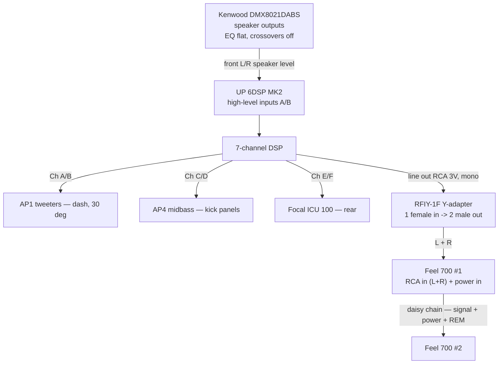
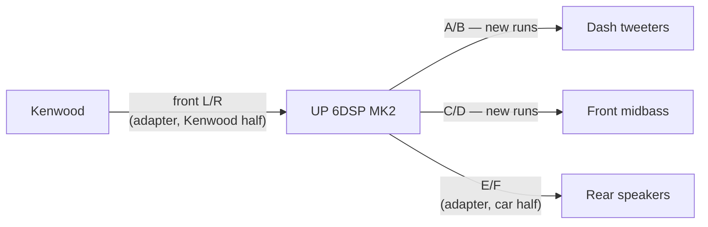
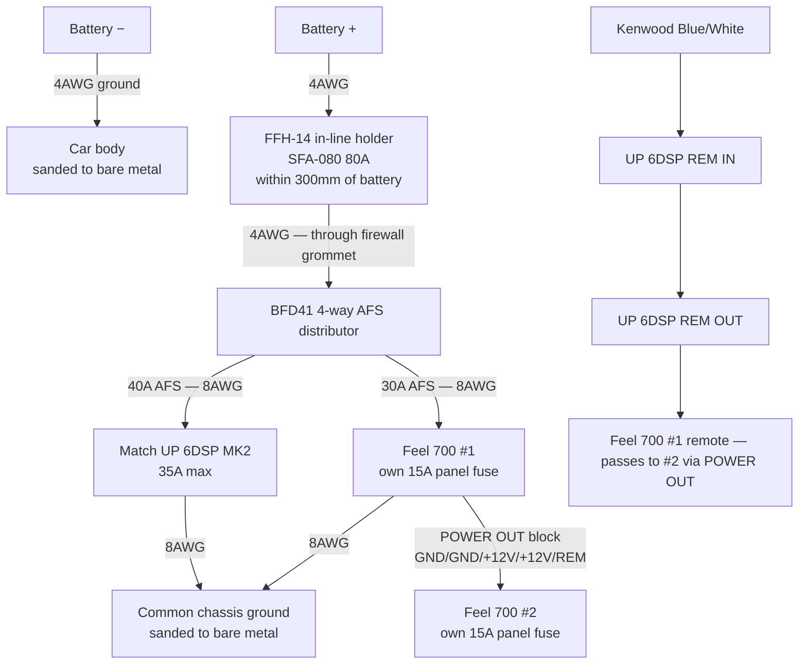

# Suzuki Jimny JB43 (2015) — Audio Upgrade

One build: Kenwood → Match UP 6DSP MK2 → active front, rears, and two underseat subs.

## Kit

| Component | Spec | Status |
|---|---|---|
| **Kenwood DMX8021DABS** | 4 x 50W, 3 x 4V preouts (front, rear, sub). The amp takes **speaker level**, not the preouts | Installed |
| **Audison Prima AP4** | 100mm midbass, 40W RMS, 4Ω — footwell kick panels, not the doors | Installed |
| **Audison Prima AP1** | Tweeters, 4Ω — dash, 30° | Installed |
| **Focal ICU 100** | Rears, 40W RMS, 4Ω | Installed |
| **Harman Kardon Feel 700** #1 | Active underseat sub, 125W RMS / 250W max, 7" | Installed, own fused feed |
| **Harman Kardon Feel 700** #2 | Daisy-chained from #1 | Bought, to fit |
| **Match UP 6DSP MK2** | 6-channel amp + 7-channel DSP, 130 × 130 × 46mm | **Still to buy** |
| Sound deadening | Material owned | To fit |

**AP4 notes:** fitted without spacer rings (plywood rings weren't needed and wouldn't have fitted);
arrived with no mounting screws. **AP1 notes:** wires routed out through the cup base via a slot cut
in the mounting pad. The AP1's **APCX TW passive high-pass** (3.5kHz, 12dB/oct) is confirmed in
circuit — it comes out when the amp goes in and the DSP takes over the crossover.

**Feel 700**, confirmed against Harman's spec sheet
([reference/feel-700-spec-sheet-harman.pdf](reference/feel-700-spec-sheet-harman.pdf)): 15A fuse,
**14A max draw**, <700mA quiescent, input sensitivity **0.10–5.0V low-level** / 0.5–25V high-level,
260 × 195 × 58mm, and **2x 300mm wiring harnesses** in the box. The amp's 3V line out sits inside
the low-level range.

## Order of work

Everything goes in in one session — no interim wiring, so the subs never run off the Kenwood.

1. **Strip** — seats out, door cards, kick panels, glovebox, trim for the cable runs
2. **Deaden** while the panels are off
3. **Power** — battery → main fuse → firewall → distribution block → amp and sub branches, grounds last
4. **Signal** — CT20UV01 cut and wired, new runs to tweeters and midbass, sub 2 daisy-chained
5. **Mount** — amp, distribution block, subs, bass remote
6. **Tune** — input gain first, then routing and crossovers, before anything plays loud
7. Then decide on any speaker upgrades

## Standing decisions

- Staying with **10cm mids** — any future mid/rear upgrade keeps the 10cm size, not 6.5"
- **100% OFC** everywhere — power, ground, speaker and remote. Never CCA
- Avoid scotchlocks and Wago lever nuts — both fail under vehicle vibration

---

## Signal Path

**The UP 6DSP has no RCA inputs** — 6 x high-level, 1 x optical SPDIF, 1 x Extension Card 2.0 slot.
The Kenwood's 4V preouts can't be used. Feed the amp from the Kenwood's **speaker outputs** into
the high-level inputs; this is what the UP range is designed for.

Per the [MK2 manual](reference/up-6dsp-mk2-manual.pdf), **two of the four A–D high-level inputs is
sufficient** — front L/R only. The DSP derives all seven channels from that pair, so no rear
speaker-level wires are needed into the amp.

Set the Kenwood flat before tuning: EQ off, loudness off, crossovers full-range, fader/balance centred.

### Channel allocation

| Channels | Rating | Feeds |
|---|---|---|
| A, B | 65W @ 4Ω | Front tweeters — AP1, L + R |
| C, D | 65W @ 4Ω | Front midbass — AP4, L + R |
| E, F | 75W @ 4Ω | Rear — Focal ICU 100, L + R |
| DSP ch 7 → line out | 3V RMS | Feel 700 #1, which chains on to #2 |

All 7 DSP channels used. Amp power exceeds speaker ratings — set gains conservatively.

**Connections:** the amp's high-level inputs and speaker outputs are supplied as plug-in harnesses
with bare wire ends, so nothing needs terminating at the amp.

### CT20UV01 — a break point, not a tap

**In plain terms:** the adapter is two plugs joined by a bundle of wires. One plugs into the car,
one into the Kenwood. **Snip only the 8 speaker wires** in the middle of that bundle. That leaves
two loose ends:

- the end that talks to the **Kenwood** → goes to the amp's **inputs**
- the end that talks to the **car's speakers** → gets fed from the amp's **outputs**

Leave every other wire in the bundle alone. Signal now goes Kenwood → amp → speakers, instead of
Kenwood → speakers.

The detail: the CT20UV01 sits **inline** between the vehicle's ISO harness and the Kenwood's ISO
plug. Nothing on the car's loom or the Kenwood's harness is cut — the sacrificial wires are the
adapter's. There are two adapters in the pack: the **brown/red one is the speakers** (ISO block B)
and is the one you cut; the **black one is power** (ISO block A) and passes through untouched.

- **Kenwood side** — front L/R feed the amp's **Highlevel Input A/B**. The Kenwood drives nothing.
- **Car side** — the factory **rear** wiring is re-fed from the amp's **speaker outputs E/F**. The
  front pair on this half is left unused, since the midbass gets new cable.

| Channel | Kenwood wire | Goes to |
|---|---|---|
| Front L | White (+) / White-Black (−) | Highlevel Input A — System Connector pins 12 / 2 |
| Front R | Grey (+) / Grey-Black (−) | Highlevel Input B — System Connector pins 13 / 3 |
| Rear L/R | Green, Purple | Not used — tape off |

**Only the rears reuse the factory loom.** The tweeters have no factory path to the dash, and the
front doors are coming apart for deadening anyway — so run new 16AWG to both. Factory speaker wire
is ~0.5–0.75mm², sized for a head unit, not 65W channels.

**Never join a speaker-output − to chassis ground** — the amp's inputs and outputs are both balanced.

---

## Subwoofer Wiring

Same whether or not the amp is in — only the signal source changes.

- **Power:** sub 1's own fused feed. Sub 2 connects to sub 1's **POWER OUT**.
- **The join under the seats:** plug one supplied pigtail into sub 1's POWER OUT and one into
  sub 2's power in, then join the bare ends colour to colour — **red–red, black–black, blue–blue**.
  Leave the speaker-level wires (white, grey) unconnected and taped.
- **Pigtail red/black is confirmed 12AWG.** Use the JTAREA 12–10AWG butts, one join at each end of
  the extension (4 total). Crimp, pull-test, then heat shrink.
- **If the pigtails don't reach:** the two joined give ~600mm. Measure the route over the tunnel.
- **Signal:** amp **Line Out** (mono, one RCA) → RFIY-1F Y-adapter → sub 1 L+R. Sub 1's RCA out →
  sub 2 RCA in.

**The RCA run, in plain terms.** The Y-adapter never touches the amp — it lives at the **sub** end:

1. **At the amp:** plug **one** male of the RCA cable into the Line Out socket.
2. **Run the cable** to under the seat.
3. **At the sub:** that cable's other male goes into the Y-adapter's **single female**.
4. **The Y's two males** go into sub 1's **L and R** inputs.

The cable has two leads (red and white) but Line Out is **mono, one socket** — so use **one lead
only, the same colour at both ends**, and tape the spare back. The Y exists because the sub expects
a signal on both L and R; without it one input sits dead and the sub plays quieter.
- **Remote:** amp **REM OUT** → sub 1. Sub 2 picks up REM through the POWER OUT block.

---

## Electrical Plan

### Vehicle baseline

| Component | Spec |
|---|---|
| Alternator | DENSO DAN1007 — 14V, 75A, B+ M6 stud |
| Battery | Yuasa HSB057 Silver — 12V, 50Ah, 450A CCA, flooded |

Workable headroom with the engine running. Extended **engine-off** listening is the limitation —
a flooded starter battery gives ~25Ah usable and degrades under repeated partial discharge.

### Current budget

| Device | Max draw | Fusing |
|---|---|---|
| Match UP 6DSP | 35A (internal 30A LP-Mini) | 40A AFS branch |
| HK Feel 700 x2, daisy-chained | 28A combined | **30A** AFS branch + each unit's own 15A fuse |
| **Worst case** | **63A** | 80A main |

### Topology

1. **4AWG** from battery positive → 80A main fuse **within 300mm of the battery** (manufacturer
   maximum) → through firewall grommet → distribution block. The only positive run carrying 63A;
   the 4AWG battery ground carries it back.
2. Two **8AWG** fused branches from the block: amp (40A) and sub 1 (30A).
   Audiotec Fischer specify **6mm² minimum for runs under 1m, 6–10mm² for longer**. 8AWG is
   8.37mm², inside spec. **Ground must match the positive's cross-section** and land on bare,
   non-insulated chassis — their words, and insufficient ground contact is called out as a direct
   cause of noise and malfunction.
3. **Sub 2 is fed from sub 1's POWER OUT block** — a labelled multi-pin connector carrying
   GND/GND/+12V/+12V and REM, with a second 300mm harness supplied for it. One feed serves both.
   Each unit carries its own 15A panel fuse, so the tap is upstream. Hence 2 x 14A = 30A branch,
   with the link itself carrying only sub 2's 14A.
4. **8AWG** ground to a single sanded, bare-metal chassis point — one point for everything, or you
   get alternator whine. **4AWG** ground from battery negative to the body, matching the 4AWG feed,
   ring terminal at each end, body end on sanded bare metal.
5. **Remote:** use an explicit remote wire, not auto-turn-on-from-high-level-signal — run the
   Kenwood's **Blue/White** power-control lead (a loose lead on its own harness, so no splicing and
   no CT20UV01 involvement) to the amp's **REM IN**. The amp's **REM OUT** then switches the subs.

**Distribution block placement:** it's heavy brass, so screw it down rather than relying on
adhesive, and keep it on the cabin side of the firewall where the fuses stay reachable.

---

## Shopping List

Retailer priority: **caraudiodirect.co.uk first**, others only where they don't stock an item.
**All wire and RCA lengths are estimates — measure the actual routes before cutting.**
Prices marked **~** are estimates, not checked against a live listing.

### Amp

**Buy the MK2 from Crown Customs at £549.99** — confirmed as the MK2, the current model (USB-C,
Extension Card 2.0), so it's both the cheapest and the newest. Car Audio Direct stocks neither.

| Retailer | Version | Price |
|---|---|---|
| **[Crown Customs](https://www.crowncustomscaraudio.co.uk/products/match-up-6dsp-6-channel-amplifier-with-integrated-7-channel-dsp)** | **MK2 (current)** | **£549.99** |
| [Dav-Tec](https://dav-tec.co.uk/product/match-up-6dsp-6-channel-amplifier-dsp/) | original | £559.00 |
| [CEN](https://www.cen.uk/products/match-up-6dsp-universal-amp-upgrade-6-channel-amplifier-64-bit-7-channel-dsp) | original | £559.99 |

*Cheaper alternative: [Match UP 4DSP](https://www.cen.uk/products/match-up-4dsp-universal-amp-upgrade-4-channel-amplifier-64-bit-4-channel-dsp)
at £449.99 (CEN, in stock) saves £100. 46 × 130 × 110mm, 2 x 60W + 2 x 85W @ 4Ω, per-channel
parametric EQ, mono line out and remote out. Gives up **active front** — the AP1/AP4 stay on the
APCX passive crossover. The channel allocation above assumes the 6DSP.*

### Subs and sub wiring

| Item | Qty | Est. |
|---|---|---|
| [Harman Kardon Feel 700](https://caraudiodirect.co.uk/products/harmon-kardon-feel-700-active-underseat-car-subwoofer) #2 — **bought** | 1 | £254.99 |
| [Connection FT2](https://caraudiodirect.co.uk/products/connection-ft2-100-2-1m-rca-cable) RCA, sub 1 → sub 2 — **bought** | 1 | ~£15.00 |
| [JTAREA uninsulated butt connector kit](https://www.amazon.co.uk/dp/B0DPC99SR1) — 100pcs, 22–16 to 4AWG straight butts + heat shrink — **bought** | 1 | — |
| [Autobar 27 Amp Cable 2.2m, Red](https://www.eurocarparts.com/p/autobar-27-amp-cable-2-2m-app-red-bar570) — Euro Car Parts Thirsk, ~3mm² (≈12AWG), extension for red (+12V) | 1 | £2.89 |
| [Autobar 27 Amp Cable 2.2m, Black](https://www.eurocarparts.com/p/autobar-27-amp-cable-2-2m-app-black-bar571) — Euro Car Parts Thirsk, ~3mm² (≈12AWG), extension for black (GND) | 1 | £5.29 |
| ~1mm² hook-up wire for blue (REM) extension — **already owned** | ~1m | — |

### Bass remote

| Item | Qty | Est. |
|---|---|---|
| [Audiotec Fischer URC.1](https://www.cen.uk/products/audiotec-fischer-urc-1-remote-volume-control-sub-level-for-helix-and-match-dsp) — CEN, in stock. Sub level knob, plugs straight into the amp's **SCP** (no M141313 adaptor). 30 × 23 × 43mm, 5m cable, housing removable to sink the knob through trim. Assign it in PC-Tool's DCM | 1 | £35.99 |

*Alternative: [Conductor Pro](https://www.cen.uk/products/audiotec-fischer-conductor-pro-one-touch-remote-control-for-helix-match-dsp-scp)
£129.99 — flush round knob, Ø46mm with a 40mm cut-out, RGB ring, 4 volumes (master, sub, rear
attenuation, AUX) + setup switching. The URC.3 is the wrong shape here and needs the M141313 adaptor.*

### Wiring & electrical

| Item | Qty | Est. |
|---|---|---|
| [Powerbass XWS-4P](https://caraudiodirect.co.uk/products/powerbass-xws-4p-4-gauge-power-wire-100-ofc-wire-per-meter) 4AWG power wire — battery → distributor | 3m @ £10.99 | £32.97 |
| [Powerbass XWS-4G](https://caraudiodirect.co.uk/products/powerbass-xws-4g-4-gauge-power-wire-100-ofc-wire-per-meter) 4AWG ground wire, 100% OFC — battery negative → body | 1m @ £10.99 | £10.99 |
| [Powerbass XWS-8P](https://www.caraudiosecurity.com/products/xws-8p-8-awg-power-wire-per-metre-100-ofc-wire) 8AWG power wire, 100% OFC — amp + sub branches | 4m @ £4.49 | £17.96 |
| [Powerbass XWS-8G](https://www.caraudiosecurity.com/products/xws-8g-8-awg-ground-wire-per-metre-100-ofc-wire) 8AWG ground wire, 100% OFC | 3m @ £4.49 | £13.47 |
| [Connection FFH-14](https://caraudiodirect.co.uk/products/connection-by-audison-ffh-14-mini-in-line-fuse-holder) mini in-line fuse holder | 1 | £17.99 |
| [Connection SFA-080](https://caraudiodirect.co.uk/products/connection-by-audison-sfa-080-80a-afs-fuses) 80A AFS (main) | 1 | £7.99 |
| [Connection BFD41](https://caraudiodirect.co.uk/products/connection-by-audison-bfd41-4-way-fuse-distributor-block) 4-way AFS distributor — **bought** | 1 | £69.99 |
| [Connection SFA-040](https://caraudiodirect.co.uk/products/connection-by-audison-sfa-040-40a-afs-fuses) 40A AFS (amp branch) | 1 | £7.99 |
| [Phonocar 4/4632](https://caraudiodirect.co.uk/products/phonocar-4-4632-afs-fuses-30a) 30A AFS (sub branch) | 1 | £4.99 |
| [Sealey LT258](https://www.amazon.co.uk/Sealey-LT258-Copper-Terminal-25mm%C2%B2/dp/B01CUMQNN8) tinned copper lugs, 25mm² × 8mm — battery positive plus both ends of the battery ground. **Check the battery clamp and body bolts are M8**. Needs a hex or hammer crimper and adhesive-lined heat shrink | pack of 10 | ~ price not read |
| [Connection FRT8](https://caraudiodirect.co.uk/products/connection-frt8-8-gauge-ring-terminals) 8AWG ring terminals — for the grounds | 1 pack | £4.99 |
| [RS PRO 10mm² bootlace ferrules](https://uk.rs-online.com/web/p/bootlace-ferrules/1571244) — build 8AWG up to fill the BFD41's 4AWG ports. **Check the box first** — the block's spec lists an 8AWG adapter | 1 pack | ~£8.00 |

The 8AWG is the same Powerbass XWS family as the 4AWG — **100% OFC throughout**. Car Audio Security
stock it per metre; caraudiodirect don't carry 8 gauge per metre. Connection AFS fuses at
caraudiodirect start at 40A, so the 30A sub branch uses Phonocar.

*Only two fused branches are needed, so a Phonocar 4/483 block (£14.99) + a 2-way AFS holder
(£9.99) would have replaced the BFD41 and saved £45.*

### Signal & speaker cabling

| Item | Qty | Est. |
|---|---|---|
| [Connection FT2](https://caraudiodirect.co.uk/products/connection-ft2-100-2-1m-rca-cable) RCA, amp → sub 1 — pick the length once **measured**. Amp's Cinch out is **mono** (1 jack); this is a 2-lead cable, only one lead is used | 1 | ~£15.00 |
| [Rockford Fosgate RFIY-1F](https://caraudiodirect.co.uk/products/rfiy-1f-twisted-pair-y-adapter-1-female-to-2-male) — 1 female / 2 male Y-adapter, splits the mono lead into the sub's L + R inputs | 1 | £9.99 |
| [Connection SL216.2](https://caraudiodirect.co.uk/products/connection-by-audison-sl216-2-silver-series-high-resolution-16-gauge-speaker-cable-per-metre) 16 gauge (1.3mm²) speaker cable — new runs to the dash tweeters **and** the front midbass | ~16m @ £3.00 | £48.00 |
| [Connects2 CT20UV01](https://caraudiodirect.co.uk/products/connects2-ct20uv01-harness-adapter-female-iso-to-male-iso-adapter) female ISO → male ISO — its own speaker wires are the ones cut, so nothing on the car's loom or the Kenwood's harness is | 1 | £9.99 |
| [RS automotive hook-up wire](https://uk.rs-online.com/web/c/cables-wires/wire-single-core-cable/automotive-wire/) ~1mm² — two runs: Kenwood **Blue/White** loose lead → amp REM IN, and amp REM OUT → sub 1 | ~3m | ~£7.50 |

No RCA is needed between head unit and amp — the amp has no RCA inputs.

### Tools & consumables

| Item | Notes | Est. |
|---|---|---|
| [Magnusson Ratchet Wire Strippers 8"](https://www.screwfix.com/p/magnusson-ratchet-wire-strippers-8-200mm-/5175v) — Screwfix, 0.2–6mm² | Speaker cable to 12AWG; strip 8AWG with a knife | £12.47 |
| [RS splice connectors](https://uk.rs-online.com/web/c/connectors/wire-terminals-splices/splice-connectors/) — adhesive-lined heat-shrink butt type, 16AWG | ~20 joins, buy a 50-pack | ~£10.00 |
| [RS rubber grommets](https://uk.rs-online.com/web/c/cables-wires/cable-glands-strain-relief-grommets/rubber-grommets/) — firewall pass-through, size to the 4AWG jacket | 1 | ~£5.00 |
| [RS spiral cable wrap](https://uk.rs-online.com/web/c/cables-wires/cable-management/cable-spiral-wrapping/) — protect the engine-bay run | ~2m | ~£8.00 |
| [Essentials Assorted Cable Ties 1000 Pack](https://www.screwfix.com/p/assorted-cable-ties-1000-pack/45376) — Screwfix | General routing | £17.99 |
| [Essentials Cable Ties Black 370mm × 7.5mm](https://www.screwfix.com/p/cable-ties-black-370mm-x-7-5mm-100-pack/24453) — Screwfix, 100 pack | Heavy duty | £7.99 |
| [Vibe CLDR-V7](https://caraudiodirect.co.uk/products/vibe-cldr-v7-critical-link-anti-vibe-sound-deadening-roller) sound deadening roller | For the material already owned | £12.99 |
| [RS PRO IPA solvent 1L](https://uk.rs-online.com/web/p/precision-cleaners-degreasers/2274427) | Panel wipe before deadening | ~£12.00 |

Already owned: crimping tool, electrical tape, hook-up wire for the blue REM run.

### Deferred

| Item | Est. |
|---|---|
| Measurement mic (UMIK-1) + REW — for proper tuning | ~£90 |
| **Windows access for DSP PC-Tool 6** — see below | £0–£80 |
| Extension Card 2.0 – ANALOG IN — only if the high-level input picks up noise | £99.99 |

### Running total

**Build ≈ £1,262**, of which **~£270 is already bought** (sub 2, RCA, butt kit, distribution block).
Roughly **£990 still to spend**, the amp being £550 of it.

≈ £1,217 with the Phonocar distribution block instead of the BFD41, ≈ £1,162 with the UP 4DSP.
All-in with the tuning kit ≈ **£1,457**.

---

## Tuning: you need Windows

DSP PC-Tool is **Windows only**, and Audiotec Fischer have said a native macOS build is not
planned. On a Mac that means VMware Fusion (free), UTM, Parallels, or borrowing a Windows laptop.
Use **PC-Tool 6**; the USB-C cable is in the box.

Order of operations from the manual: install the software *first*, connect the amp *after*, then
power the amp on before launching the software. Firmware updates itself on first connect.

**Setting input sensitivity in PC-Tool is mandatory, not optional** — the manual warns that failing
to match it to the source can damage the amplifier. Do this before any real listening.

Step-by-step first setup, with screenshots: [DSP-SETUP.md](DSP-SETUP.md).

## Before you start

Physical checks only — everything else is settled above.

- [ ] **Under-seat space, passenger side** — Feel 700 is 260 × 195 × 58mm. Check for seat vents or
      heater ducting; the installer in the reference video abandoned under-seat mounting in a
      Tacoma for that reason.
- [ ] **Route length between seats** — string it over the tunnel; over ~550mm needs extension.
- [ ] **Amp location** — 130 × 130 × 46mm. Glovebox interior works and keeps USB accessible; mount
      to metal or a backing plate, not trim foam, and don't block the heatsink.
- [ ] **Battery and charging** — rested voltage on the HSB057 (12.6V+ healthy) and a load test, then
      voltage at the amp position at idle with lights, blower and wipers on.

Wire quantities include slack, so nothing needs measuring before ordering except the RCAs, which
are fixed-length products — run a string along each route before picking.
