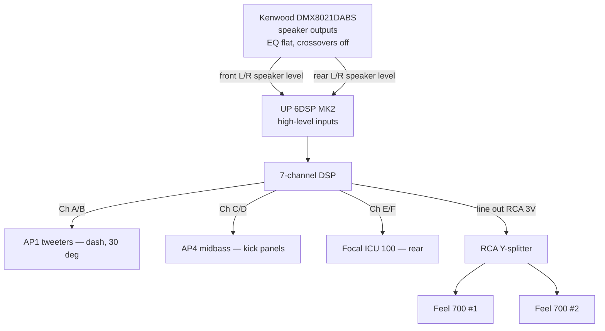
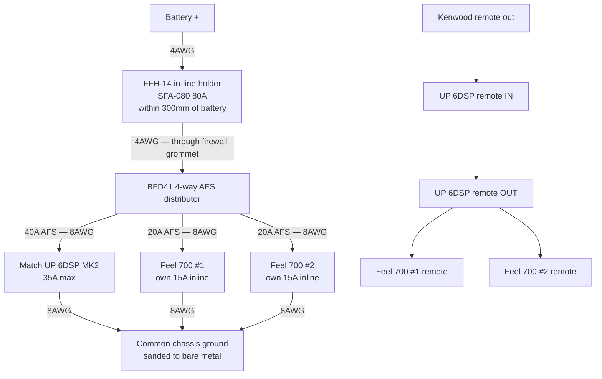

# Suzuki Jimny JB43 (2015) — Audio Upgrade

Corrections from [AUDIO-UPGRADE-REVIEW.md](AUDIO-UPGRADE-REVIEW.md) are applied here.

## Head Unit
- **Kenwood DMX8021DABS** — 4 x 50W, 3 x 4V preouts (preouts unused, see Signal Path)

## Front Speakers
- **Audison Prima AP4** (100mm midbass, 40W RMS, 4Ω) + **Audison Prima AP1** tweeters (4Ω)
- On the JB43, front speakers sit in the footwell kick panels, not the doors
- **Status: installed**
  - AP4s fitted without spacer rings (plywood rings weren't needed and wouldn't have fitted)
  - AP1 tweeters mounted on the dash at 30°, wires routed out through the cup base via a slot cut in the mounting pad, connected to the front speaker wires
  - Working, but not yet tested at volume
  - Note: AP4s arrived with no mounting screws
- **⚠️ Open: confirm the APCX TW crossovers are in circuit.** The AP1 ships with a passive
  high-pass (3.5kHz, 12dB/oct). If it isn't fitted, the tweeters are running full-range off the
  Kenwood. Check before any high-volume testing.

## Rear Speakers
- **Focal ICU 100** — 40W RMS, 4Ω

## Subwoofer
- **Harman Kardon Feel 700** — active underseat subwoofer, 125W RMS, 14A max draw, 15A fuse supplied

## Sound Deadening
- Material owned, still to fit

## Still to Buy
- **Match UP 6DSP MK2** — 6-channel amp with DSP (to fit behind the glovebox)
- Second **Harman Kardon Feel 700** — deferred until after tuning, see Plan

## Plan / Sequence
1. **Deaden first** — panels are coming off to run cable anyway, and it's the cheapest dB in the car
2. Verify the tweeter crossover situation before high-volume testing
3. Add amp + one sub, active front
4. Tune the system
5. **Then** decide on sub two, and on any speaker upgrades

## Standing Decisions
- Staying with **10cm mids** — any future mid/rear upgrades will keep the 10cm size rather than going to 6.5"

---

## Signal Path

**The UP 6DSP has no RCA inputs** — 6 x high-level, 1 x optical SPDIF, 1 x extension card slot.
The Kenwood's 4V preouts cannot be used and go unused. Feed the amp from the Kenwood's
**speaker outputs** into the high-level inputs; this is what the UP range is designed for.

Set the Kenwood flat before tuning: EQ off, loudness off, crossovers full-range, fader/balance centred.

### Channel allocation

| Channels | Rating | Feeds |
|---|---|---|
| A, B | 65W @ 4Ω | Front tweeters — AP1, L + R |
| C, D | 65W @ 4Ω | Front midbass — AP4, L + R |
| E, F | 75W @ 4Ω | Rear — Focal ICU 100, L + R |
| DSP ch 7 → line out | 3V RMS | Both Feel 700 subs via Y-splitter |

All 7 DSP channels used. Amp power exceeds speaker ratings — set gains conservatively.

**Connections:** the amp's high-level inputs and speaker outputs are supplied as plug-in harnesses
with bare wire ends, so nothing needs terminating at the amp. Use a spare ISO harness pair so the
Kenwood and the factory speaker runs plug in rather than being cut — the tweeters are the
exception and need their own new runs to the dash.

---

## Electrical Plan

### Vehicle baseline

| Component | Spec |
|---|---|
| Alternator | DENSO DAN1007 — 14V, 75A, B+ M6 stud |
| Battery | Yuasa HSB057 Silver — 12V, 50Ah, 450A CCA, flooded |

Workable headroom with the engine running. Extended **engine-off** listening is the limitation —
a flooded starter battery gives ~25Ah usable and degrades under repeated partial discharge.

### Current budget

| Device | Max draw | Fusing |
|---|---|---|
| Match UP 6DSP | 35A (internal 30A LP-Mini) | 40A AFS branch |
| HK Feel 700 (sub 1) | 14A | 20A AFS branch + own 15A inline |
| HK Feel 700 (sub 2) | 14A | 20A AFS branch + own 15A inline |
| **Worst case** | **63A** | 80A main |

### Topology

1. **4AWG** from battery positive → 80A main fuse within ~300mm of the battery → through firewall
   grommet → distribution block near the amp. This is the only run carrying the full 63A.
2. Three **8AWG** fused branches from the block: amp (40A), sub 1 (20A), sub 2 (20A).
   Each sub keeps its own supplied 15A inline fuse. **No power loop-through between subs.**
3. **8AWG** ground per device to a single sanded, bare-metal chassis point — one point for all
   three, or you get alternator whine.
4. Remote: Kenwood blue/white → amp REM in; amp REM out → both subs.

---

## Shopping List

Retailer priority: **caraudiodirect.co.uk first**, others only where they don't stock an item.
**All wire and RCA lengths below are estimates — measure the actual routes before cutting.**

### Amp

**Buy the MK2 from Crown Customs at £549.99** — confirmed as the MK2, which is the current model
(USB-C, Extension Card 2.0), so it is both the cheapest and the newest. Car Audio Direct stocks
neither version.

| Retailer | Version | Price |
|---|---|---|
| **[Crown Customs](https://www.crowncustomscaraudio.co.uk/products/match-up-6dsp-6-channel-amplifier-with-integrated-7-channel-dsp)** | **MK2 (current)** | **£549.99** |
| [Dav-Tec](https://dav-tec.co.uk/product/match-up-6dsp-6-channel-amplifier-dsp/) | original | £559.00 |
| [CEN](https://www.cen.uk/products/match-up-6dsp-universal-amp-upgrade-6-channel-amplifier-64-bit-7-channel-dsp) | original | £559.99 |

### Wiring & electrical
| Item | Qty | Est. |
|---|---|---|
| [Powerbass XWS-4P](https://caraudiodirect.co.uk/products/powerbass-xws-4p-4-gauge-power-wire-100-ofc-wire-per-meter) 4AWG power wire — battery → distributor | 3m @ £10.99 | £32.97 |
| [Stinger SSK8](https://caraudiodirect.co.uk/products/stinger-ssk8-8-awg-600w-amplifier-wiring-kit) 8AWG kit — covers the three branches, grounds and remote wire | 1 | £24.99 |
| [Connection FFH-14](https://caraudiodirect.co.uk/products/connection-by-audison-ffh-14-mini-in-line-fuse-holder) mini in-line fuse holder | 1 | £17.99 |
| [Connection SFA-080](https://caraudiodirect.co.uk/products/connection-by-audison-sfa-080-80a-afs-fuses) 80A AFS (main) | 1 | £7.99 |
| [Connection BFD41](https://caraudiodirect.co.uk/products/connection-by-audison-bfd41-4-way-fuse-distributor-block) 4-way AFS distributor | 1 | £69.99 |
| [Connection SFA-040](https://caraudiodirect.co.uk/products/connection-by-audison-sfa-040-40a-afs-fuses) 40A AFS (amp branch) | 1 | £7.99 |
| [Phonocar 4/4622](https://caraudiodirect.co.uk/products/phonocar-4-4622-afs-fuses-20a) 20A AFS (sub branches) | 2 | £9.98 |
| [Vibe CLRT4-V7](https://caraudiodirect.co.uk/products/vibe-clrt4-v7-critical-link-4-awg-ring-terminal-pair) 4AWG ring terminals — Connection FRT4 is out of stock | 1 pair | £4.99 |
| [Connection FRT8](https://caraudiodirect.co.uk/products/connection-frt8-8-gauge-ring-terminals) 8AWG ring terminals — for the grounds | 1 pack | £4.99 |
| [RS PRO 10mm² bootlace ferrules](https://uk.rs-online.com/web/p/bootlace-ferrules/1571244) — build 8AWG up to fill the BFD41's 4AWG ports | 1 pack | ~£8.00 |

The SSK8 is **CCA**, not OFC — fine at 14–35A over these short runs, but a step down from the
4AWG. For OFC throughout, [Connection FSK 350](https://caraudiodirect.co.uk/products/connection-by-audison-fsk-350-8-gauge-complete-amplifier-wiring-kit)
is £86.99. The kit's MIDI fuse holder and RCA are surplus here.

*Cheaper alternative: Phonocar 4/483 distribution block (£14.99) + 4/499 **4-way** AFS holder
(£11.99) replaces the BFD41 and saves £43.*

Note: Connection AFS fuses at caraudiodirect start at 40A — hence Phonocar for the 20A branches.

### Signal & speaker cabling
| Item | Qty | Est. |
|---|---|---|
| [Connection FTF-030](https://caraudiodirect.co.uk/products/connection-ftf-030-2-female-1-male-y-lead) Y-lead, 1 male → 2 female — one per channel | 2 | £12.98 |
| [Connection FT2](https://caraudiodirect.co.uk/products/connection-ft2-100-2-1m-rca-cable) RCA, amp → each sub — pick the length from this range once **measured** | 2 | ~£30.00 |
| [Connection SL216.2](https://caraudiodirect.co.uk/products/connection-by-audison-sl216-2-silver-series-high-resolution-16-gauge-speaker-cable-per-metre) 16 gauge speaker cable — new runs to dash tweeters | ~8m @ £3.00 | £24.00 |
| [Connects2 CT20UV01](https://caraudiodirect.co.uk/products/connects2-ct20uv01-harness-adapter-female-iso-to-male-iso-adapter) female ISO → male ISO — lets the Kenwood and factory runs plug in rather than be cut | 1 | £9.99 |
| Remote wire — included in the SSK8 kit above | — | £0.00 |

No RCA is needed between head unit and amp — the amp has no RCA inputs.

### Tools & consumables
| Item | Notes | Est. |
|---|---|---|
| [RS splice connectors](https://uk.rs-online.com/web/c/connectors/wire-terminals-splices/splice-connectors/) — adhesive-lined heat-shrink butt type, sized for 16AWG | ~20 joins, buy a 50-pack | ~£10.00 |
| [RS rubber grommets](https://uk.rs-online.com/web/c/cables-wires/cable-glands-strain-relief-grommets/rubber-grommets/) — firewall pass-through, size to the 4AWG jacket | 1 | ~£5.00 |
| [RS spiral cable wrap](https://uk.rs-online.com/web/c/cables-wires/cable-management/cable-spiral-wrapping/) — protect the engine-bay run | ~2m | ~£8.00 |
| [RS cable ties](https://uk.rs-online.com/web/c/cables-wires/cable-ties-fixings/cable-ties/) | 1 pack | ~£6.00 |
| [Vibe CLDR-V7](https://caraudiodirect.co.uk/products/vibe-cldr-v7-critical-link-anti-vibe-sound-deadening-roller) sound deadening roller | For the material already owned | £12.99 |
| [RS PRO IPA solvent 1L](https://uk.rs-online.com/web/p/precision-cleaners-degreasers/2274427) | Panel wipe before deadening | ~£12.00 |

Already owned: crimping tool, electrical tape.

Avoid scotchlocks and Wago lever nuts — both fail under vehicle vibration.

### Deferred
| Item | Est. |
|---|---|
| [Harman Kardon Feel 700](https://caraudiodirect.co.uk/products/harmon-kardon-feel-700-active-underseat-car-subwoofer) #2 — after tuning | £254.99 |
| Measurement mic (UMIK-1) + REW — for proper tuning | ~£90 |
| MATCH DIRECTOR remote — sub level from the driver's seat | ~£90 |

### Running total
**Phase 1 ≈ £881** (≈ £838 with the Phonocar distribution block).
All-in with the second sub and tuning kit ≈ £1,316.

---

## Verify before ordering

- [ ] APCX TW tweeter crossovers in circuit on the installed AP1s
- [ ] Under-seat space — each Feel 700 is 260 × 195 × 58mm; measure both sides
- [ ] Glovebox space and airflow — amp is 130 × 130 × 46mm
- [ ] Gauge of the supplied power pigtails on the amp and the subs
- [ ] All cable run lengths — string along the real route
- [ ] Battery health: rested voltage and a load test
- [ ] Voltage at the amp position at idle, with lights, blower and wipers on
- [ ] A Windows machine for DSP PC-Tool 5
