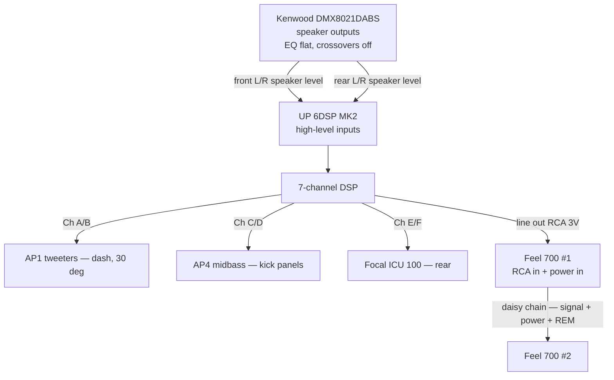
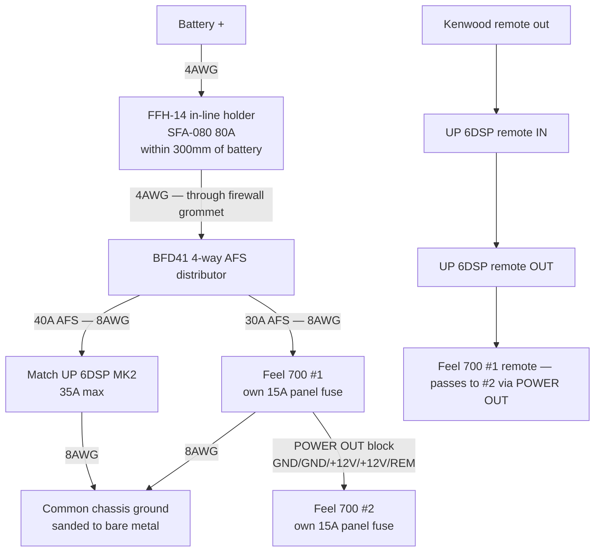

# Suzuki Jimny JB43 (2015) — Audio Upgrade

Corrections from [AUDIO-UPGRADE-REVIEW.md](AUDIO-UPGRADE-REVIEW.md) are applied here.

## Head Unit
- **Kenwood DMX8021DABS** — 4 x 50W, 3 x 4V preouts (preouts unused, see Signal Path)

## Front Speakers
- **Audison Prima AP4** (100mm midbass, 40W RMS, 4Ω) + **Audison Prima AP1** tweeters (4Ω)
- On the JB43, front speakers sit in the footwell kick panels, not the doors
- **Status: installed**
  - AP4s fitted without spacer rings (plywood rings weren't needed and wouldn't have fitted)
  - AP1 tweeters mounted on the dash at 30°, wires routed out through the cup base via a slot cut in the mounting pad, connected to the front speaker wires
  - Working, but not yet tested at volume
  - Note: AP4s arrived with no mounting screws
- The AP1 ships with an APCX TW passive high-pass (3.5kHz, 12dB/oct). Confirm it's in circuit
  before turning up — see the resistance test under [Before you start](#before-you-start).
  Going active later, the DSP takes over the crossover and the APCX comes out.

## Rear Speakers
- **Focal ICU 100** — 40W RMS, 4Ω

## Subwoofer
- **Harman Kardon Feel 700** — active underseat subwoofer, 125W RMS / 250W max, 7" driver
- Confirmed against Harman's own spec sheet
  ([reference/feel-700-spec-sheet-harman.pdf](reference/feel-700-spec-sheet-harman.pdf)):
  15A fuse, **14A max draw**, <700mA quiescent, input sensitivity **0.10–5.0V low-level** /
  0.5–25V high-level, 260 × 195 × 58mm, and **2x 300mm wiring harnesses** for power and
  speaker-level input in the box
- The amp's 3V line output sits comfortably inside the 0.10–5.0V low-level input range

## Sound Deadening
- Material owned, still to fit

## Still to Buy
- **Match UP 6DSP MK2** — 6-channel amp with DSP (to fit behind the glovebox)
- Second **Harman Kardon Feel 700** — deferred until after tuning, see Plan

## Plan / Sequence
1. **Deaden first** — panels are coming off to run cable anyway, and it's the cheapest dB in the car
2. Verify the tweeter crossover situation before high-volume testing
3. Add amp + one sub, active front
4. Tune the system
5. **Then** decide on sub two, and on any speaker upgrades

## Standing Decisions
- Staying with **10cm mids** — any future mid/rear upgrades will keep the 10cm size rather than going to 6.5"

---

## Signal Path

**The UP 6DSP has no RCA inputs** — 6 x high-level, 1 x optical SPDIF, 1 x extension card slot.
The Kenwood's 4V preouts cannot be used and go unused. Feed the amp from the Kenwood's
**speaker outputs** into the high-level inputs; this is what the UP range is designed for.

Per the [MK2 manual](reference/up-6dsp-mk2-manual.pdf), **two of the four A–D high-level inputs is
sufficient** — front L/R only. The DSP derives all seven channels from that pair, so there is no
need to run rear speaker-level wires into the amp as well.

Set the Kenwood flat before tuning: EQ off, loudness off, crossovers full-range, fader/balance centred.

### Channel allocation

| Channels | Rating | Feeds |
|---|---|---|
| A, B | 65W @ 4Ω | Front tweeters — AP1, L + R |
| C, D | 65W @ 4Ω | Front midbass — AP4, L + R |
| E, F | 75W @ 4Ω | Rear — Focal ICU 100, L + R |
| DSP ch 7 → line out | 3V RMS | Feel 700 #1, which chains on to #2 |

All 7 DSP channels used. Amp power exceeds speaker ratings — set gains conservatively.

**Connections:** the amp's high-level inputs and speaker outputs are supplied as plug-in harnesses
with bare wire ends, so nothing needs terminating at the amp. Use a spare ISO harness pair so the
Kenwood and the factory speaker runs plug in rather than being cut — the tweeters are the
exception and need their own new runs to the dash.

---

## Electrical Plan

### Vehicle baseline

| Component | Spec |
|---|---|
| Alternator | DENSO DAN1007 — 14V, 75A, B+ M6 stud |
| Battery | Yuasa HSB057 Silver — 12V, 50Ah, 450A CCA, flooded |

Workable headroom with the engine running. Extended **engine-off** listening is the limitation —
a flooded starter battery gives ~25Ah usable and degrades under repeated partial discharge.

### Current budget

| Device | Max draw | Fusing |
|---|---|---|
| Match UP 6DSP | 35A (internal 30A LP-Mini) | 40A AFS branch |
| HK Feel 700 x2, daisy-chained | 28A combined | **30A** AFS branch + each unit's own 15A fuse |
| **Worst case** | **63A** | 80A main |

### Topology

1. **4AWG** from battery positive → 80A main fuse **within 300mm of the battery** (manufacturer
   maximum) → through firewall grommet → distribution block near the amp. Only run carrying 63A.
2. Two **8AWG** fused branches from the block: amp (40A) and sub 1 (30A).
   Audiotec Fischer specify **6mm² minimum for runs under 1m, 6–10mm² for longer**. 8AWG is
   8.37mm², inside spec. **Ground must match the positive's cross-section** and land on bare,
   non-insulated chassis — their words, and insufficient ground contact is called out as a direct
   cause of noise and malfunction.
3. **Sub 2 is fed from sub 1's POWER OUT block** — a labelled multi-pin connector carrying
   GND/GND/+12V/+12V and REM, with a second 300mm harness supplied for it. One feed serves both.
   The doubled pins are the input terminal shared out, and each unit carries its own 15A panel
   fuse — two fuses in series would be pointless, so the tap is upstream. Hence 2 x 14A = 30A
   branch, with the link itself carrying only sub 2's 14A.
4. **8AWG** ground to a single sanded, bare-metal chassis point — one point for everything,
   or you get alternator whine.
5. Remote: **the amp needs no remote wire.** The manual states REM IN can be left unconnected
   when any high-level input A–F is used — the amp switches on from the high-level signal. Use
   the amp's **REM OUT** to switch the subs (its documented purpose is turning on amps fed from
   Line Out); sub 2 picks up REM through the POWER OUT block.

---

## Shopping List

Retailer priority: **caraudiodirect.co.uk first**, others only where they don't stock an item.
**All wire and RCA lengths below are estimates — measure the actual routes before cutting.**
Prices marked **~** are my estimates, not checked against a live listing. Everything else is a
price read off the linked page.

### Amp

**Buy the MK2 from Crown Customs at £549.99** — confirmed as the MK2, which is the current model
(USB-C, Extension Card 2.0), so it is both the cheapest and the newest. Car Audio Direct stocks
neither version.

| Retailer | Version | Price |
|---|---|---|
| **[Crown Customs](https://www.crowncustomscaraudio.co.uk/products/match-up-6dsp-6-channel-amplifier-with-integrated-7-channel-dsp)** | **MK2 (current)** | **£549.99** |
| [Dav-Tec](https://dav-tec.co.uk/product/match-up-6dsp-6-channel-amplifier-dsp/) | original | £559.00 |
| [CEN](https://www.cen.uk/products/match-up-6dsp-universal-amp-upgrade-6-channel-amplifier-64-bit-7-channel-dsp) | original | £559.99 |

### Wiring & electrical
| Item | Qty | Est. |
|---|---|---|
| [Powerbass XWS-4P](https://caraudiodirect.co.uk/products/powerbass-xws-4p-4-gauge-power-wire-100-ofc-wire-per-meter) 4AWG power wire — battery → distributor | 3m @ £10.99 | £32.97 |
| [Powerbass XWS-8P](https://www.caraudiosecurity.com/products/xws-8p-8-awg-power-wire-per-metre-100-ofc-wire) 8AWG power wire, 100% OFC — amp + sub branches | 4m @ £4.49 | £17.96 |
| [Powerbass XWS-8G](https://www.caraudiosecurity.com/products/xws-8g-8-awg-ground-wire-per-metre-100-ofc-wire) 8AWG ground wire, 100% OFC | 3m @ £4.49 | £13.47 |
| [Connection FFH-14](https://caraudiodirect.co.uk/products/connection-by-audison-ffh-14-mini-in-line-fuse-holder) mini in-line fuse holder | 1 | £17.99 |
| [Connection SFA-080](https://caraudiodirect.co.uk/products/connection-by-audison-sfa-080-80a-afs-fuses) 80A AFS (main) | 1 | £7.99 |
| [Connection BFD41](https://caraudiodirect.co.uk/products/connection-by-audison-bfd41-4-way-fuse-distributor-block) 4-way AFS distributor | 1 | £69.99 |
| [Connection SFA-040](https://caraudiodirect.co.uk/products/connection-by-audison-sfa-040-40a-afs-fuses) 40A AFS (amp branch) | 1 | £7.99 |
| [Phonocar 4/4632](https://caraudiodirect.co.uk/products/phonocar-4-4632-afs-fuses-30a) 30A AFS (sub branch) | 1 | £4.99 |
| [Vibe CLRT4-V7](https://caraudiodirect.co.uk/products/vibe-clrt4-v7-critical-link-4-awg-ring-terminal-pair) 4AWG ring terminals — Connection FRT4 is out of stock | 1 pair | £4.99 |
| [Connection FRT8](https://caraudiodirect.co.uk/products/connection-frt8-8-gauge-ring-terminals) 8AWG ring terminals — for the grounds | 1 pack | £4.99 |
| [RS PRO 10mm² bootlace ferrules](https://uk.rs-online.com/web/p/bootlace-ferrules/1571244) — build 8AWG up to fill the BFD41's 4AWG ports | 1 pack | ~£8.00 |

The 8AWG is the same Powerbass XWS family as the 4AWG above — **100% OFC throughout**, no
copper-clad aluminium anywhere in the run. Car Audio Security stock it per metre; caraudiodirect
don't carry 8 gauge per metre.

Quantities include slack, so nothing here needs measuring before ordering.

*Only two fused branches are needed now, so the cheaper route is better value than before:
Phonocar 4/483 distribution block (£14.99) + a 2-way AFS holder (£9.99) replaces the BFD41
and saves £45.*

Note: Connection AFS fuses at caraudiodirect start at 40A, so the 30A sub branch uses Phonocar.

### Signal & speaker cabling
| Item | Qty | Est. |
|---|---|---|
| [Connection FT2](https://caraudiodirect.co.uk/products/connection-ft2-100-2-1m-rca-cable) RCA, amp → sub 1 — pick the length from this range once **measured** | 1 | ~£15.00 |
| [Connection SL216.2](https://caraudiodirect.co.uk/products/connection-by-audison-sl216-2-silver-series-high-resolution-16-gauge-speaker-cable-per-metre) 16 gauge speaker cable — new runs to dash tweeters | ~8m @ £3.00 | £24.00 |
| [Connects2 CT20UV01](https://caraudiodirect.co.uk/products/connects2-ct20uv01-harness-adapter-female-iso-to-male-iso-adapter) female ISO → male ISO — lets the Kenwood and factory runs plug in rather than be cut | 1 | £9.99 |
| [RS automotive hook-up wire](https://uk.rs-online.com/web/c/cables-wires/wire-single-core-cable/automotive-wire/) ~1mm² — amp REM OUT → sub 1 only | ~2m | ~£5.00 |

No RCA is needed between head unit and amp — the amp has no RCA inputs.

### Tools & consumables
| Item | Notes | Est. |
|---|---|---|
| [RS splice connectors](https://uk.rs-online.com/web/c/connectors/wire-terminals-splices/splice-connectors/) — adhesive-lined heat-shrink butt type, sized for 16AWG | ~20 joins, buy a 50-pack | ~£10.00 |
| [RS rubber grommets](https://uk.rs-online.com/web/c/cables-wires/cable-glands-strain-relief-grommets/rubber-grommets/) — firewall pass-through, size to the 4AWG jacket | 1 | ~£5.00 |
| [RS spiral cable wrap](https://uk.rs-online.com/web/c/cables-wires/cable-management/cable-spiral-wrapping/) — protect the engine-bay run | ~2m | ~£8.00 |
| [RS cable ties](https://uk.rs-online.com/web/c/cables-wires/cable-ties-fixings/cable-ties/) | 1 pack | ~£6.00 |
| [Vibe CLDR-V7](https://caraudiodirect.co.uk/products/vibe-cldr-v7-critical-link-anti-vibe-sound-deadening-roller) sound deadening roller | For the material already owned | £12.99 |
| [RS PRO IPA solvent 1L](https://uk.rs-online.com/web/p/precision-cleaners-degreasers/2274427) | Panel wipe before deadening | ~£12.00 |

Already owned: crimping tool, electrical tape.

Avoid scotchlocks and Wago lever nuts — both fail under vehicle vibration.

### Deferred
| Item | Est. |
|---|---|
| [Harman Kardon Feel 700](https://caraudiodirect.co.uk/products/harmon-kardon-feel-700-active-underseat-car-subwoofer) #2 — after tuning | £254.99 |
| Measurement mic (UMIK-1) + REW — for proper tuning | ~£90 |
| **Windows access for DSP PC-Tool 6** — see below | £0–£80 |
| MATCH DIRECTOR remote — sub level from the driver's seat | ~£90 |

### Running total
**Phase 1 ≈ £860** (≈ £815 with the Phonocar distribution block).
All-in with the second sub and tuning kit ≈ £1,295.

---

## Tuning: you need Windows

DSP PC-Tool is **Windows only**, and Audiotec Fischer have said a native macOS build is not
planned. On a Mac that means Parallels, VMware Fusion, Boot Camp on Intel, or borrowing a
Windows laptop. Use **PC-Tool 6**, which added UP 6DSP support; the USB-C cable is in the box.

Order of operations from the manual: install the software *first*, connect the amp *after*, then
power the amp on before launching the software. Firmware updates itself on first connect.

**Setting input sensitivity in PC-Tool is mandatory, not optional** — the manual warns that
failing to match it to the source can damage the amplifier. Do this before any real listening.

## Before you start

Physical checks only — everything else is settled above.

- [ ] **APCX TW tweeter crossovers.** Quickest test: measure DC resistance across each tweeter's
      terminals. Direct-connected reads roughly 4Ω; with the APCX in circuit the series capacitor
      blocks DC and you'll read open or very high. If it reads ~4Ω, fit the crossovers before
      turning up.
- [ ] **Under-seat space** — each Feel 700 is 260 × 195 × 58mm. Measure both sides, and check for
      seat vents or heater ducting; the installer in the reference video abandoned under-seat
      mounting in a Tacoma for that reason.
- [ ] **Glovebox space and airflow** — amp is 130 × 130 × 46mm. Mount to metal, not trim foam.
- [ ] **Battery and charging** — rested voltage on the HSB057 (12.6V+ healthy) and a load test,
      then voltage at the amp position at idle with lights, blower and wipers on.

Wire quantities in the shopping list include slack, so nothing needs measuring before ordering
except the RCA, which is a fixed-length product — run a string from the amp position to under the
seat before picking that one.

