# DSP PC-Tool — First Setup (MATCH UP 6DSP MK2)

A safe first tune for this car. Screenshots are from the
[UP 6DSP MK2 manual](https://www.audiotec-fischer.de/media/pdf/ce/c3/75/UP-6DSP-MK2_Manual_25-02-2026.pdf)
and the [DSP PC-Tool knowledge base](https://www.audiotec-fischer.de/en/knowledge-base/DSP-PC-Tool/).

| Part | What | When |
|---|---|---|
| **1. Required** | Mute, input gain, routing, crossovers, save, speaker check | Before playing *any* music |
| **2. Recommended** | Levels, time alignment | Same session — biggest improvement, no extra kit |
| **3. Optional** | EQ by ear, or with a measurement mic | Once it already sounds right |

| Amp output | Speaker |
|---|---|
| AMP Out A / B | AP1 tweeters L / R |
| AMP Out C / D | AP4 midbass L / R |
| AMP Out E / F | Focal ICU 100 rears L / R |
| Line Out I | Feel 700 subs (via Y-lead) |

How the signal flows through PC-Tool:

---

# Part 1 — Required

Skipping any of these risks damaging the amp or speakers.

## 1.1 Before connecting

- **Kenwood:** EQ flat, loudness off, all crossovers/HPF off, fader and balance centred, volume **low**.
- **Feel 700:** turn the sub's own low-pass knob to maximum.
- **Test track:** PC-Tool home screen → **Audio Test Tracks** → copy **IGS – Input Gain Setup** to a USB stick for the Kenwood.
- Install PC-Tool **before** plugging the amp in. Ignition on, USB-C in, launch PC-Tool, accept the firmware update.

## 1.2 Open Advanced Gain Setup and mute all outputs

KB: [Adjustment of the input sensitivity](https://www.audiotec-fischer.de/en/knowledge-base/DSP-PC-Tool/dcm/)

Needs the amp connected — the title bar must not say "Disconnected".

1. **Input** tab → **Gain Configuration** → tick **Advanced Gain Setup** → click
   **Advanced Gain Adjustment**.
2. Click **Mute All Outputs**. The button then reads **Unmute All Outputs** — leave it like
   that. Nothing plays until 1.7.

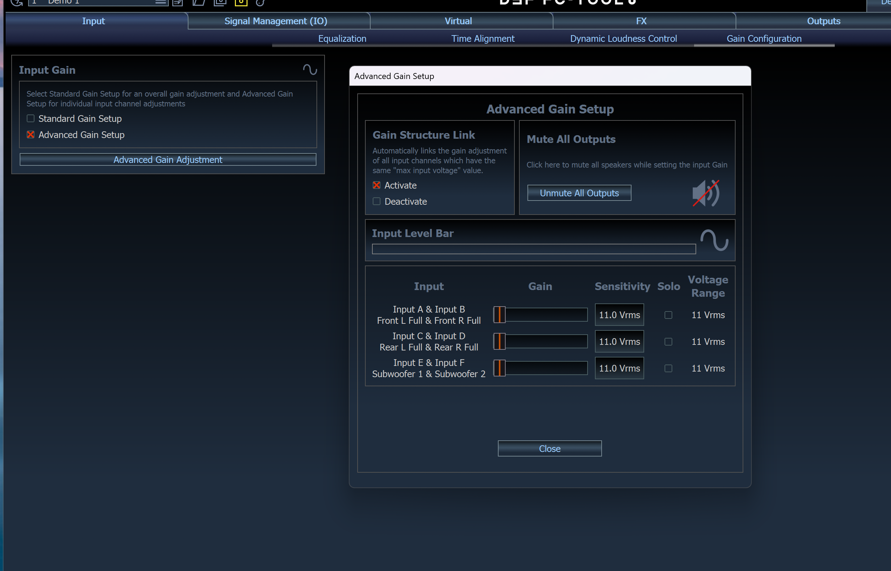

## 1.3 Input gain

No microphone — PC-Tool reads the electrical signal from the Kenwood, not sound in the car.
Only the **Input A & Input B** row matters; C–F aren't connected. Leave **Gain Structure Link**
on **Activate**.

1. Kenwood to **~90% volume**, play the **IGS** track. The **Input Level Bar** fills up.
2. Drag the **Input A & Input B** slider until the **∿ icon** at the end of the level bar turns
   **red**, then back **one step** until it goes grey again.

   

3. Turn the Kenwood back down and click **Close**.

## 1.4 Routing

KB: [Signal routing (IO) incl. VCP](https://www.audiotec-fischer.de/en/knowledge-base/DSP-PC-Tool/io/)

**Signal Management (IO)** → **Routing**.

**Main to Virtual Routing**

Left column = physical inputs (only **[Input A]** and **[Input B]** are wired). Right = virtual
channels. The blocks in between are **input names**, not speakers. Drag an input onto a row to
add it; right-click a block to remove it.

| Virtual channel | Fed from |
|---|---|
| Virtual A — Front L Full | [Input A] Front L Full 100% |
| Virtual B — Front R Full | [Input B] Front R Full 100% |
| Virtual C — Rear L Full | [Input A] Front L Full 100% — *replace the default Input C* |
| Virtual D — Rear R Full | [Input B] Front R Full 100% — *replace the default Input D* |
| Virtual E — Front Center | Empty — remove both blocks |
| Virtual F — Subwoofer 1 | Front L 50% + Front R 50% (default) |
| Virtual G — Subwoofer 2 | Empty — remove all blocks |

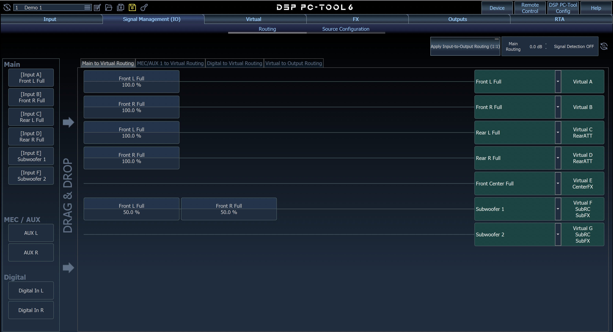

**Virtual to Output Routing**

The **block** on each row is the signal source — drag it from **Virtual Inputs** on the left
(right-click to remove). The **dropdown** on the right only names the output; it also sets the
phase control type.

| Output | Source block | Dropdown name |
|---|---|---|
| Amp Out A | [Virtual A] Front L Full | Front L High |
| Amp Out B | [Virtual B] Front R Full | Front R High |
| Amp Out C | [Virtual A] Front L Full | Front L Mid |
| Amp Out D | [Virtual B] Front R Full | Front R Mid |
| Amp Out E | [Virtual C] Rear L Full | Rear L Full |
| Amp Out F | [Virtual D] Rear R Full | Rear R Full |
| Line Out I | [Virtual F] Subwoofer 1 | Subwoofer 1 |

E/F should show **RearATT** and Line Out **SubRC** under the output name — that confirms the
right source.

Changing a dropdown asks **"Load Channel HP/LP Preset Filters?"** — click **No** (crossovers are
set in 1.5) and leave "Remember my choice" unticked.

## 1.5 Crossovers

KB: [High- & lowpass filter](https://www.audiotec-fischer.de/en/knowledge-base/DSP-PC-Tool/filter/)

**Outputs** tab → click a channel button → set **Highpass** / **Lowpass Filter Section**. Use
**Butterworth** throughout.

| Channel | Highpass | Lowpass |
|---|---|---|
| A / B tweeters | 3,500 Hz, −12 dB | Off |
| C / D midbass | 80 Hz, −24 dB | 3,500 Hz, −12 dB |
| E / F rears | 90 Hz, −24 dB | Off |
| Line Out I sub | Off | 80 Hz, −24 dB |

Tick the checkbox next to the L and R channel names to **link** them, so each pair is set once.

**Off** means the **Bypass** light is lit (orange) or **Slope** is OFF. Check the graph matches
— one slope for tweeters/rears/sub, a hill shape for midbass. On E/F set the unused lowpass
**Slope** to OFF too, so an accidental un-bypass can't silence the rears.

Correct settings — one screenshot per channel

**Amp Out A — Front L High** (B is identical)

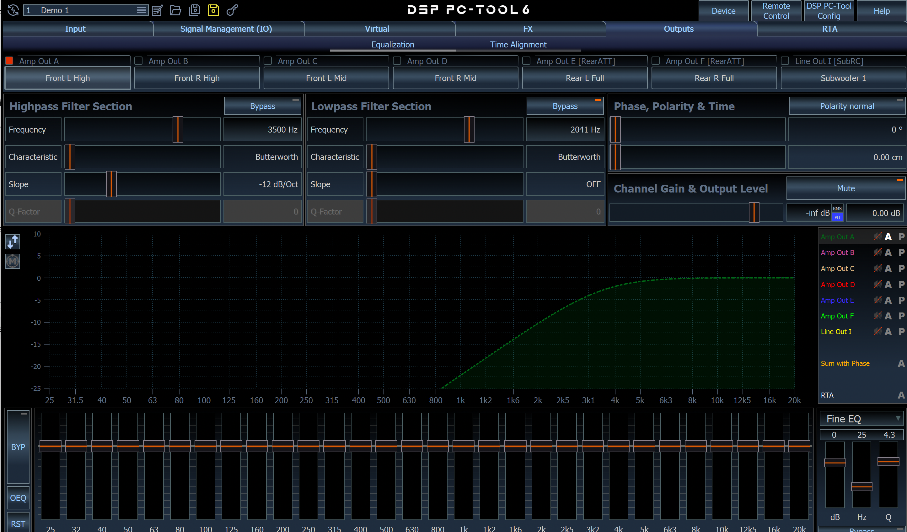

**Amp Out B — Front R High**

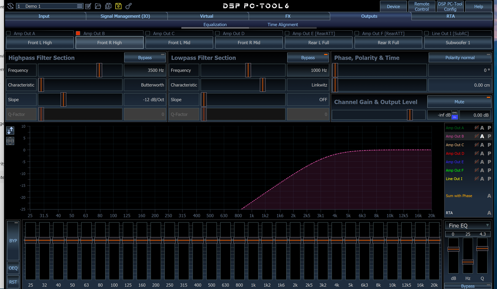

**Amp Out C — Front L Mid** (D is identical)

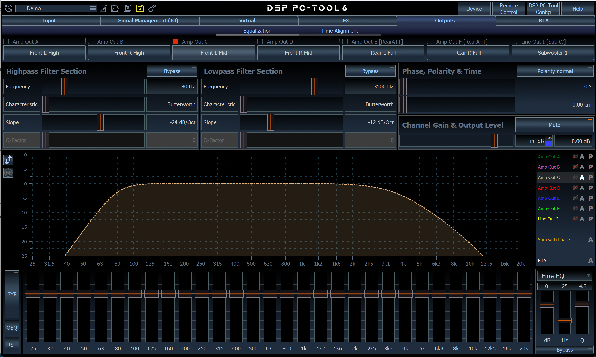

**Amp Out D — Front R Mid**

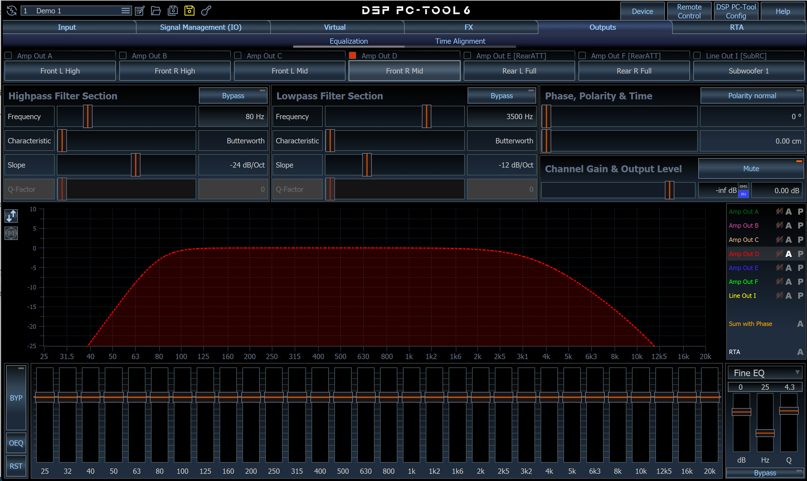

**Amp Out E — Rear L Full** (F is identical)

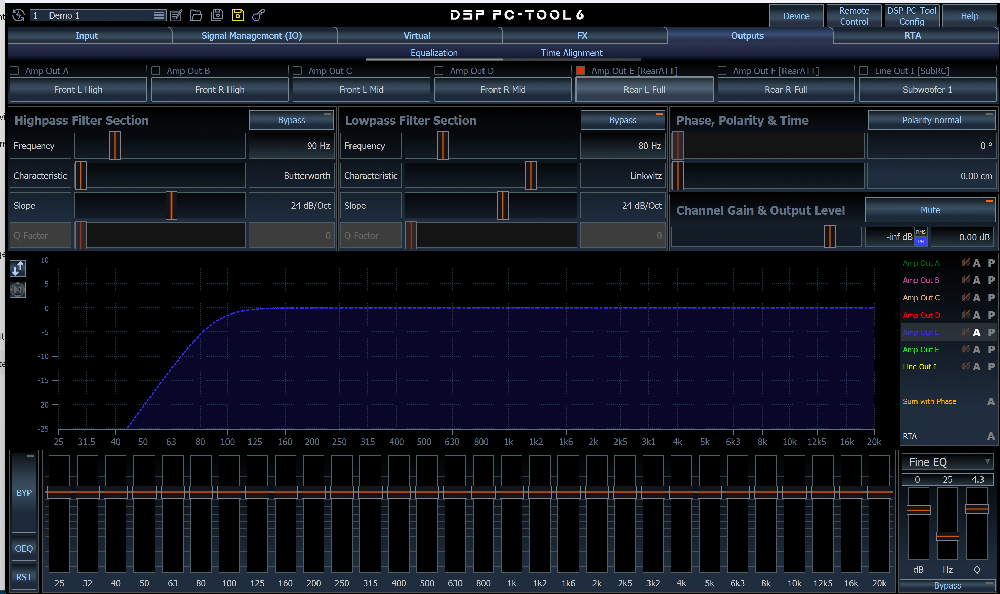

**Amp Out F — Rear R Full**

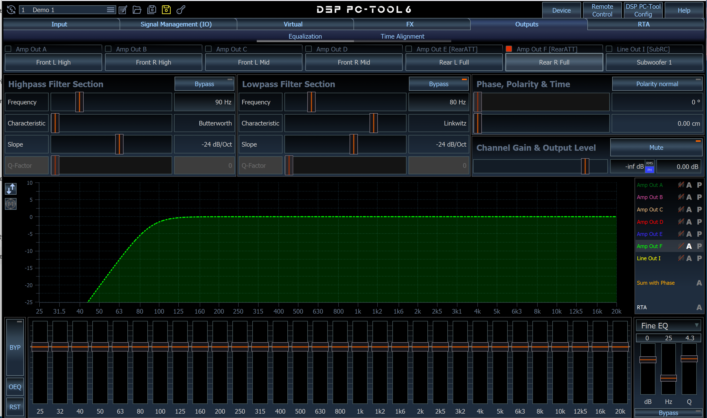

**Line Out I — Subwoofer 1**

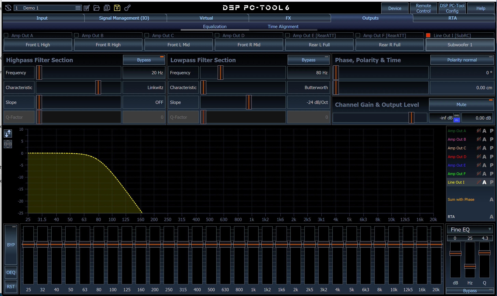

## 1.6 Save

Click **Save&Store** — it saves a file on the PC *and* writes the setup to the amp.
The red dot means unsaved changes, which are lost on power-off.

## 1.7 Speaker check

1. Kenwood volume low. **Outputs** tab → select each channel → set its output level to about
   **−10 dB**, tweeters **−15 dB**, and click **Mute** so every channel is individually muted.

   

2. Back in **Advanced Gain Setup**, click **Unmute All Outputs** (channels stay muted
   individually).
3. **Outputs** tab → unmute **one pair**, check the right speakers play, mute again. Repeat for
   every pair.
4. Wrong speaker = routing or wiring mistake — fix before going further.

The system is now safe to use.

---

# Part 2 — Recommended

## 2.1 Levels

Unmute everything, play familiar music at moderate volume. Levels are set per channel on the
**Outputs** tab → select the channel → **Channel Gain & Output Level** slider (dB box on the
right). Move in **1–2 dB** steps, and link L/R so both sides change together.

- Tweeters too bright → **lower the output level** of A/B.
- Thin vocals → **raise the output level** of C/D.
- Rears should support, not compete — keep the E/F output level a few dB **below** the fronts.
- Sub → adjust the **Line Out I** output level to taste.

**Save&Store**.

## 2.2 Time alignment

KB: [Phase and time alignment](https://www.audiotec-fischer.de/en/knowledge-base/DSP-PC-Tool/time/)

The driver sits much nearer the left speakers, so their sound arrives first and the stage pulls
left. Delaying the nearer speakers puts the image back in the centre of the dash.

**Outputs** tab → **Time Alignment** shows every channel on one screen (screenshot below is
an older PC-Tool layout — the controls are the same).

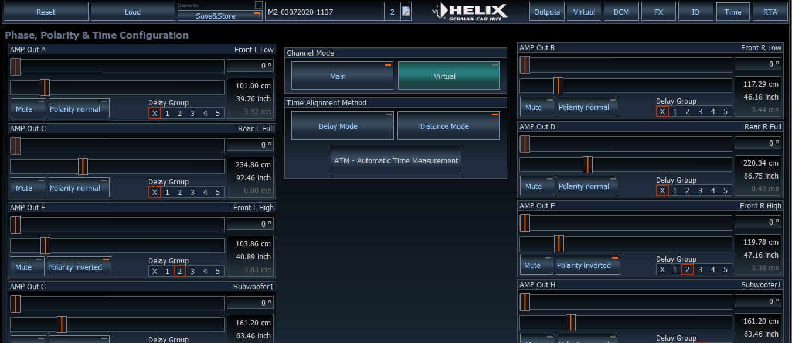

1. **Measure.** Sit in the driving position. With a tape measure, record the distance from the
   **centre of your head** (between your ears) to the centre of each speaker:

   | Speaker | Output | cm |
   |---|---|---|
   | Tweeter L | A | |
   | Tweeter R | B | |
   | Midbass L | C | |
   | Midbass R | D | |
   | Rear L | E | |
   | Rear R | F | |
   | Sub (under seats) | Line Out I | |

2. Under **Time Alignment Method**, choose **Distance Mode**.

   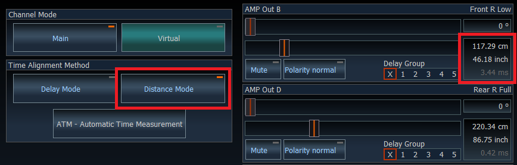

3. Enter each distance on its output's slider. PC-Tool works out the delays itself.
4. **Fine-tune the fronts by ear.** Mute rears and sub. Play a mono vocal track — the voice
   should sit dead centre on the dash. If it leans left, add a few cm to A/C; right, to B/D.
5. **Rears.** Unmute E/F. They should add ambience, not pull sound backwards — if they do,
   add **100–200 cm** extra to E and F.
6. **Sub.** Unmute the Line Out. If bass sounds thin or sits behind you, try **Polarity
   inverted**, then nudge the **phase** slider above it until the bass is fullest and sits up front.
7. **Save&Store**.

---

# Part 3 — Optional: EQ

KB: [Equalizer](https://www.audiotec-fischer.de/en/knowledge-base/DSP-PC-Tool/equalizer/) ·
[Real Time Analyzer](https://www.audiotec-fischer.de/en/knowledge-base/DSP-PC-Tool/rta/)

Only after Parts 1 and 2 — EQ on a system with wrong levels or delays just chases problems.
Each output channel has **30 bands** (1/3 octave, 25 Hz–20 kHz), **+6 dB boost / −15 dB cut**.
Cut more than you boost.

**Outputs** tab → select a channel → drag the EQ sliders. Link L/R pairs first.

## 3.1 By ear (no mic)

1. Play familiar music at moderate volume. Change **one band at a time, 2–3 dB**.
2. **Midbass C/D:** small cabins usually boom around **100–250 Hz** — cut there first.
3. **Tweeters A/B:** harsh or fatiguing → cut around **3–6 kHz**.
4. Rears and sub: leave flat; set their levels instead.
5. If a change doesn't clearly help, put it back to 0. **Save&Store**.

## 3.2 With a measurement mic (UMIK-1) — best result

1. Plug the UMIK-1 into the Mac and pass it to the VM like the amp. Open the **RTA** tab →
   **Settings** → set **Audio device** to the UMIK-1, not the PC's own mic.
2. Play **pink noise** from **Audio Test Tracks** on the Kenwood. Sit in the driver's seat.
3. **Mute everything except the fronts** (A–D) and link them.
4. **Start Analyzer** → hold the mic upright and sweep slowly in a semicircle between your ears.
   Adjust volume until the level bar is neither **orange** (too quiet) nor **red** (too loud).

   

5. **Start Measurement**, then EQ the fronts toward the reference curve. **SetEQ / AutoEQ** can
   do a first pass over a chosen band range — tidy it by ear afterwards.
6. Repeat for the rears (fronts muted), then bring the sub in and match its level.
7. **Save&Store**.

Further topics (sound effects, loudness, input EQ) are in the
[knowledge base](https://www.audiotec-fischer.de/en/knowledge-base/DSP-PC-Tool/).
