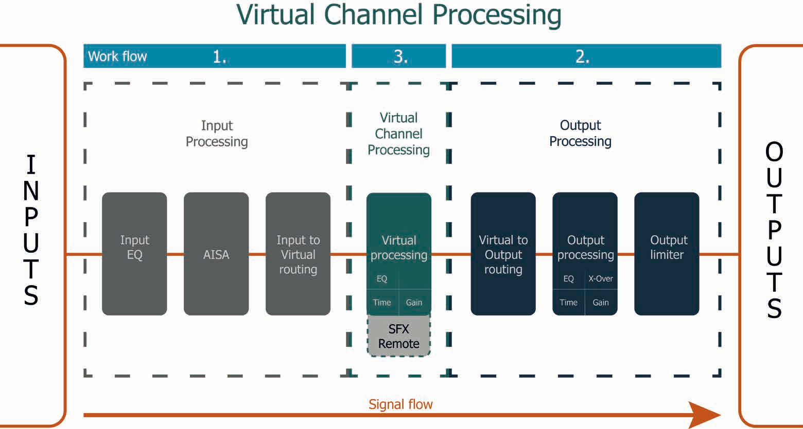
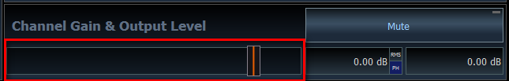
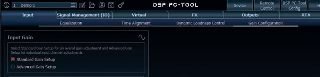
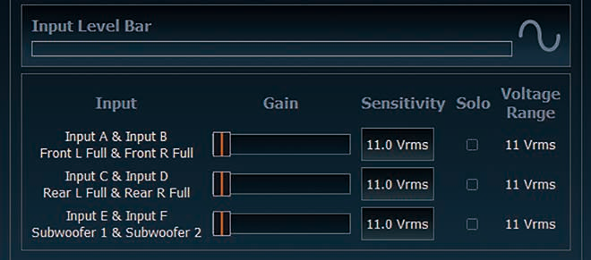
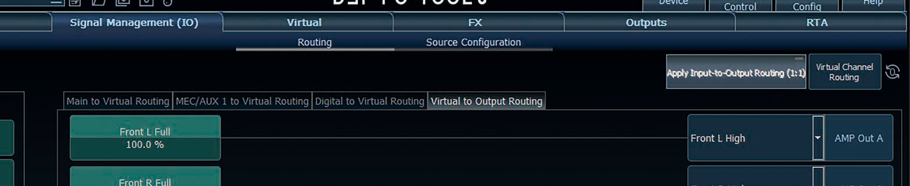
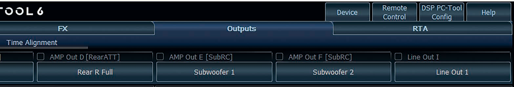
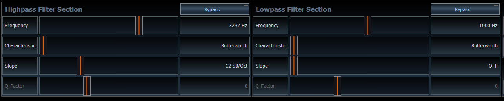
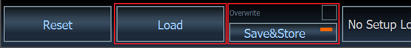
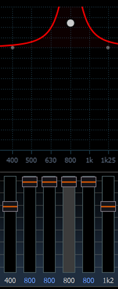
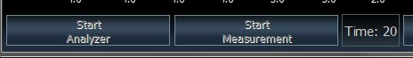

# DSP PC-Tool — First Setup (MATCH UP 6DSP MK2)

A basic, safe first tune for this car. Work through it in order. Screenshots are from the
[UP 6DSP MK2 manual](https://www.audiotec-fischer.de/media/pdf/ce/c3/75/UP-6DSP-MK2_Manual_25-02-2026.pdf)
and the [DSP PC-Tool knowledge base](https://www.audiotec-fischer.de/en/knowledge-base/DSP-PC-Tool/).

| Amp output | Speaker |
|---|---|
| AMP Out A / B | AP1 tweeters L / R |
| AMP Out C / D | AP4 midbass L / R |
| AMP Out E / F | Focal ICU 100 rears L / R |
| Line Out I | Feel 700 subs (via Y-lead) |

The order PC-Tool expects — inputs, then outputs, then the virtual layer in between:

---

## 0. Before connecting

- **Kenwood:** EQ flat, loudness off, all crossovers/HPF off, fader and balance centred, volume **low**.
- **Feel 700:** turn the sub's own low-pass knob to maximum.
- **Test track:** PC-Tool home screen → **Audio Test Tracks** → copy **IGS – Input Gain Setup** to a USB stick for the Kenwood.
- Install PC-Tool **before** plugging the amp in. Ignition on, USB-C in, launch PC-Tool, accept the firmware update.

## 1. Mute all outputs

**Outputs** tab → select each channel → **Mute**. Nothing should play until step 6.

## 2. Input gain — mandatory

KB: [Adjustment of the input sensitivity](https://www.audiotec-fischer.de/en/knowledge-base/DSP-PC-Tool/dcm/)

1. **Input** tab → **Gain Configuration** → tick **Standard Gain Setup**.

   

2. Kenwood to **~90% volume**, play the **IGS** track.
3. Drag the **Input A & Input B** slider until the clipping indicator turns **red**, then back **one step** until it goes grey.

   
   

4. Turn the Kenwood back down.

## 3. Routing

KB: [Signal routing (IO) incl. VCP](https://www.audiotec-fischer.de/en/knowledge-base/DSP-PC-Tool/io/)

**Signal Management (IO)** → **Routing**.

**Main to Virtual Routing**
- Input A → **Front L Full** and **Rear L Full**
- Input B → **Front R Full** and **Rear R Full**
- Input A + B → **Subwoofer 1**

**Virtual to Output Routing** — pick the source from each output's dropdown:

| Output | Source |
|---|---|
| AMP Out A | Front L Full |
| AMP Out B | Front R Full |
| AMP Out C | Front L Full |
| AMP Out D | Front R Full |
| AMP Out E | Rear L Full |
| AMP Out F | Rear R Full |
| Line Out I | Subwoofer 1 |

## 4. Crossovers — still muted

KB: [High- & lowpass filter](https://www.audiotec-fischer.de/en/knowledge-base/DSP-PC-Tool/filter/)

**Outputs** tab → click a channel button → set **Highpass** / **Lowpass Filter Section**. Use
**Butterworth** throughout.

| Channel | Highpass | Lowpass |
|---|---|---|
| A / B tweeters | 3,500 Hz, −12 dB | Off |
| C / D midbass | 80 Hz, −24 dB | 3,500 Hz, −12 dB |
| E / F rears | 90 Hz, −24 dB | Off |
| Line Out I sub | Off | 80 Hz, −24 dB |

Tick the checkbox next to the L and R channel names to **link** them, so each pair is set once.

## 5. Save before listening

Click **Save&Store** — it saves a file on the PC *and* writes the setup to the amp.
The red dot means unsaved changes, which are lost on power-off.

## 6. Unmute one pair at a time

1. Kenwood volume low. Set every channel's output level to about **−10 dB**, tweeters **−15 dB**.
2. Unmute **one pair**, check the right speakers play, mute again. Repeat for every pair.
3. Wrong speaker = routing or wiring mistake — fix before going further.

## 7. Balance by ear

Unmute everything, play familiar music at moderate volume:
- Tweeters too bright → lower A/B. Thin vocals → raise C/D.
- Rears should support, not compete — keep E/F a few dB below the fronts.
- Sub to taste. If bass sounds thin around 80 Hz, try the sub's **Phase** 0° / 180°.

**Save&Store** again.

## Later

- **Time alignment** — [KB: Time](https://www.audiotec-fischer.de/en/knowledge-base/DSP-PC-Tool/time/): enter the distance from your head to each speaker.
- **EQ** — see below.
- Everything else in the [knowledge base](https://www.audiotec-fischer.de/en/knowledge-base/DSP-PC-Tool/).

---

## EQ

KB: [Equalizer](https://www.audiotec-fischer.de/en/knowledge-base/DSP-PC-Tool/equalizer/) ·
[Real Time Analyzer](https://www.audiotec-fischer.de/en/knowledge-base/DSP-PC-Tool/rta/)

Do the setup above and **time alignment first** — EQ on a system with wrong levels or delays
just chases problems. Each output channel has **30 bands** (1/3 octave, 25 Hz–20 kHz),
**+6 dB boost / −15 dB cut**. Cut more than you boost.

**Outputs** tab → select a channel → drag the EQ sliders. Link L/R pairs first.

### Option A — by ear (no mic)

1. Play familiar music at moderate volume. Change **one band at a time, 2–3 dB**.
2. **Midbass C/D:** small cabins usually boom around **100–250 Hz** — cut there first.
3. **Tweeters A/B:** harsh or fatiguing → cut around **3–6 kHz**.
4. Rears and sub: leave flat; set their levels instead.
5. If a change doesn't clearly help, put it back to 0. **Save&Store**.

### Option B — with a measurement mic (UMIK-1) — best result

1. Plug the UMIK-1 into the Mac and pass it to the VM like the amp. Open the **RTA** tab →
   **Settings** → set **Audio device** to the UMIK-1, not the PC's own mic.
2. Play **pink noise** from **Audio Test Tracks** on the Kenwood. Sit in the driver's seat.
3. **Mute everything except the fronts** (A–D) and link them.
4. **Start Analyzer** → hold the mic upright and sweep slowly in a semicircle between your ears.
   Adjust volume until the level bar is neither **orange** (too quiet) nor **red** (too loud).

   

5. **Start Measurement**, then EQ the fronts toward the reference curve. **SetEQ / AutoEQ** can
   do a first pass over a chosen band range — tidy it by ear afterwards.
6. Repeat for the rears (fronts muted), then bring the sub in and match its level.
7. **Save&Store**.
