# DSP PC-Tool — First Setup (MATCH UP 6DSP MK2)

A safe first tune for this car. Screenshots are from the
[UP 6DSP MK2 manual](https://www.audiotec-fischer.de/media/pdf/ce/c3/75/UP-6DSP-MK2_Manual_25-02-2026.pdf)
and the [DSP PC-Tool knowledge base](https://www.audiotec-fischer.de/en/knowledge-base/DSP-PC-Tool/).

| Part | What | When |
|---|---|---|
| **1. Required** | Mute, input gain, routing, crossovers, save, speaker check | Before playing *any* music |
| **2. Recommended** | Levels, time alignment, polarity check, URC.3 remote | Same session — biggest improvement, no extra kit |
| **3. Optional** | EQ by ear, or with a measurement mic | Once it already sounds right |

| Amp output | Speaker |
|---|---|
| AMP Out A / B | Audison AV 1.1 II tweeters L / R |
| AMP Out C / D | Morel Virtus Nano MW4 midbass L / R |
| AMP Out E / F | Focal ICU 100 rears L / R |
| Line Out I | Feel 700 subs (via Y-lead) |

How the signal flows through PC-Tool:

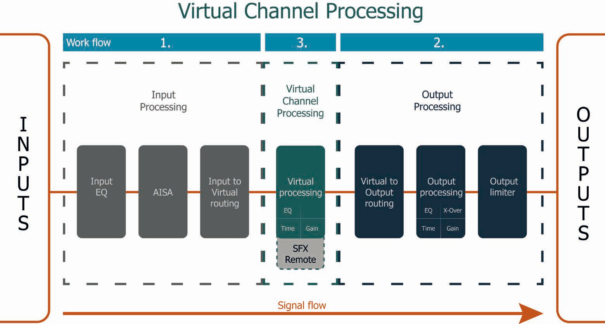

---

# Part 1 — Required

Skipping any of these risks damaging the amp or speakers.

## 1.1 Before connecting

- **Kenwood:** EQ flat, loudness off, all crossovers/HPF off, fader and balance centred, volume **low**.
- **Feel 700 (both subs):** low-pass knob to **maximum**, **Bass Boost to 0**, gain around 25%.
- **ICU 100 rears:** tweeter switch on **Flat**, not +3 dB (behind the grilles).
- **Test track:** PC-Tool home screen → **Audio Test Tracks** → copy **IGS – Input Gain Setup** to a USB stick for the Kenwood.
- Install PC-Tool **before** plugging the amp in. Ignition on, USB-C in, launch PC-Tool, accept the firmware update.

## 1.2 Open Advanced Gain Setup and mute all outputs

KB: [Adjustment of the input sensitivity](https://www.audiotec-fischer.de/en/knowledge-base/DSP-PC-Tool/dcm/)

Needs the amp connected — the title bar must not say "Disconnected".

1. **Input** tab → **Gain Configuration** → tick **Advanced Gain Setup** → click
   **Advanced Gain Adjustment**.
2. Click **Mute All Outputs**. The button then reads **Unmute All Outputs** — leave it like
   that. Nothing plays until 1.7.

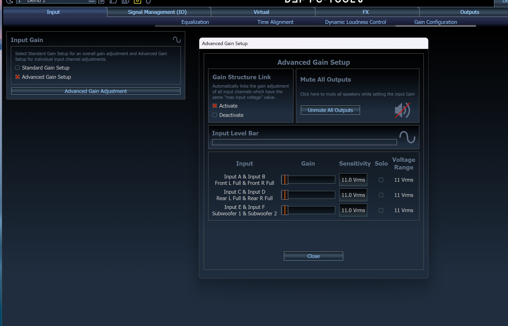

## 1.3 Input gain

No microphone — PC-Tool reads the electrical signal from the Kenwood, not sound in the car.
Only the **Input A & Input B** row matters; C–F aren't connected. Leave **Gain Structure Link**
on **Activate**.

1. Kenwood to **~90% volume**, play the **IGS** track. The **Input Level Bar** fills up.
2. Drag the **Input A & Input B** slider until the **∿ icon** at the end of the level bar turns
   **red**, then back **one step** until it goes grey again.

   

3. Turn the Kenwood back down and click **Close**.

## 1.4 Routing

KB: [Signal routing (IO) incl. VCP](https://www.audiotec-fischer.de/en/knowledge-base/DSP-PC-Tool/io/)

**Signal Management (IO)** → **Routing**.

**Main to Virtual Routing**

Left column = physical inputs (only **[Input A]** and **[Input B]** are wired). Right = virtual
channels. The blocks in between are **input names**, not speakers. Drag an input onto a row to
add it; right-click a block to remove it.

| Virtual channel | Fed from |
|---|---|
| Virtual A — Front L Full | [Input A] Front L Full 100% |
| Virtual B — Front R Full | [Input B] Front R Full 100% |
| Virtual C — Rear L Full | [Input A] Front L Full 100% — *replace the default Input C* |
| Virtual D — Rear R Full | [Input B] Front R Full 100% — *replace the default Input D* |
| Virtual E — Front Center | Empty — remove both blocks |
| Virtual F — Subwoofer 1 | Front L 50% + Front R 50% (default) |
| Virtual G — Subwoofer 2 | Empty — remove all blocks |

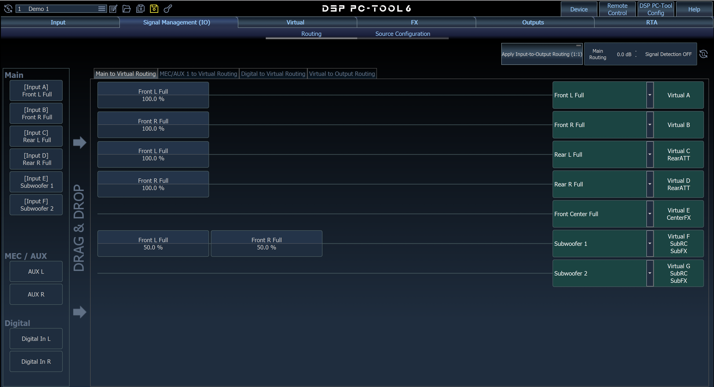

**Virtual to Output Routing**

The **block** on each row is the signal source — drag it from **Virtual Inputs** on the left
(right-click to remove). The **dropdown** on the right only names the output; it also sets the
phase control type.

| Output | Source block | Dropdown name |
|---|---|---|
| Amp Out A | [Virtual A] Front L Full | Front L High |
| Amp Out B | [Virtual B] Front R Full | Front R High |
| Amp Out C | [Virtual A] Front L Full | Front L Mid |
| Amp Out D | [Virtual B] Front R Full | Front R Mid |
| Amp Out E | [Virtual C] Rear L Full | Rear L Full |
| Amp Out F | [Virtual D] Rear R Full | Rear R Full |
| Line Out I | [Virtual F] Subwoofer 1 | Subwoofer 1 |

E/F should show **RearATT** and Line Out **SubRC** under the output name — that confirms the
right source.

Changing a dropdown asks **"Load Channel HP/LP Preset Filters?"** — click **No** (crossovers are
set in 1.5) and leave "Remember my choice" unticked.

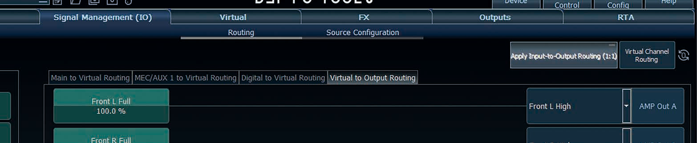

## 1.5 Crossovers

KB: [High- & lowpass filter](https://www.audiotec-fischer.de/en/knowledge-base/DSP-PC-Tool/filter/)

**Outputs** tab → click a channel button → set **Highpass** / **Lowpass Filter Section**.

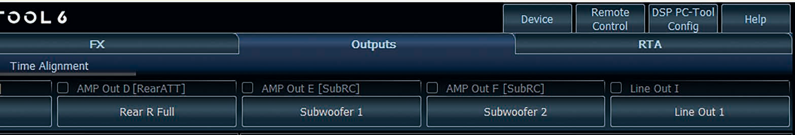
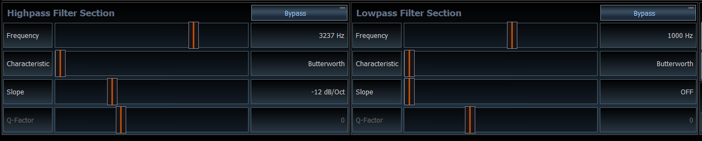

Every filter is **−24 dB**. Type is in brackets.

| Channel | Highpass | Lowpass |
|---|---|---|
| A / B tweeters | 2,500 Hz (Linkwitz) | Off |
| C / D midbass | 90 Hz (Linkwitz) | 2,500 Hz (Linkwitz) |
| E / F rears | 100 Hz (Butterworth) | Off |
| Line Out I sub | 30 Hz (Butterworth) | 90 Hz (Linkwitz) |

Where two speakers hand over, both sides use the **same frequency and Linkwitz**, so they blend
without a bump:

- **Sub → midbass at 90 Hz.** The MW4 is slim with little cone travel; the subs take the lowest notes.
- **Midbass → tweeter at 2,500 Hz.** Moves more of the vocals up from the footwells to the dash.
- **Sub bottom at 30 Hz.** The Feel 700 only plays down to 40 Hz — lower just wastes cone movement.

**Never set the tweeter highpass below 1,800 Hz or bypass it.** The AV 1.1 II is rated for only
10W continuous. If vocals sound thin or the tweeters get harsh, go back to 3,000 Hz on both A/B
and C/D.

Tick the checkbox next to the L and R channel names to **link** them, so each pair is set once.

**Off** means the **Bypass** light is lit (orange) or **Slope** is OFF. Check the graph matches
— one slope for tweeters/rears, a hill shape for midbass and sub. On E/F set the unused lowpass
**Slope** to OFF too, so an accidental un-bypass can't silence the rears.

Correct settings — one screenshot per channel

*These screenshots show the old values — use the table above.*

**Amp Out A — Front L High** (B is identical)

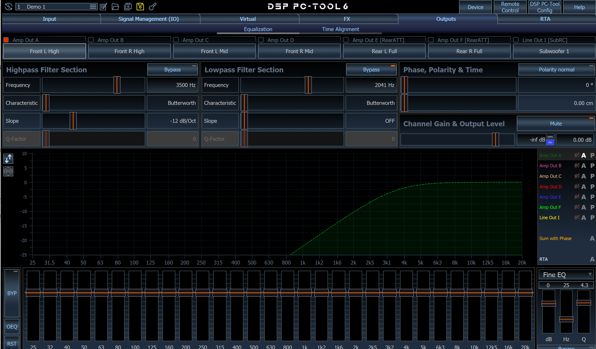

**Amp Out B — Front R High**

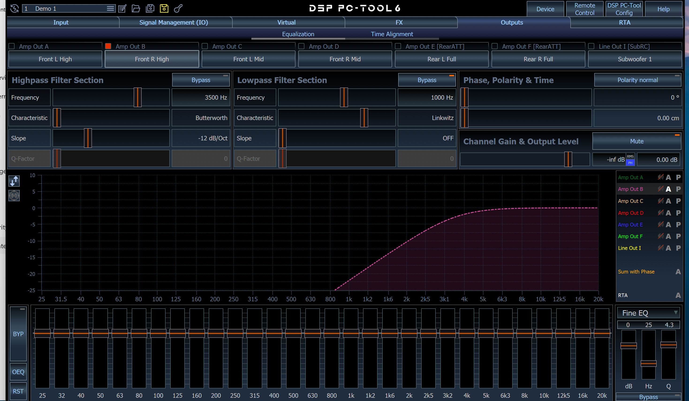

**Amp Out C — Front L Mid** (D is identical)

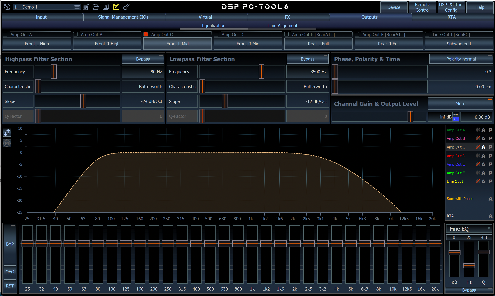

**Amp Out D — Front R Mid**

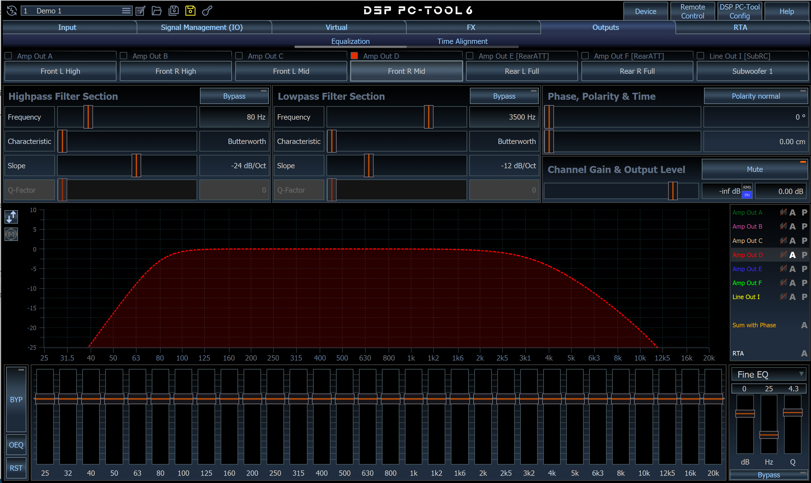

**Amp Out E — Rear L Full** (F is identical)

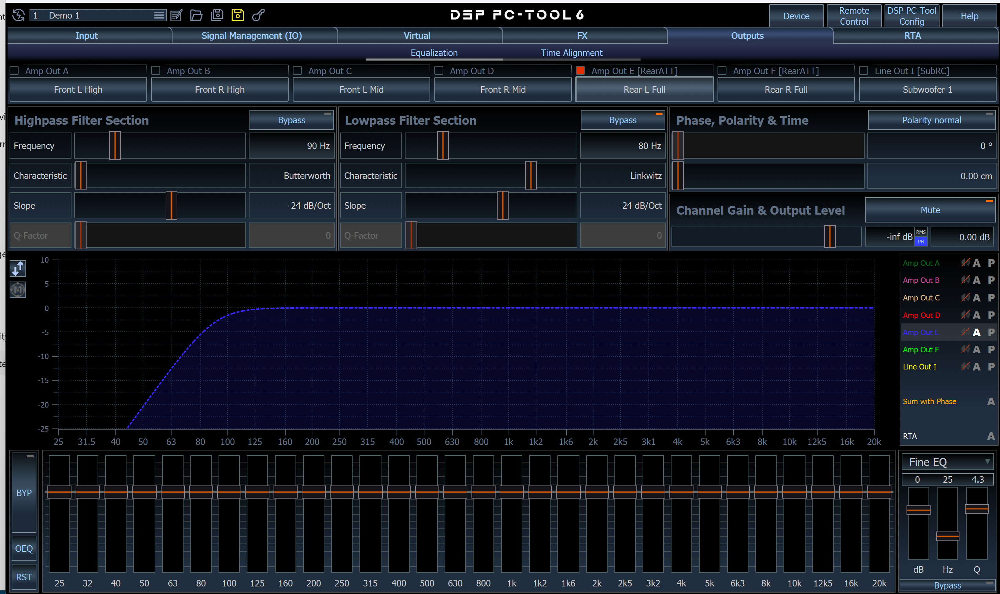

**Amp Out F — Rear R Full**

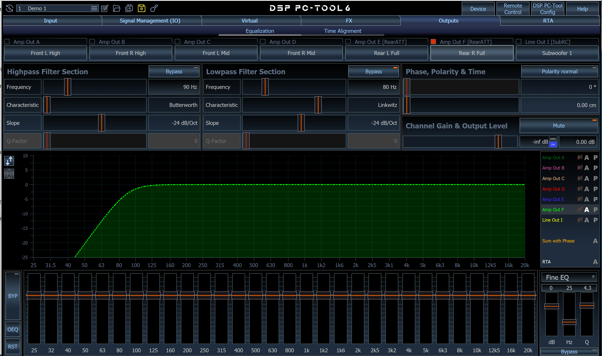

**Line Out I — Subwoofer 1**

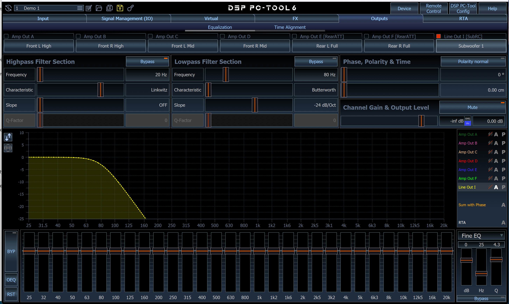

## 1.6 Save

Click **Save&Store** — it saves a file on the PC *and* writes the setup to the amp.
The red dot means unsaved changes, which are lost on power-off.

## 1.7 Speaker check

1. Kenwood volume low. **Outputs** tab → select each channel → set its output level to about
   **−10 dB**, tweeters **−15 dB**, and click **Mute** so every channel is individually muted.

   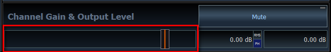

2. Back in **Advanced Gain Setup**, click **Unmute All Outputs** (channels stay muted
   individually).
3. **Outputs** tab → unmute **one pair**, check the right speakers play, mute again. Repeat for
   every pair.
4. Wrong speaker = routing or wiring mistake — fix before going further.

The system is now safe to use.

---

# Part 2 — Recommended

## 2.1 Levels

Unmute everything, play familiar music at moderate volume. Levels are set per channel on the
**Outputs** tab → select the channel → **Channel Gain & Output Level** slider (dB box on the
right). Move in **1–2 dB** steps, and link L/R so both sides change together.

Starting points, measured from the midbass:

| Channel | Start at |
|---|---|
| C / D midbass | 0 dB |
| A / B tweeters | −10 dB — start low, bring up by ear |
| E / F rears | −8 dB |
| Line Out I sub | By ear |

Then adjust by ear:

- Tweeters too bright → **lower** A/B.
- Thin vocals → **raise** C/D.
- Sound pulled behind you → **lower** E/F. Rears are for ambience, not volume.
- Sub → set with the **Line Out I** level, then day to day with the URC.3 knob.

**Save&Store**.

## 2.2 Time alignment

KB: [Phase and time alignment](https://www.audiotec-fischer.de/en/knowledge-base/DSP-PC-Tool/time/)

The driver sits much nearer the left speakers, so their sound arrives first and the stage pulls
left. Delaying the nearer speakers puts the image back in the centre of the dash.

**Outputs** tab → **Time Alignment** shows every channel on one screen (screenshot below is
an older PC-Tool layout — the controls are the same).

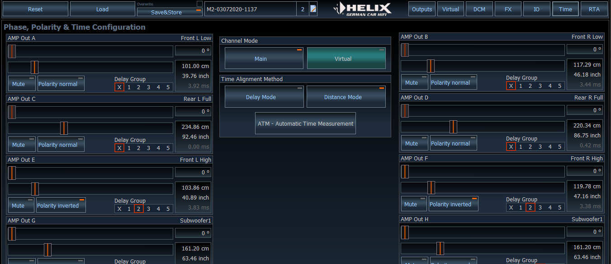

1. **Measure.** Sit in the driving position. With a tape measure, record the distance from the
   **centre of your head** (between your ears) to the centre of each speaker:

   | Speaker | Output | cm |
   |---|---|---|
   | Tweeter L | A | |
   | Tweeter R | B | |
   | Midbass L | C | |
   | Midbass R | D | |
   | Rear L | E | |
   | Rear R | F | |
   | Sub (under seats) | Line Out I | |

2. Under **Time Alignment Method**, choose **Distance Mode**.

   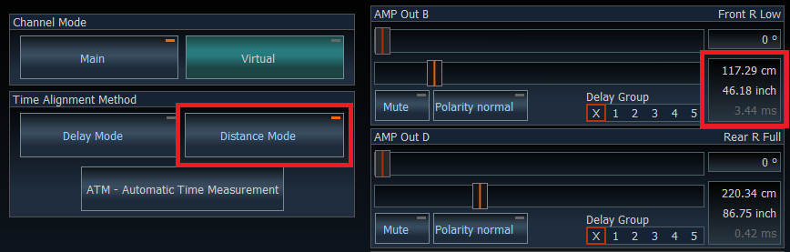

3. Enter each distance on its output's slider. PC-Tool works out the delays itself.
4. **Fine-tune the fronts by ear.** Mute rears and sub. Play a mono vocal track — the voice
   should sit dead centre on the dash. If it leans left, add a few cm to A/C; right, to B/D.
5. **Rears.** Unmute E/F. They should add ambience, not pull sound backwards — if they do,
   add **100–200 cm** extra to E and F.
6. **Save&Store**.

## 2.3 Polarity check

Where two speakers hand over, they can partly cancel each other out and leave a hollow gap.
Flipping one of them in PC-Tool can fix it. Do this after time alignment.

**Tweeter vs midbass**

1. Mute rears and sub. Play a mono vocal track.
2. Set A/B **Polarity** to inverted, listen, then back to normal.
3. Keep whichever sounds **fuller**, with the voice more solid and centred.

**Sub vs midbass**

1. Rears muted, sub on. Play a track with steady bass guitar or kick drum.
2. Set Line Out I **Polarity** to inverted, listen, then back to normal.
3. Keep whichever has **more punch** and sits **more up front**. For a final touch, nudge the
   **phase** slider until the bass is fullest.

Can't hear a difference? Leave it on normal. **Save&Store**.

## 2.4 URC.3 remote

Do this last — the passenger tune is a copy of your finished tune.

| Control | Does |
|---|---|
| Knob I | Sub level |
| Knob II | Rear level (rear attenuation) |
| Button | Switches between your tune and the passenger tune |

**Connect:** URC.3 → M141313 adaptor → amp's **SCP** port.

**Knobs**

1. **Remote Control** tab → activate the **URC.3**.
2. **Control I** → subwoofer volume.
3. **Control II** → rear attenuation. *If it isn't in the list, leave Control II unused.*
4. Check: the **Outputs** tab shows **[SubRC]** next to Line Out I and **[RearATT]** next to E/F.

**Button — passenger tune**

1. Your finished tune is in **memory 1**.
2. Copy it to **memory 2**, then change only:
   - Rears **E/F** up about **5 dB**.
   - Time alignment → set every distance the same, so the sound is balanced for the whole car
     instead of the driver.
3. **Save&Store**.
4. **Device** menu → **URC Setup Switch Configuration** → check the button toggles memory **1** and **2**
   (the default).

The URC.3's LED shows which tune is on.

*Menu names are from the amp manual — PC-Tool's wording may differ slightly.*

---

# Part 3 — Optional: EQ

KB: [Equalizer](https://www.audiotec-fischer.de/en/knowledge-base/DSP-PC-Tool/equalizer/) ·
[Real Time Analyzer](https://www.audiotec-fischer.de/en/knowledge-base/DSP-PC-Tool/rta/)

Only after Parts 1 and 2 — EQ on a system with wrong levels or delays just chases problems.
Each output channel has **30 bands** (1/3 octave, 25 Hz–20 kHz), **+6 dB boost / −15 dB cut**.
Cut more than you boost.

**The target isn't flat.** Road noise masks bass, so a flat car sounds thin and harsh. Aim for:

- **Bass** (below ~100 Hz) — 6–10 dB louder than the mids. Get this from the sub level, not EQ.
- **Mids** — the reference.
- **Treble** — easing off gently, a few dB down by 10 kHz.

**Outputs** tab → select a channel → drag the EQ sliders. Link L/R pairs first.

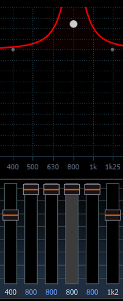

## 3.1 By ear (no mic)

1. Play familiar music at moderate volume. Change **one band at a time, 2–3 dB**.
2. **Midbass C/D:** small cabins usually boom around **100–250 Hz** — cut there first.
3. **Tweeters A/B:** harsh or fatiguing → cut around **3–6 kHz**.
4. Rears and sub: leave flat; set their levels instead.
5. If a change doesn't clearly help, put it back to 0. **Save&Store**.

## 3.2 With a measurement mic (UMIK-1) — best result

1. Plug the UMIK-1 into the Mac and pass it to the VM like the amp. Open the **RTA** tab →
   **Settings** → set **Audio device** to the UMIK-1, not the PC's own mic.
2. Play **pink noise** from **Audio Test Tracks** on the Kenwood. Sit in the driver's seat.
3. **Mute everything except the fronts** (A–D) and link them.
4. **Start Analyzer** → hold the mic upright and sweep slowly in a semicircle between your ears.
   Adjust volume until the level bar is neither **orange** (too quiet) nor **red** (too loud).

   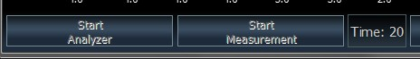

5. **Start Measurement**, then EQ the fronts toward the reference curve. **SetEQ / AutoEQ** can
   do a first pass over a chosen band range — tidy it by ear afterwards.
6. Repeat for the rears (fronts muted), then bring the sub in and match its level.
7. **Save&Store**.

Further topics (sound effects, loudness, input EQ) are in the
[knowledge base](https://www.audiotec-fischer.de/en/knowledge-base/DSP-PC-Tool/).
