I love the feeling of a good sound system, but I was never satisfied with the Jimny-sized 10cm
speakers buried in the footwell. So I upgraded the system in stages, and now I'm finally happy with
it. I stuck with the standard speaker size, added a 6-channel DSP amp, tweeters and two underseat
subs without any drilling or modification to the car body, and it's ended up sounding really great.

Contents

* TOC
{:toc}

## The system

One DSP amp drives every speaker on its own channel. It takes its signal from the head unit's
speaker outputs, and there's a sub under each front seat.

| Part | What it does |
|---|---|
| **[Kenwood DMX8021DABS](https://kenwood.eu/car/navigation_multimedia/multimedia/DMX8021DABS/)** | Head unit |
| **[Match UP 6DSP MK2](https://www.audiotec-fischer.de/en/match/amplifiers/up-6dsp-mk2)** | 6-channel amp with a 7-channel DSP. 130 × 130 × 46mm, so it fits in the glovebox |
| **[Morel Virtus Nano MW4](https://www.morelhifi.com/en/products/car-audio/reference-9/virtus-nano-carbon-18/virtus-nano-carbon-woofer-mw-4-55)** | 4" midbass in the footwell kick panels |
| **[Audison Voce II AV 1.1 II](https://audison.com/product/av-1-1-ii/)** | Tweeters on the dash |
| **[Focal ICU 100](https://www.focal.com/products/icu-100)** | 4" coaxials in the rear |
| **2 × [Harman Kardon Feel 700](https://caraudiodirect.co.uk/products/harmon-kardon-feel-700-active-underseat-car-subwoofer)** | Active underseat subs, 125W RMS each, daisy-chained |
| **[Audiotec Fischer URC.3](https://www.audiotec-fischer.de/en/brax/accessories/urc.3)** | Remote knob for sub and rear level |

Why the Match: it's a good DSP (digital sound processor), and it lets each speaker have its own
crossover, level, delay and EQ. It's Class D, so it doesn't get very hot, and it's small enough to
fit in the glovebox. The Kenwood head unit wasn't sufficient for powering the speakers.

An "active front stage" means each front tweeter and midbass (the 4" speaker that handles vocals
and punch) gets its own amp channel, and the DSP decides which frequencies each one plays. Doing it
in the DSP means I can tune each speaker for where it sits in the car.

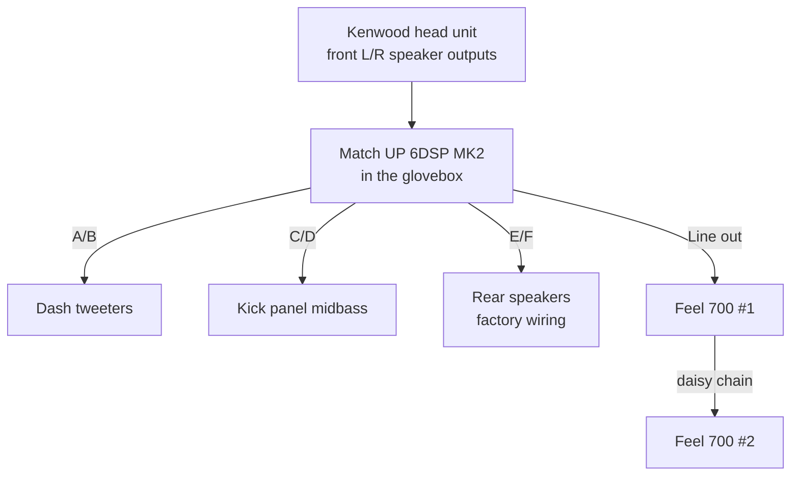

<figure class="wiring">
<svg viewBox="0 0 540 772" role="img" aria-label="Top-down wiring diagram of the Jimny, front at the top. Power runs from the battery on the driver side through the firewall grommet to a fuse block below the passenger-side glovebox, then to the amp in the glovebox and the sub under the driver's seat. The amp takes speaker-level signal from the head unit in the centre dash, drives the dash tweeters directly, and sends the midbass and rear channels through the factory wiring to the kick panels and rear side trims. An RCA lead runs from the amp to the driver-side sub, which chains power and signal to the passenger-side sub. The amp and sub grounds meet at the driver seat's front bolt. The URC.3 remote sits on the driver side of the centre console.">
<defs>
<marker id="wd-a-spk" viewBox="0 0 8 8" refX="7" refY="4" markerWidth="6" markerHeight="6" orient="auto"><path class="wd-f-spk" d="M0,0 L8,4 L0,8 z"/></marker>
<marker id="wd-a-rca" viewBox="0 0 8 8" refX="7" refY="4" markerWidth="6" markerHeight="6" orient="auto"><path class="wd-f-rca" d="M0,0 L8,4 L0,8 z"/></marker>
</defs>
<text class="wd-note" x="130" y="26">Passenger</text>
<text class="wd-note" x="270" y="26" text-anchor="middle">▲ Front</text>
<text class="wd-note" x="410" y="26" text-anchor="end">Driver (RHD)</text>
<rect class="wd-wheel" x="118" y="100" width="12" height="64" rx="3"/>
<rect class="wd-wheel" x="410" y="100" width="12" height="64" rx="3"/>
<rect class="wd-wheel" x="118" y="572" width="12" height="64" rx="3"/>
<rect class="wd-wheel" x="410" y="572" width="12" height="64" rx="3"/>
<rect class="wd-body" x="130" y="40" width="280" height="620" rx="28"/>
<line class="wd-trim" x1="130" y1="190" x2="410" y2="190"/>
<rect class="wd-dash" x="131" y="191" width="278" height="51"/>
<text class="wd-note" x="190" y="120" text-anchor="middle">Engine bay</text>
<rect class="wd-trim wd-fill" x="248" y="344" width="44" height="140" rx="6"/>
<rect class="wd-trim wd-fill" x="144" y="372" width="84" height="108" rx="8"/>
<rect class="wd-trim wd-fill" x="312" y="372" width="84" height="108" rx="8"/>
<line class="wd-trim" x1="144" y1="464" x2="228" y2="464"/>
<line class="wd-trim" x1="312" y1="464" x2="396" y2="464"/>
<text class="wd-note" x="186" y="476" text-anchor="middle">Passenger seat</text>
<text class="wd-note" x="354" y="476" text-anchor="middle">Driver seat</text>
<rect class="wd-trim wd-fill" x="144" y="520" width="252" height="76" rx="8"/>
<line class="wd-trim" x1="144" y1="580" x2="396" y2="580"/>
<text class="wd-note" x="270" y="556" text-anchor="middle">Rear seat</text>
<text class="wd-note" x="270" y="632" text-anchor="middle">Boot</text>
<rect class="wd-glovebox" x="146" y="198" width="74" height="40" rx="3"/>
<path class="wd-spk wd-loom" d="M154,228 H138 V524"/>
<path class="wd-spk wd-loom" d="M210,234 V242 H402 V524"/>
<path class="wd-pw wd-thick" d="M360,96 V276 H224"/>
<path class="wd-pw" d="M204,266 V234"/>
<path class="wd-pw" d="M204,286 V300 H376 V388"/>
<path class="wd-pw" d="M322,436 H218"/>
<path class="wd-gnd" d="M322,446 H218"/>
<path class="wd-rca" d="M172,234 V310 H350 V376 M350,376 L344,388 M350,376 L356,388"/>
<path class="wd-rca" d="M322,426 H220" marker-end="url(#wd-a-rca)"/>
<path class="wd-gnd" d="M166,234 V320 H318 V362"/>
<path class="wd-gnd" d="M330,388 V352 H318"/>
<circle class="wd-dot-gnd" cx="318" cy="352" r="3"/>
<path class="wd-gnd" d="M308,362 H328 M312,367 H324 M316,372 H320"/>
<path class="wd-ctl" d="M160,234 V330 H296 V348"/>
<path class="wd-spk" d="M154,210 H138 V203"/>
<path class="wd-spk" d="M200,204 V196 H395"/>
<path class="wd-spk" d="M236,219 H214" marker-end="url(#wd-a-spk)"/>
<rect class="wd-part" x="336" y="60" width="56" height="36" rx="3"/>
<text class="wd-label" x="364" y="82" text-anchor="middle">Battery</text>
<rect class="wd-part" x="354" y="114" width="12" height="26" rx="2"/>
<text class="wd-small" x="374" y="131">80A fuse</text>
<text class="wd-small" x="352" y="164" text-anchor="end">4AWG</text>
<circle class="wd-part" cx="360" cy="190" r="5"/>
<text class="wd-small" x="370" y="183">Grommet</text>
<rect class="wd-part" x="236" y="202" width="68" height="30" rx="3"/>
<text class="wd-label" x="270" y="221" text-anchor="middle">Head unit</text>
<rect class="wd-part" x="154" y="204" width="58" height="30" rx="3"/>
<text class="wd-label wd-bold" x="183" y="223" text-anchor="middle">Amp</text>
<rect class="wd-part" x="184" y="266" width="40" height="20" rx="2"/>
<text class="wd-small" x="204" y="280" text-anchor="middle">Fuses</text>
<text class="wd-small" x="210" y="262">40A</text>
<text class="wd-small" x="330" y="296">30A</text>
<rect class="wd-part" x="292" y="348" width="7" height="20" rx="1"/>
<text class="wd-small" x="287" y="362" text-anchor="end">URC.3</text>
<rect class="wd-sub" x="154" y="388" width="64" height="66" rx="3"/>
<text class="wd-label" x="186" y="418" text-anchor="middle">Feel 700</text>
<text class="wd-small" x="186" y="434" text-anchor="middle">sub 2</text>
<rect class="wd-sub" x="322" y="388" width="64" height="66" rx="3"/>
<text class="wd-label" x="354" y="418" text-anchor="middle">Feel 700</text>
<text class="wd-small" x="354" y="434" text-anchor="middle">sub 1</text>
<circle class="wd-part" cx="138" cy="196" r="6"/>
<circle class="wd-part" cx="402" cy="196" r="6"/>
<circle class="wd-part" cx="138" cy="300" r="10"/><circle class="wd-cone" cx="138" cy="300" r="4"/>
<circle class="wd-part" cx="402" cy="300" r="10"/><circle class="wd-cone" cx="402" cy="300" r="4"/>
<circle class="wd-part" cx="138" cy="524" r="10"/><circle class="wd-cone" cx="138" cy="524" r="4"/>
<circle class="wd-part" cx="402" cy="524" r="10"/><circle class="wd-cone" cx="402" cy="524" r="4"/>
<text class="wd-label" x="112" y="200" text-anchor="end">Tweeter</text>
<text class="wd-label" x="112" y="226" text-anchor="end">Amp in</text>
<text class="wd-label" x="112" y="242" text-anchor="end">glovebox</text>
<text class="wd-label" x="112" y="298" text-anchor="end">MW4 mid</text>
<text class="wd-small" x="112" y="313" text-anchor="end">kick panel</text>
<text class="wd-label" x="112" y="522" text-anchor="end">Focal coax</text>
<text class="wd-small" x="112" y="537" text-anchor="end">rear side trim</text>
<text class="wd-label" x="428" y="200">Tweeter</text>
<text class="wd-label" x="428" y="298">MW4 mid</text>
<text class="wd-small" x="428" y="313">kick panel</text>
<text class="wd-label" x="428" y="522">Focal coax</text>
<text class="wd-small" x="428" y="537">rear side trim</text>
<g transform="translate(40,692)">
<line class="wd-pw wd-thick" x1="0" y1="0" x2="24" y2="0"/><text class="wd-small" x="32" y="4">Power</text>
<line class="wd-gnd" x1="150" y1="0" x2="174" y2="0"/><text class="wd-small" x="182" y="4">Ground</text>
<line class="wd-spk" x1="300" y1="0" x2="324" y2="0"/><text class="wd-small" x="332" y="4">Speaker, new wire</text>
<line class="wd-spk wd-loom" x1="0" y1="24" x2="24" y2="24"/><text class="wd-small" x="32" y="28">Speaker, factory loom</text>
<line class="wd-rca" x1="150" y1="24" x2="174" y2="24"/><text class="wd-small" x="182" y="28">RCA</text>
<line class="wd-ctl" x1="300" y1="24" x2="324" y2="24"/><text class="wd-small" x="332" y="28">URC.3 lead</text>
<path class="wd-gnd" d="M2,44 H22 M6,49 H18 M10,54 H14"/><text class="wd-small" x="32" y="52">Ground at the driver seat's front bolt</text>
</g>
</svg>
<figcaption>Top-down, front at the top. The amp takes the head unit's front speaker outputs and drives
every speaker: the tweeters on new wire, and the midbass and rears through the factory wiring. Sub 1 passes power and signal on to sub 2.</figcaption>
</figure>

## Power

At full volume the amp can draw 35A and the two subs 28A between them, so 63A in total.

1. 4AWG cable (about 21mm²) from the battery positive to an 80A fuse, within 300mm of the battery.
2. Through the firewall to a 4-way fuse distribution block under the dash. I made a hole in the
   existing rubber grommet on the driver side and fed the cable through it.
3. Two 8AWG (about 8mm²) fused branches from the block: 40A to the amp and 30A to the subs.
4. The second sub takes its power from the first sub's POWER OUT block, so one feed serves both.

I used 100% OFC (oxygen-free copper) cable throughout, not the cheaper CCA (copper-clad aluminium).
It costs more, but CCA has higher resistance, so it would need to be thicker to carry the same
current.

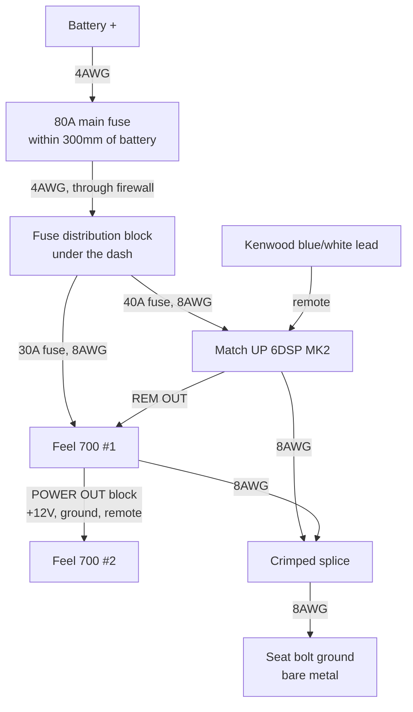

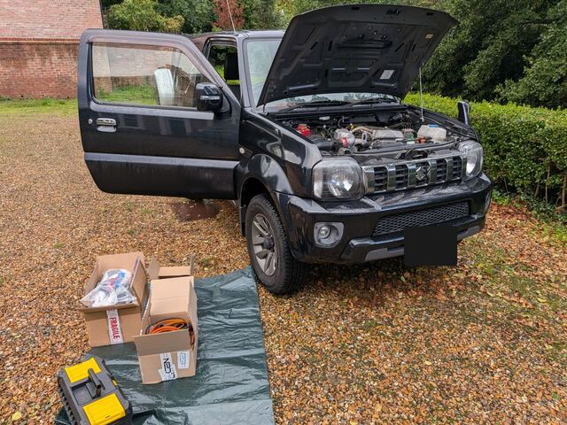
*Day one: bonnet up, doors open, kit on the driveway.*

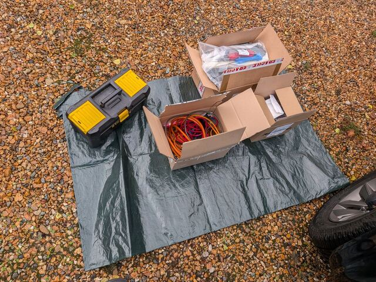
*The kit, before starting.*

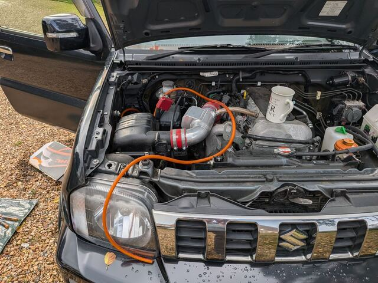
*The 4AWG run from the battery, before routing and tidying.*

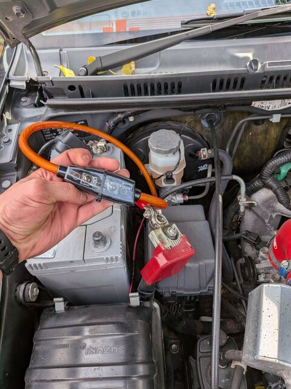
*80A main fuse, close to the battery.*

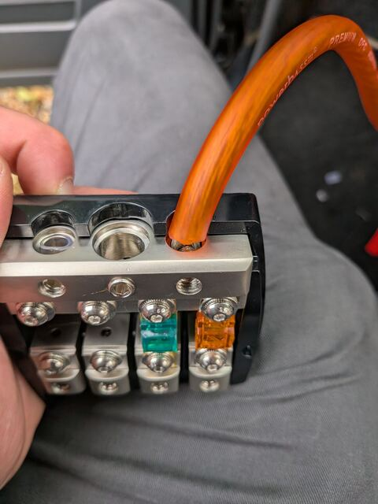
*The distribution block with the amp and sub fuses.*

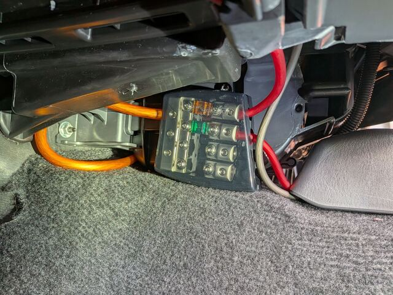
*Fitted under the dash, where the fuses stay reachable.*

### Ground

The amp and sub grounds join in one heavy crimped splice and go to the front bolt of the driver's
seat, sanded to bare metal on both faces. Using one ground point for everything stops alternator
whine, and I haven't had any.

I planned to upgrade the battery-to-body strap to 4AWG too, but on the JB43 the factory strap is
very short and already sized for the starter motor, which pulls far more than 63A. So I left it.

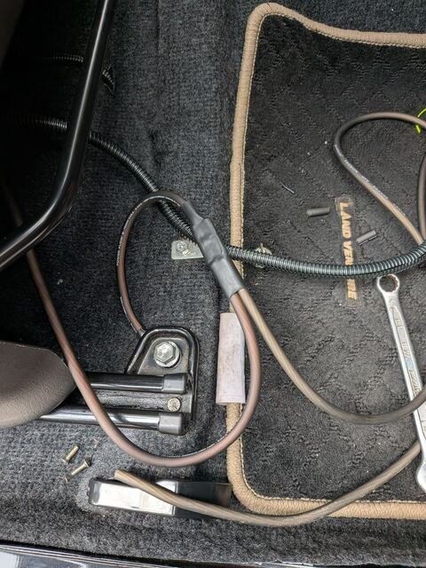
*The ground at the seat bolt, with the amp and sub grounds joined in a single heat-shrunk splice.*

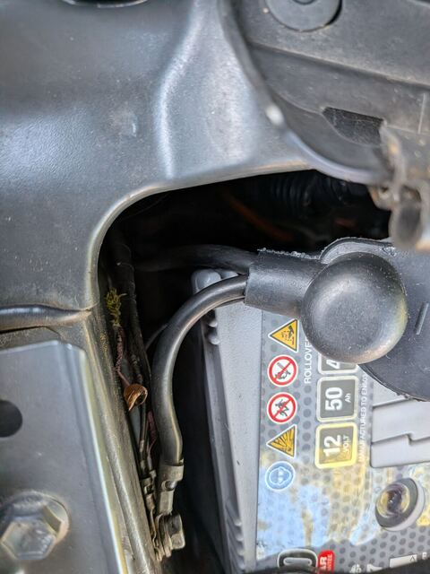
*The factory battery-to-body strap is short enough to leave alone.*

Remote turn-on switches the amp and subs on and off with the head unit. The Kenwood's blue/white
power-control lead goes to the amp's REM IN, and the amp's REM OUT switches the subs. There's no
splicing into the car's wiring.

## Signal

The Kenwood's wiring harness plugs into the car's ISO connector. I cut only its 8 speaker wires,
which leaves two loose ends:

- The Kenwood end goes to the amp's inputs. Only front left and right are used, and the DSP makes
  every other channel from those two.
- The car end is fed from the amp's midbass and rear outputs, so the factory wiring still carries
  the signal to those speakers.

The tweeters are the only speakers with new wire, since there's no factory wiring to the dash.

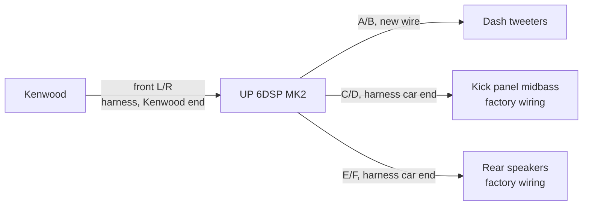

All the joins are crimped butt connectors. I didn't cut anything on the car's own loom, so fitting a
new Kenwood harness would put it all back to standard.

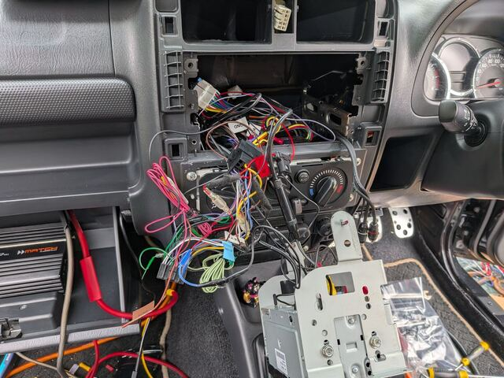
*Head unit out. The speaker wires on the Kenwood's harness get cut behind here.*

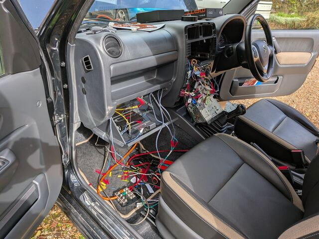
*The dash stripped mid-install.*

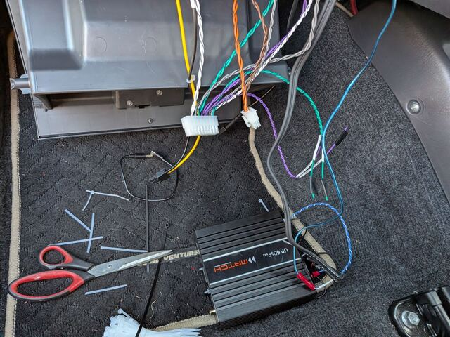
*The amp's plug-in harnesses, ready to be wired to the head unit harness.*

## The amp in the glovebox

I planned to mount the amp behind the glovebox, but the space back there was too awkward to work in.
So it went inside the glovebox on heavy-duty velcro, with the cables fed through the existing gap at
the back. Nothing was drilled, and I can still reach the USB port for tuning.

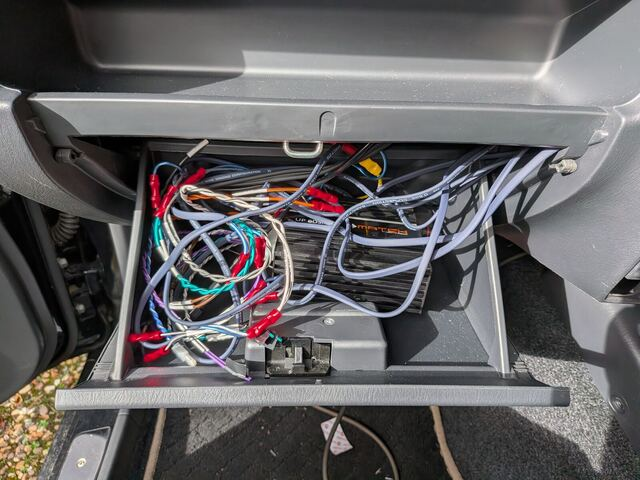
*Before tidying: everything comes together in the glovebox.*

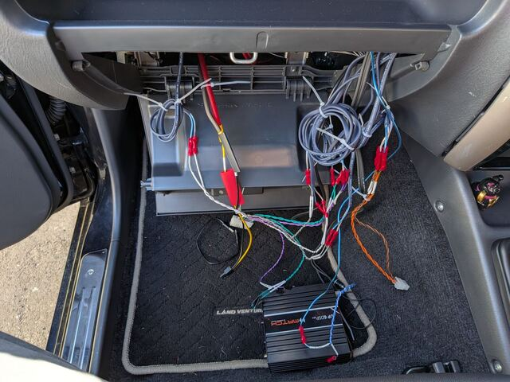
*Mid-install. The amp's harnesses come with bare wire ends, so nothing needs terminating at the amp.*

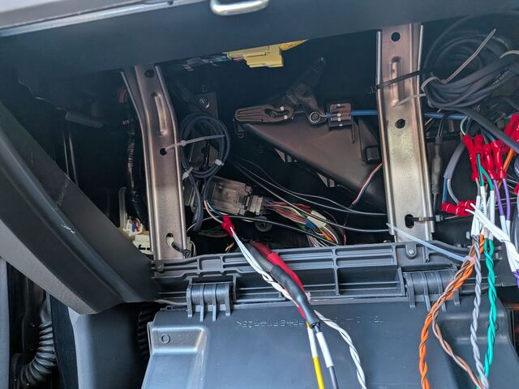
*Behind the glovebox. The cables come through the gap at the back.*

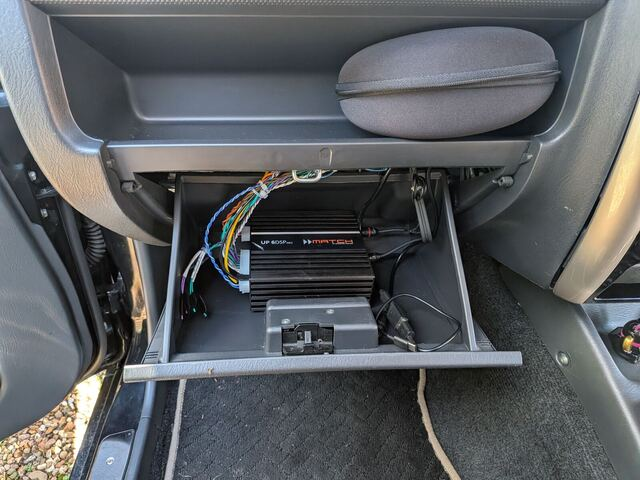
*Mounted. The glovebox still opens and closes freely, but can't be used for storage any more.*

## Two subs under the seats

The Feel 700 is 260 × 195 × 58mm and fits under both front seats. The second sub is chained from
the first: power through the POWER OUT block, and signal through an RCA lead from the first sub's
output.

The supplied pigtails don't reach between the seats on their own, so I extended them with 27A cable
(about 3mm²), red for +12V and black for ground, and ~1mm² hook-up wire for the blue remote lead.
All the joins are crimped butt connectors.

The amp's sub output is mono, with one RCA socket, but the Feel 700 needs a signal on both its left
and right inputs. A cheap 1-female-to-2-male Y-adapter at the sub end sorts that out. Without it the
sub plays quieter.

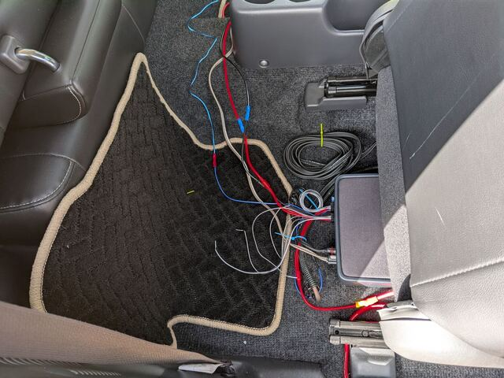
*Wiring in progress. The seats stayed in.*

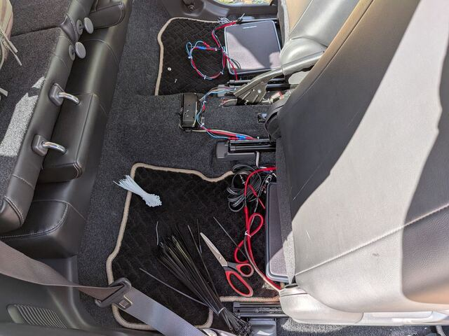
*Running the sub wiring.*

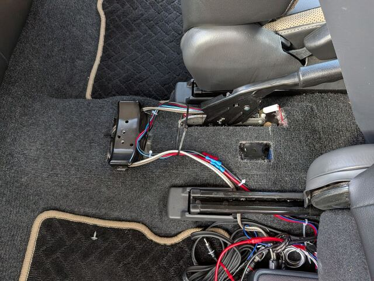
*The Feel 700's supplied pigtails joined between the seats with crimped butt connectors and heat
shrink.*

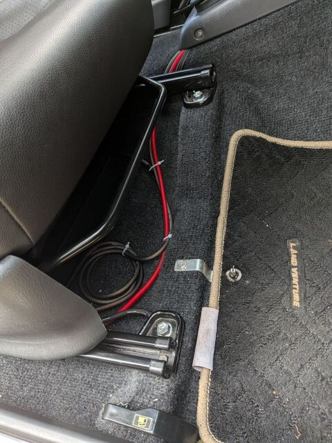
*The main power run comes in under the driver's seat, where the amp ground joins the sub ground. These runs will get a proper tidy-up.*

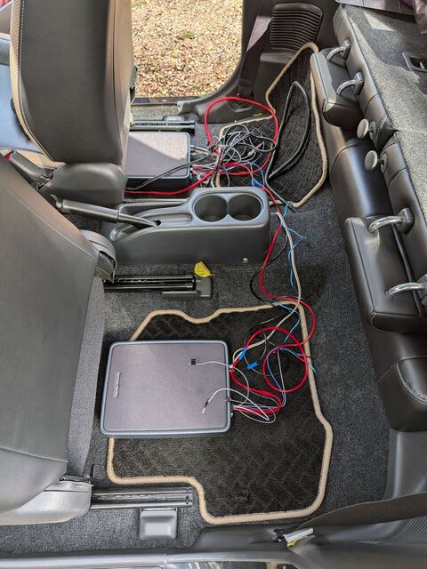
*One sub in place under the seat.*

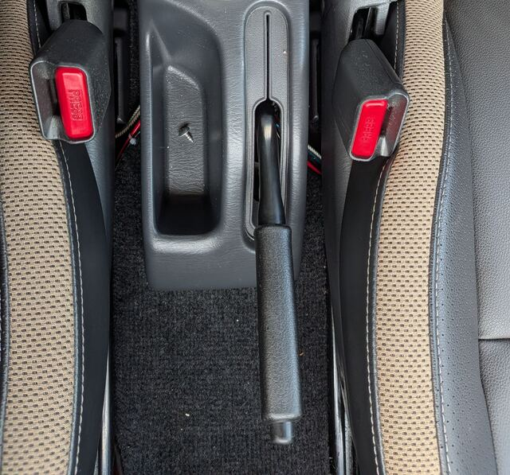
*Mostly tidy. A few wires still show beside the console.*

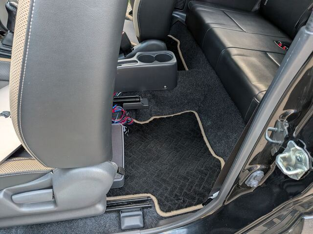
*The finished sub, seen from the back seat with the front seat slid all the way forward. Rear
passengers can still get in and out without any trouble.*

## Speakers

I had a shop fit the rear Focal ICU 100s, since getting to the rear speakers means taking the rear
seats out. If you'd rather do it yourself, there's a good step-by-step guide:
[Installation of the rear speakers on the Suzuki Jimny](https://web.archive.org/web/20180319083057/http://www.danbp.org/p/node/104).

### Front speakers

The front speakers sit in the footwell side panels (the kick panels). Getting to them is simple:

1. Undo the screws on the silver sill plate along the bottom of the door opening and lift it off.
2. The plastic trim underneath pops off.
3. The kick panel then pops off, exposing the speaker.

The front stage is Morel Virtus Nano MW4 midbass and Audison Voce II AV 1.1 II tweeters. The MW4 is
from Morel's high-end range, with a carbon-fibre cone and a neodymium magnet. The AV 1.1 II is a
soft-dome tweeter that plays up to 40kHz. Vocals and instruments are cleaner and more detailed than
before, especially at higher volume.

- The MW4 is only 17mm deep, which suits the Jimny's kick panels.
- The AV 1.1 II can cross lower than most tweeters (down to 1.8kHz), which lifts the vocals from the
  footwells up to the dash.

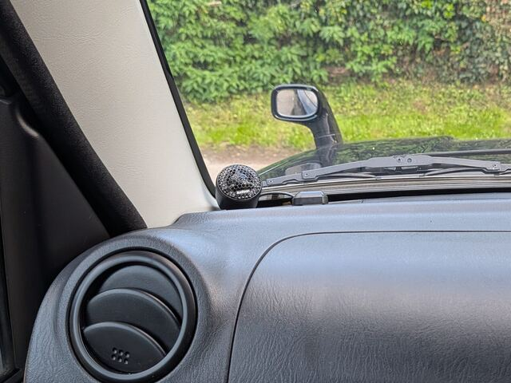
*The tweeter sits on the dash at the base of the A-pillar. Note: the photo shows the previous
Audison AP1 tweeter.*

Mounting the tweeters means taking off the A-pillar trims, which is easy:

1. Peel back the door rubber along the pillar. It makes the trim much easier to get at.
2. Starting at the top, slide a plastic trim tool (or your fingers) under the edge and pull the trim
   towards the inside of the car. The bottom end tucks behind the lower trim and lifts out.
3. To refit, check the metal clips, because they tend to stay on the trim when it comes off. Move
   each one back into its hole in the pillar first, line the trim up and push it firmly home. If
   you refit with the clips still on the trim, it sits slightly proud and rattles.

## Tuning

I set up the DSP in Audiotec Fischer's DSP PC-Tool. It's Windows only, so on my Mac I ran it in a
virtual machine, using the free VMware Fusion. I set the Kenwood flat first, with EQ, loudness and
crossovers all off.

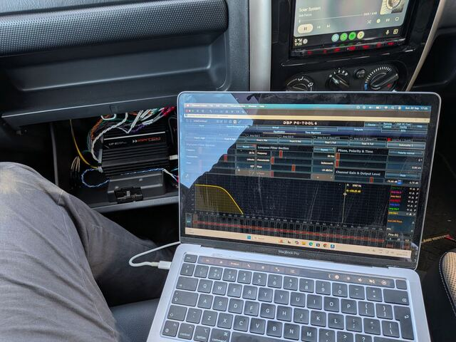
*Tuning from the passenger seat, laptop plugged straight into the amp in the glovebox.*

### Input gain

This matches the amp to the head unit's signal. With every output muted, so
nothing actually plays, I put the Kenwood at about 90% volume and played Audiotec Fischer's IGS test
track. In PC-Tool's Advanced Gain Setup I raised the input slider until the clip indicator turned
red, then backed it off one step.

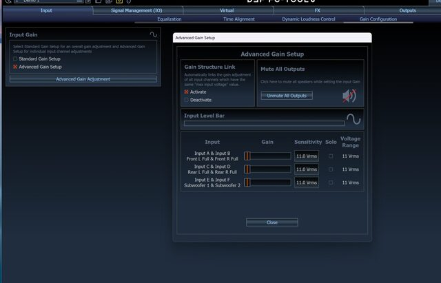
*PC-Tool's Advanced Gain Setup, with all outputs muted while the input gain is set.*

### Crossovers

The crossovers are the filters that decide which speaker plays which frequencies. These are my
starting settings, with every filter at −24dB:

| Speaker | Plays |
|---|---|
| Tweeters | Above 2,500 Hz |
| Midbass | 90 – 2,500 Hz |
| Rears | Above 100 Hz, kept quieter than the fronts |
| Subs | 30 – 90 Hz |

<figure class="crossover">
<svg viewBox="0 0 540 268" role="img" aria-label="Crossover chart, frequency from 20 Hz to 20 kHz. The subs play 30 to 90 Hz, the midbass 90 Hz to 2.5 kHz and the tweeters above 2.5 kHz. At 90 Hz and 2.5 kHz the neighbouring speakers cross at the same point, each 6 dB down, so they add back to flat.">
<line class="xo-grid" x1="56" y1="34" x2="520" y2="34"/>
<text class="xo-tick" x="48" y="38" text-anchor="end">0 dB</text>
<line class="xo-grid" x1="56" y1="106" x2="520" y2="106"/>
<text class="xo-tick" x="48" y="110" text-anchor="end">−12</text>
<line class="xo-grid" x1="56" y1="178" x2="520" y2="178"/>
<text class="xo-tick" x="48" y="182" text-anchor="end">−24</text>
<line class="xo-axis" x1="56" y1="214" x2="520" y2="214"/>
<text class="xo-tick" x="56" y="232" text-anchor="start">20 Hz</text>
<text class="xo-tick" x="164" y="232" text-anchor="middle">100 Hz</text>
<text class="xo-tick" x="319" y="232" text-anchor="middle">1 kHz</text>
<text class="xo-tick" x="473" y="232" text-anchor="middle">10 kHz</text>
<line class="xo-mark" x1="83.2" y1="20" x2="83.2" y2="214"/>
<text class="xo-tick" x="83.2" y="16" text-anchor="middle">30 Hz</text>
<line class="xo-mark" x1="157.0" y1="20" x2="157.0" y2="214"/>
<text class="xo-tick" x="157.0" y="16" text-anchor="middle">90 Hz</text>
<line class="xo-mark" x1="380.3" y1="20" x2="380.3" y2="214"/>
<text class="xo-tick" x="380.3" y="16" text-anchor="middle">2.5 kHz</text>
<path class="xo-line xo-sub" d="M56.0,128.0 L57.2,125.1 L58.3,122.1 L59.5,119.2 L60.6,116.4 L61.8,113.5 L63.0,110.7 L64.1,108.0 L65.3,105.3 L66.4,102.7 L67.6,100.1 L68.8,97.6 L69.9,95.1 L71.1,92.6 L72.2,90.3 L73.4,87.9 L74.6,85.7 L75.7,83.5 L76.9,81.4 L78.0,79.3 L79.2,77.3 L80.4,75.3 L81.5,73.4 L82.7,71.6 L83.8,69.9 L85.0,68.2 L86.2,66.5 L87.3,65.0 L88.5,63.5 L89.6,62.1 L90.8,60.7 L92.0,59.4 L93.1,58.2 L94.3,57.0 L95.4,55.9 L96.6,54.8 L97.8,53.8 L98.9,52.9 L100.1,52.0 L101.2,51.2 L102.4,50.4 L103.6,49.7 L104.7,49.1 L105.9,48.5 L107.0,47.9 L108.2,47.4 L109.4,46.9 L110.5,46.5 L111.7,46.2 L112.8,45.9 L114.0,45.6 L115.2,45.4 L116.3,45.2 L117.5,45.1 L118.6,45.0 L119.8,45.0 L121.0,45.0 L122.1,45.0 L123.3,45.1 L124.4,45.3 L125.6,45.5 L126.8,45.7 L127.9,46.0 L129.1,46.3 L130.2,46.7 L131.4,47.1 L132.6,47.6 L133.7,48.1 L134.9,48.7 L136.0,49.3 L137.2,50.0 L138.4,50.7 L139.5,51.5 L140.7,52.4 L141.8,53.3 L143.0,54.2 L144.2,55.3 L145.3,56.3 L146.5,57.5 L147.6,58.7 L148.8,59.9 L150.0,61.3 L151.1,62.7 L152.3,64.1 L153.4,65.6 L154.6,67.2 L155.8,68.9 L156.9,70.6 L158.1,72.4 L159.2,74.2 L160.4,76.1 L161.6,78.1 L162.7,80.2 L163.9,82.3 L165.0,84.4 L166.2,86.6 L167.4,88.9 L168.5,91.3 L169.7,93.7 L170.8,96.1 L172.0,98.6 L173.2,101.2 L174.3,103.8 L175.5,106.5 L176.6,109.2 L177.8,111.9 L179.0,114.7 L180.1,117.6 L181.3,120.5 L182.4,123.4 L183.6,126.3 L184.8,129.3 L185.9,132.4 L187.1,135.4 L188.2,138.5 L189.4,141.6 L190.6,144.8 L191.7,148.0 L192.9,151.2 L194.0,154.4 L195.2,157.6 L196.4,160.9 L197.5,164.2 L198.7,167.5 L199.8,170.8 L201.0,174.2 L202.2,177.5 L203.3,180.9 L204.5,184.3 L205.6,187.7 L206.8,191.1 L208.0,194.5 L209.1,198.0 L210.3,201.4 L211.4,204.9 L212.6,208.4 L213.8,211.8"/>
<path class="xo-line xo-mid" d="M100.1,212.5 L101.2,209.0 L102.4,205.5 L103.6,202.1 L104.7,198.6 L105.9,195.2 L107.0,191.7 L108.2,188.3 L109.4,184.9 L110.5,181.5 L111.7,178.1 L112.8,174.8 L114.0,171.4 L115.2,168.1 L116.3,164.8 L117.5,161.5 L118.6,158.2 L119.8,154.9 L121.0,151.7 L122.1,148.5 L123.3,145.3 L124.4,142.1 L125.6,139.0 L126.8,135.9 L127.9,132.8 L129.1,129.8 L130.2,126.8 L131.4,123.8 L132.6,120.9 L133.7,118.0 L134.9,115.1 L136.0,112.3 L137.2,109.5 L138.4,106.8 L139.5,104.1 L140.7,101.4 L141.8,98.9 L143.0,96.3 L144.2,93.8 L145.3,91.4 L146.5,89.0 L147.6,86.7 L148.8,84.4 L150.0,82.2 L151.1,80.1 L152.3,78.0 L153.4,76.0 L154.6,74.0 L155.8,72.1 L156.9,70.3 L158.1,68.5 L159.2,66.8 L160.4,65.2 L161.6,63.6 L162.7,62.0 L163.9,60.6 L165.0,59.2 L166.2,57.8 L167.4,56.5 L168.5,55.3 L169.7,54.1 L170.8,53.0 L172.0,51.9 L173.2,50.9 L174.3,49.9 L175.5,49.0 L176.6,48.1 L177.8,47.3 L179.0,46.5 L180.1,45.7 L181.3,45.0 L182.4,44.4 L183.6,43.7 L184.8,43.1 L185.9,42.6 L187.1,42.1 L188.2,41.6 L189.4,41.1 L190.6,40.6 L191.7,40.2 L192.9,39.8 L194.0,39.5 L195.2,39.1 L196.4,38.8 L197.5,38.5 L198.7,38.2 L199.8,37.9 L201.0,37.7 L202.2,37.4 L203.3,37.2 L204.5,37.0 L205.6,36.8 L206.8,36.6 L208.0,36.5 L209.1,36.3 L210.3,36.1 L211.4,36.0 L212.6,35.9 L213.8,35.8 L214.9,35.6 L216.1,35.5 L217.2,35.4 L218.4,35.3 L219.6,35.2 L220.7,35.2 L221.9,35.1 L223.0,35.0 L224.2,35.0 L225.4,34.9 L226.5,34.8 L227.7,34.8 L228.8,34.7 L230.0,34.7 L231.2,34.6 L232.3,34.6 L233.5,34.6 L234.6,34.5 L235.8,34.5 L237.0,34.5 L238.1,34.4 L239.3,34.4 L240.4,34.4 L241.6,34.4 L242.8,34.3 L243.9,34.3 L245.1,34.3 L246.2,34.3 L247.4,34.3 L248.6,34.2 L249.7,34.2 L250.9,34.2 L252.0,34.2 L253.2,34.2 L254.4,34.2 L255.5,34.2 L256.7,34.2 L257.8,34.2 L259.0,34.2 L260.2,34.2 L261.3,34.1 L262.5,34.1 L263.6,34.1 L264.8,34.1 L266.0,34.1 L267.1,34.1 L268.3,34.1 L269.4,34.1 L270.6,34.1 L271.8,34.1 L272.9,34.1 L274.1,34.1 L275.2,34.1 L276.4,34.1 L277.6,34.2 L278.7,34.2 L279.9,34.2 L281.0,34.2 L282.2,34.2 L283.4,34.2 L284.5,34.2 L285.7,34.2 L286.8,34.2 L288.0,34.2 L289.2,34.2 L290.3,34.3 L291.5,34.3 L292.6,34.3 L293.8,34.3 L295.0,34.3 L296.1,34.4 L297.3,34.4 L298.4,34.4 L299.6,34.4 L300.8,34.5 L301.9,34.5 L303.1,34.5 L304.2,34.6 L305.4,34.6 L306.6,34.6 L307.7,34.7 L308.9,34.7 L310.0,34.8 L311.2,34.8 L312.4,34.9 L313.5,35.0 L314.7,35.0 L315.8,35.1 L317.0,35.2 L318.2,35.3 L319.3,35.4 L320.5,35.5 L321.6,35.6 L322.8,35.7 L324.0,35.8 L325.1,35.9 L326.3,36.0 L327.4,36.2 L328.6,36.3 L329.8,36.5 L330.9,36.7 L332.1,36.9 L333.2,37.1 L334.4,37.3 L335.6,37.5 L336.7,37.7 L337.9,38.0 L339.0,38.3 L340.2,38.6 L341.4,38.9 L342.5,39.2 L343.7,39.6 L344.8,39.9 L346.0,40.3 L347.2,40.8 L348.3,41.2 L349.5,41.7 L350.6,42.2 L351.8,42.8 L353.0,43.3 L354.1,43.9 L355.3,44.6 L356.4,45.3 L357.6,46.0 L358.8,46.7 L359.9,47.5 L361.1,48.4 L362.2,49.3 L363.4,50.2 L364.6,51.2 L365.7,52.2 L366.9,53.3 L368.0,54.5 L369.2,55.7 L370.4,56.9 L371.5,58.2 L372.7,59.6 L373.8,61.0 L375.0,62.5 L376.2,64.1 L377.3,65.7 L378.5,67.3 L379.6,69.1 L380.8,70.9 L382.0,72.7 L383.1,74.6 L384.3,76.6 L385.4,78.7 L386.6,80.8 L387.8,82.9 L388.9,85.2 L390.1,87.4 L391.2,89.8 L392.4,92.2 L393.6,94.6 L394.7,97.1 L395.9,99.7 L397.0,102.3 L398.2,104.9 L399.4,107.6 L400.5,110.4 L401.7,113.2 L402.8,116.0 L404.0,118.9 L405.2,121.8 L406.3,124.7 L407.5,127.7 L408.6,130.7 L409.8,133.8 L411.0,136.9 L412.1,140.0 L413.3,143.1 L414.4,146.3 L415.6,149.5 L416.8,152.7 L417.9,156.0 L419.1,159.2 L420.2,162.5 L421.4,165.8 L422.6,169.1 L423.7,172.5 L424.9,175.8 L426.0,179.2 L427.2,182.6 L428.4,186.0 L429.5,189.4 L430.7,192.8 L431.8,196.3 L433.0,199.7 L434.2,203.2 L435.3,206.6 L436.5,210.1 L437.6,213.6"/>
<path class="xo-line xo-tw" d="M324.0,210.7 L325.1,207.2 L326.3,203.8 L327.4,200.3 L328.6,196.9 L329.8,193.4 L330.9,190.0 L332.1,186.6 L333.2,183.2 L334.4,179.8 L335.6,176.4 L336.7,173.1 L337.9,169.7 L339.0,166.4 L340.2,163.1 L341.4,159.8 L342.5,156.5 L343.7,153.3 L344.8,150.1 L346.0,146.9 L347.2,143.7 L348.3,140.5 L349.5,137.4 L350.6,134.3 L351.8,131.3 L353.0,128.2 L354.1,125.3 L355.3,122.3 L356.4,119.4 L357.6,116.5 L358.8,113.7 L359.9,110.9 L361.1,108.1 L362.2,105.4 L363.4,102.7 L364.6,100.1 L365.7,97.6 L366.9,95.0 L368.0,92.6 L369.2,90.2 L370.4,87.8 L371.5,85.6 L372.7,83.3 L373.8,81.1 L375.0,79.0 L376.2,77.0 L377.3,75.0 L378.5,73.1 L379.6,71.2 L380.8,69.4 L382.0,67.6 L383.1,66.0 L384.3,64.3 L385.4,62.8 L386.6,61.3 L387.8,59.8 L388.9,58.5 L390.1,57.2 L391.2,55.9 L392.4,54.7 L393.6,53.5 L394.7,52.4 L395.9,51.4 L397.0,50.4 L398.2,49.4 L399.4,48.5 L400.5,47.7 L401.7,46.9 L402.8,46.1 L404.0,45.4 L405.2,44.7 L406.3,44.0 L407.5,43.4 L408.6,42.9 L409.8,42.3 L411.0,41.8 L412.1,41.3 L413.3,40.9 L414.4,40.4 L415.6,40.0 L416.8,39.6 L417.9,39.3 L419.1,38.9 L420.2,38.6 L421.4,38.3 L422.6,38.1 L423.7,37.8 L424.9,37.5 L426.0,37.3 L427.2,37.1 L428.4,36.9 L429.5,36.7 L430.7,36.5 L431.8,36.4 L433.0,36.2 L434.2,36.1 L435.3,35.9 L436.5,35.8 L437.6,35.7 L438.8,35.6 L440.0,35.5 L441.1,35.4 L442.3,35.3 L443.4,35.2 L444.6,35.1 L445.8,35.0 L446.9,35.0 L448.1,34.9 L449.2,34.9 L450.4,34.8 L451.6,34.7 L452.7,34.7 L453.9,34.6 L455.0,34.6 L456.2,34.6 L457.4,34.5 L458.5,34.5 L459.7,34.5 L460.8,34.4 L462.0,34.4 L463.2,34.4 L464.3,34.3 L465.5,34.3 L466.6,34.3 L467.8,34.3 L469.0,34.3 L470.1,34.2 L471.3,34.2 L472.4,34.2 L473.6,34.2 L474.8,34.2 L475.9,34.2 L477.1,34.2 L478.2,34.2 L479.4,34.1 L480.6,34.1 L481.7,34.1 L482.9,34.1 L484.0,34.1 L485.2,34.1 L486.4,34.1 L487.5,34.1 L488.7,34.1 L489.8,34.1 L491.0,34.1 L492.2,34.1 L493.3,34.1 L494.5,34.1 L495.6,34.1 L496.8,34.1 L498.0,34.0 L499.1,34.0 L500.3,34.0 L501.4,34.0 L502.6,34.0 L503.8,34.0 L504.9,34.0 L506.1,34.0 L507.2,34.0 L508.4,34.0 L509.6,34.0 L510.7,34.0 L511.9,34.0 L513.0,34.0 L514.2,34.0 L515.4,34.0 L516.5,34.0 L517.7,34.0 L518.8,34.0 L520.0,34.0"/>
<text class="xo-label" x="124" y="88" text-anchor="middle">Subs</text>
<text class="xo-label" x="268" y="54" text-anchor="middle">Midbass</text>
<text class="xo-label" x="458" y="54" text-anchor="middle">Tweeters</text>
<g transform="translate(56,256)">
<line class="xo-line xo-sub" x1="0" y1="-4" x2="24" y2="-4"/><text class="xo-tick" x="32" y="0">Subs</text>
<line class="xo-line xo-mid" x1="110" y1="-4" x2="134" y2="-4"/><text class="xo-tick" x="142" y="0">Midbass</text>
<line class="xo-line xo-tw" x1="220" y1="-4" x2="244" y2="-4"/><text class="xo-tick" x="252" y="0">Tweeters</text>
</g>
</svg>
<figcaption>My starting crossovers, drawn as ideal −24dB Linkwitz filters. Filters fade out
rather than cutting off, so each speaker still plays a little beyond its range. The rears are left
out. They play above 100Hz at a lower level.</figcaption>
</figure>

Where two speakers hand over, both use the same frequency with Linkwitz filters, a filter type
designed so the two speakers blend without a bump. The subs take everything below 90Hz because the
slim midbass has little cone travel.

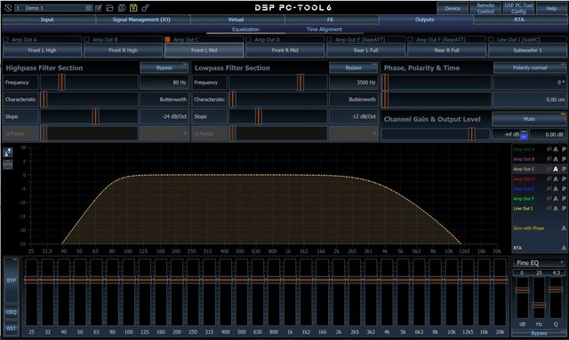
*The midbass channel in PC-Tool. The highpass and lowpass make the "hill" shape, with the 30-band EQ
underneath. This screenshot shows my earlier settings, before the new speakers.*

### Levels

Each output has its own level, so I balanced the speakers against each other by ear, in 1–2dB steps with left and right linked. I used the midbass as the reference,
then brought the tweeters in quieter (they're more efficient and sit right in front of you on the
dash), kept the rears well below the fronts so the sound stays up front, and set the subs to taste.

### The remote

Day to day I use the URC.3 remote: one knob for sub level, one for rear level. It's on the driver's
side of the centre console for now, but the knobs are awkward to reach there, so I'll move it higher
up.

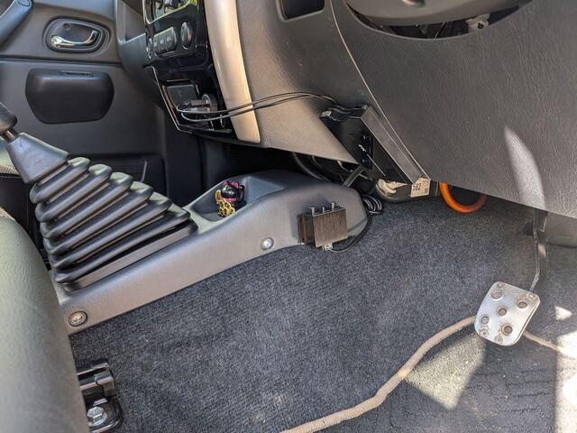
*The URC.3 remote on the side of the centre console. It'll move somewhere easier to reach.*

## How it sounds

Really great. I get excited every time I take the car out. There's lots of bass, enough to shake the
rear-view mirror.

## Looking back

It was more complicated than I expected. I did most of it in one weekend, and the rest spread out
over many more.

If I did it again, I'd use multi-core cable to connect the amp to the factory speaker loom instead
of separate wires. There'd be far fewer runs to route and tidy.

## What it cost

| | Cost |
|---|---|
| Match UP 6DSP MK2 amp | £549.99 |
| Morel Virtus Nano MW4 midbass | £529.00 |
| Audison Voce II AV 1.1 II tweeters | £349.99 |
| 2 × Harman Kardon Feel 700 subs | £509.98 |
| Focal ICU 100 rears | £109.00 |
| Wiring, fuses, remote and tools | ~£400 |
| **Total** | **~£2,450** |

Not counting the head unit.

## Full build notes

The full plan, with wiring tables, a parts list with links and a step-by-step DSP setup guide, is on
GitHub: [badsyntax/jimny-sound](https://github.com/badsyntax/jimny-sound).

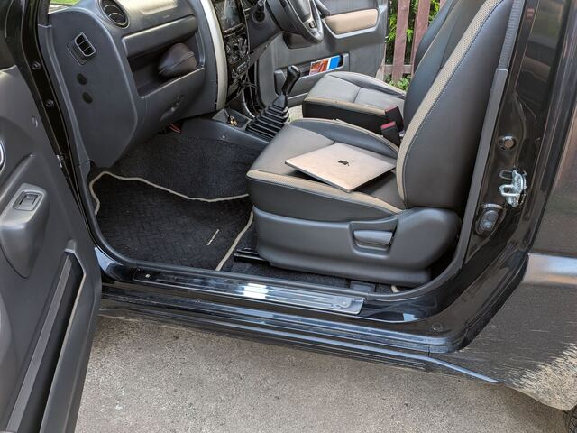
*Finished. The amp is in the glovebox and the subs are under the seats.*
