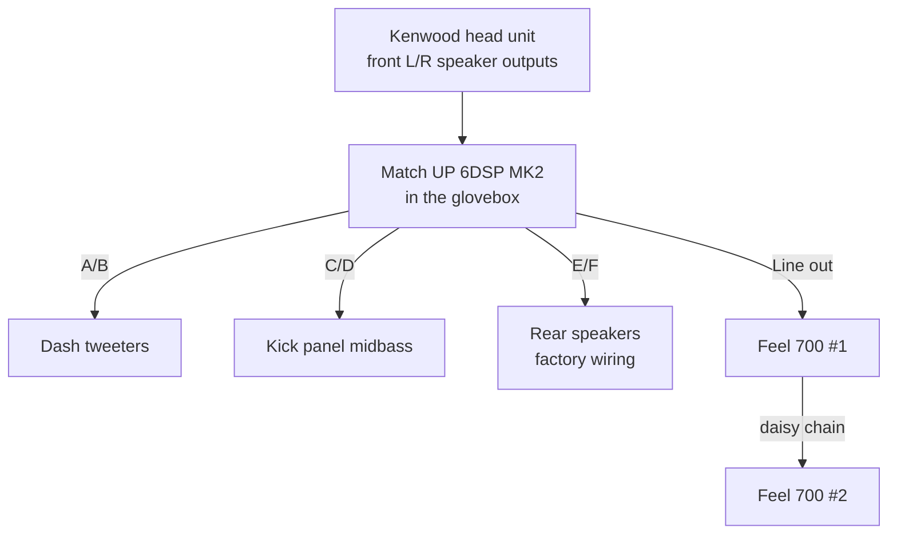
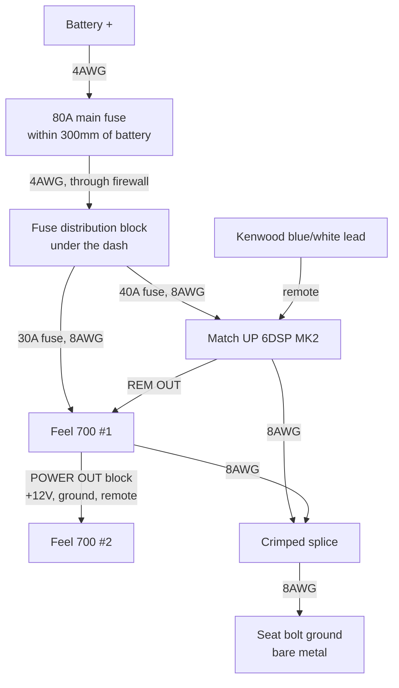
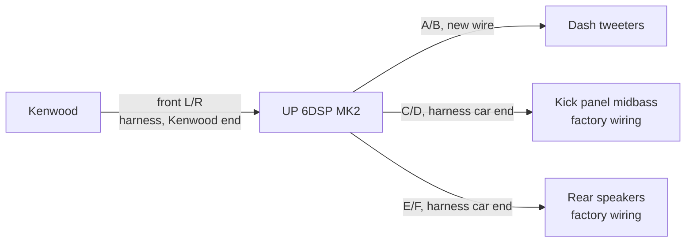

A DSP amp hidden in the glovebox, an active front stage, and two underseat subs.
Here's how it went together and what it cost.

## The system

One DSP amplifier drives every speaker separately, fed from the head unit's speaker outputs, plus
a sub under each front seat.

| Part | What it does |
|---|---|
| **[Kenwood DMX8021DABS](https://kenwood.eu/car/navigation_multimedia/multimedia/DMX8021DABS/)** | Head unit |
| **[Match UP 6DSP MK2](https://www.audiotec-fischer.de/en/match/amplifiers/up-6dsp-mk2)** | 6-channel amp with a 7-channel DSP. 130 × 130 × 46mm — small enough for the glovebox |
| **[Morel Virtus Nano MW4](https://www.morelhifi.com/en/products/car-audio/reference-9/virtus-nano-carbon-18/virtus-nano-carbon-woofer-mw-4-55)** | 4" midbass in the footwell kick panels |
| **[Audison Voce II AV 1.1 II](https://audison.com/product/av-1-1-ii/)** | Tweeters on the dash |
| **[Focal ICU 100](https://www.focal.com/products/icu-100)** | 4" coaxials in the rear |
| **2 × [Harman Kardon Feel 700](https://caraudiodirect.co.uk/products/harmon-kardon-feel-700-active-underseat-car-subwoofer)** | Active underseat subs, 125W RMS each, daisy-chained |
| **[Audiotec Fischer URC.3](https://www.audiotec-fischer.de/en/brax/accessories/urc.3)** | Remote knob for sub and rear level |

Why the Match: **it takes speaker-level inputs**, so it works with any head unit, and its DSP lets
each speaker have its own crossover, level, delay and EQ. Note it has **no RCA inputs** — it's
designed to sit between the head unit and the speakers, so the Kenwood's preouts go unused.

*Day one: bonnet up, doors open, kit on the driveway.*

*The kit, before starting.*

## Power

The biggest job. Worst case the amp draws 35A and the two subs 28A between them, so **63A** in total.

1. **4AWG** from the battery positive to an **80A fuse within 300mm of the battery**
2. Through the firewall to a **4-way fuse distribution block** under the dash
3. Two **8AWG** fused branches — 40A to the amp, 30A to the subs
4. The second sub takes its power from the first sub's **POWER OUT** block, so one feed serves both

**100% OFC copper everywhere** — no CCA. It costs more but it's the one place not to save money.

*The 4AWG run from the battery, before routing and tidying.*

*80A main fuse, close to the battery.*

*The distribution block with the amp and sub fuses.*

*Fitted under the dash, where the fuses stay reachable.*

### Ground

The amp and sub grounds join in one heavy crimped splice and go to a **seat bolt**, sanded to bare
metal on both faces. One ground point for everything is what stops alternator whine — and there
isn't any.

*The ground at the seat bolt, with the amp and sub grounds joined in a single heat-shrunk splice.*

I planned to upgrade the battery-to-body strap to 4AWG too, but on the JB43 the factory strap is
very short and already sized for the starter motor, which pulls far more than 63A. It's staying.

*The factory battery-to-body strap — short enough to leave alone.*

**Remote turn-on:** the Kenwood's blue/white power-control lead goes to the amp's REM IN, and the
amp's REM OUT switches the subs. No splicing into the car.

## Signal: cut the head unit's harness, not the car

The Kenwood's own wiring harness plugs into the car's ISO connector. I cut **only its 8 speaker
wires**, which gives two loose ends:

- The **Kenwood** end → the amp's **inputs** (front left and right only — the DSP makes every
  other channel from those two)
- The **car** end → fed from the amp's **midbass and rear outputs**, reusing the factory speaker wiring

All the joins are crimped butt connectors. Nothing on the car's loom is cut, so a replacement
Kenwood harness puts it all back to standard. (If you'd rather not cut the head unit's harness, an
ISO male-to-female adapter like the Connects2 CT20UV01 can be the sacrificial part instead.)

The midbass and rears **reuse the car's factory speaker wiring** — new wire runs from the amp to
the harness, and the factory loom does the rest. Only the **tweeters get new wire**, since there's
no factory wiring to the dash.

*Head unit out: the speaker wires on the Kenwood's harness get cut behind here.*

*The dash mid-install — it gets worse before it gets better.*

*The amp's plug-in harnesses, ready to be wired to the head unit harness.*

## The amp in the glovebox

The plan was to mount the amp **behind** the glovebox, but the space back there was too awkward to
work in. So it went **inside the glovebox on heavy-duty velcro**, with the cables fed through the
existing gap at the back. Nothing drilled, and the USB port stays reachable for tuning.

*Before tidying: everything comes together in the glovebox.*

*Mid-install: the amp's harnesses come with bare wire ends, so nothing needs terminating at the amp.*

*Behind the glovebox — the cables come through the gap at the back.*

*Mounted. The glovebox still opens and closes freely, but can't be used for storage any more.*

## Two subs under the seats

The Feel 700 is 260 × 195 × 58mm and fits under both front seats. The second sub is chained from
the first: power through the POWER OUT block, signal through an RCA from the first sub's output.

The amp's sub output is **mono, one RCA socket**, but the Feel 700 wants a signal on both left and
right. A cheap **1-female-to-2-male Y-adapter** at the sub end fixes that — without it the sub plays
quieter.

*Wiring in progress — the seats stayed in.*

*Running the sub wiring.*

*The Feel 700's supplied pigtails joined between the seats — crimped butt connectors and heat
shrink.*

*The main power run comes in under the driver's seat, where the amp ground joins the sub ground. These runs will get a proper tidy-up.*

*Sub fitted.*

*Mostly tidy. A few wires still show beside the console — a proper tidy-up is on the to-do list.*

*The finished sub, seen from the back seat with the front seat slid all the way forward.*

## Front speakers

The front stage is **Morel Virtus Nano MW4** midbass and **Audison Voce II AV 1.1 II** tweeters.

- The MW4 is only **17mm deep**, which suits the Jimny's kick panels.
- The AV 1.1 II can cross lower than most tweeters (down to 1.8kHz), which lifts the vocals from the
  footwells up to the dash.

## Tuning

The DSP is set up in **Audiotec Fischer's DSP PC-Tool** — Windows only, so on a Mac it runs in a
virtual machine. I used the free **VMware Fusion**. Set the Kenwood flat first: EQ off, loudness off, crossovers off.

*Tuning from the passenger seat, laptop plugged straight into the amp in the glovebox.*

My starting settings — every filter is −24dB:

| Speaker | Plays |
|---|---|
| Tweeters | Above 2,500 Hz |
| Midbass | 90 – 2,500 Hz |
| Rears | Above 100 Hz, kept quieter than the fronts |
| Subs | 30 – 90 Hz |

Where two speakers hand over, both sides use the same frequency with **Linkwitz** filters, so they
blend without a bump. The subs take everything below 90Hz because the slim midbass has little cone
travel — let each speaker do what it's good at.

After the crossovers: set levels by ear, time-align from measured distances so the sound centres on
the dash rather than the nearest door, and aim for a gentle "house curve" rather than flat — road
noise masks bass, so a flat car sounds thin.

## What it cost

| | Cost |
|---|---|
| Match UP 6DSP MK2 amp | £549.99 |
| Morel Virtus Nano MW4 midbass | £529.00 |
| Audison Voce II AV 1.1 II tweeters | £349.99 |
| 2 × Harman Kardon Feel 700 subs | £509.98 |
| Focal ICU 100 rears | £109.00 |
| Wiring, fuses, remote and tools | ~£400 |
| **Total** | **~£2,450** |

Not counting the head unit.

## Full build notes

The full plan — wiring tables, parts list with links, and a step-by-step DSP setup guide — is on
GitHub: [badsyntax/jimny-sound](https://github.com/badsyntax/jimny-sound).
