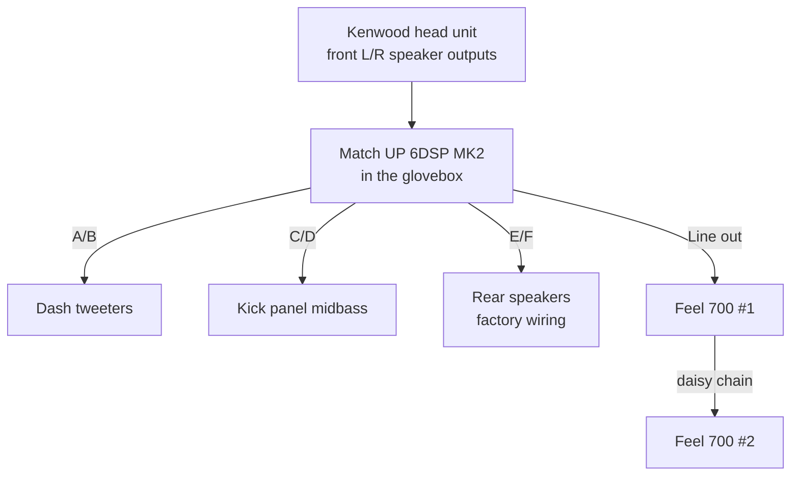
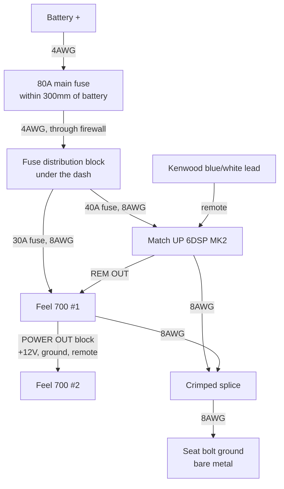
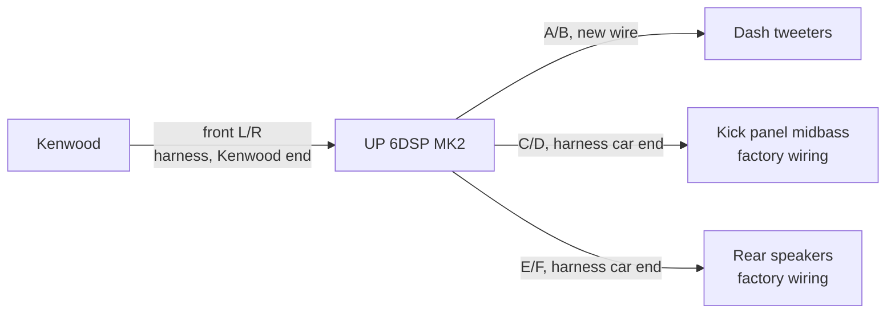

A DSP amp hidden in the glovebox, an active front stage, and two underseat subs in
my 2015 Suzuki Jimny.
Here's how it went together and what it cost.

I love the feeling of a good sound system, but I was never satisfied with what small, Jimny-sized
10cm speakers could do on their own. So I've upgraded bit by bit until I'm properly happy with it —
sticking with the standard speaker size, and adding the tweeters and subs without any drilling or
modification to the car body. This is where it's ended up.

<nav class="toc" markdown="1">
**Contents**

* TOC
{:toc}
</nav>

## The system

One DSP amplifier drives every speaker separately, fed from the head unit's speaker outputs, plus
a sub under each front seat.

| Part | What it does |
|---|---|
| **[Kenwood DMX8021DABS](https://kenwood.eu/car/navigation_multimedia/multimedia/DMX8021DABS/)** | Head unit |
| **[Match UP 6DSP MK2](https://www.audiotec-fischer.de/en/match/amplifiers/up-6dsp-mk2)** | 6-channel amp with a 7-channel DSP. 130 × 130 × 46mm — small enough for the glovebox |
| **[Morel Virtus Nano MW4](https://www.morelhifi.com/en/products/car-audio/reference-9/virtus-nano-carbon-18/virtus-nano-carbon-woofer-mw-4-55)** | 4" midbass in the footwell kick panels |
| **[Audison Voce II AV 1.1 II](https://audison.com/product/av-1-1-ii/)** | Tweeters on the dash |
| **[Focal ICU 100](https://www.focal.com/products/icu-100)** | 4" coaxials in the rear |
| **2 × [Harman Kardon Feel 700](https://caraudiodirect.co.uk/products/harmon-kardon-feel-700-active-underseat-car-subwoofer)** | Active underseat subs, 125W RMS each, daisy-chained |
| **[Audiotec Fischer URC.3](https://www.audiotec-fischer.de/en/brax/accessories/urc.3)** | Remote knob for sub and rear level |

Why the Match: **it takes speaker-level inputs**, so it works with any head unit. Its DSP (digital
sound processor) lets each speaker have its own crossover, level, delay and EQ. Note it has **no
RCA inputs** — it's designed to sit between the head unit and the speakers, so the Kenwood's RCA
outputs go unused.

**"Active front stage"** means each front tweeter and midbass (the small driver that handles
vocals and punch) gets its own amp channel, and the DSP decides which frequencies each one plays —
instead of a fixed passive crossover doing it. That lets me tune the whole system to get the best
out of these drivers in this car.

*Day one: bonnet up, doors open, kit on the driveway.*

*The kit, before starting.*

## Power

The biggest job. Worst case the amp draws 35A and the two subs 28A between them, so **63A** in total.

1. **4AWG** (about 21mm² — thick cable) from the battery positive to an **80A fuse within 300mm
   of the battery**
2. Through the firewall to a **4-way fuse distribution block** under the dash. I made a hole in
   the existing rubber grommet on the driver side and fed the cable through it.
3. Two **8AWG** (about 8mm²) fused branches — 40A to the amp, 30A to the subs
4. The second sub takes its power from the first sub's **POWER OUT** block, so one feed serves both

**100% OFC (oxygen-free copper) everywhere** — no cheaper CCA (copper-clad aluminium). It costs
more but it's the one place not to save money.

*The 4AWG run from the battery, before routing and tidying.*

*80A main fuse, close to the battery.*

*The distribution block with the amp and sub fuses.*

*Fitted under the dash, where the fuses stay reachable.*

### Ground

The amp and sub grounds join in one heavy crimped splice and go to a **seat bolt**, sanded to bare
metal on both faces. One ground point for everything is what stops alternator whine — and there
isn't any.

*The ground at the seat bolt, with the amp and sub grounds joined in a single heat-shrunk splice.*

I planned to upgrade the battery-to-body strap to 4AWG too, but on the JB43 the factory strap is
very short and already sized for the starter motor, which pulls far more than 63A. It's staying.

*The factory battery-to-body strap — short enough to leave alone.*

**Remote turn-on** (so the amp and subs switch on and off with the head unit): the Kenwood's
blue/white power-control lead goes to the amp's REM IN, and the amp's REM OUT switches the subs.
No splicing into the car.

## Signal

The Kenwood's own wiring harness plugs into the car's ISO connector. I cut **only its 8 speaker
wires**, which gives two loose ends:

- The **Kenwood** end → the amp's **inputs** (front left and right only — the DSP makes every
  other channel from those two)
- The **car** end → fed from the amp's **midbass and rear outputs**, so the factory speaker wiring
  still runs to those speakers

Only the **tweeters get new wire**, since there's no factory wiring to the dash.

All the joins are crimped butt connectors. Nothing on the car's loom is cut, so a replacement
Kenwood harness puts it all back to standard.

*Head unit out: the speaker wires on the Kenwood's harness get cut behind here.*

*The dash mid-install — it gets worse before it gets better.*

*The amp's plug-in harnesses, ready to be wired to the head unit harness.*

## The amp in the glovebox

The plan was to mount the amp **behind** the glovebox, but the space back there was too awkward to
work in. So it went **inside the glovebox on heavy-duty velcro**, with the cables fed through the
existing gap at the back. Nothing drilled, and the USB port stays reachable for tuning.

*Before tidying: everything comes together in the glovebox.*

*Mid-install: the amp's harnesses come with bare wire ends, so nothing needs terminating at the amp.*

*Behind the glovebox — the cables come through the gap at the back.*

*Mounted. The glovebox still opens and closes freely, but can't be used for storage any more.*

## Two subs under the seats

The Feel 700 is 260 × 195 × 58mm and fits under both front seats. The second sub is chained from
the first: power through the POWER OUT block, signal through an RCA from the first sub's output.

The supplied pigtails don't reach between the seats on their own, so I extended them with
**27A cable** (about 3mm²) — red for +12V, black for ground — and ~1mm² hook-up wire for
the blue remote lead, all joined with crimped butt connectors.

The amp's sub output is **mono, one RCA socket**, but the Feel 700 wants a signal on both left and
right. A cheap **1-female-to-2-male Y-adapter** at the sub end fixes that — without it the sub plays
quieter.

*Wiring in progress — the seats stayed in.*

*Running the sub wiring.*

*The Feel 700's supplied pigtails joined between the seats — crimped butt connectors and heat
shrink.*

*The main power run comes in under the driver's seat, where the amp ground joins the sub ground. These runs will get a proper tidy-up.*

*One sub in place under the seat.*

*Mostly tidy — a few wires still show beside the console.*

*The finished sub, seen from the back seat with the front seat slid all the way forward. Rear
passengers can still get in and out without any trouble.*

## Speakers

I had a shop fit the **rear Focal ICU 100s**, since getting to the rear speakers means taking the
rear seats out. If you'd rather do it yourself, there's a good step-by-step guide:
[Installation of the rear speakers on the Suzuki Jimny](https://web.archive.org/web/20180319083057/http://www.danbp.org/p/node/104).

### Front speakers

The front speakers sit in the footwell side panels (the kick panels). Getting to them is simple:

1. Undo the screws on the **silver sill plate** along the bottom of the door opening and lift it off.
2. The **plastic trim** underneath pops off.
3. The **kick panel** then pops off, exposing the speaker.

The front stage is **Morel Virtus Nano MW4** midbass and **Audison Voce II AV 1.1 II** tweeters.
The MW4 is from Morel's high-end Reference range, with a carbon-fibre cone
and neodymium magnet, and the AV 1.1 II is Hi-Res Audio certified, with a soft dome that plays up to
40kHz. The result is cleaner, more detailed vocals and instruments, especially at volume.

- The MW4 is only **17mm deep**, which suits the Jimny's kick panels.
- The AV 1.1 II can cross lower than most tweeters (down to 1.8kHz), which lifts the vocals from the
  footwells up to the dash.

*The tweeter sits on the dash at the base of the A-pillar. Note: the photo shows the previous
Audison AP1 tweeter.*

Mounting the tweeters means taking off the **A-pillar trims**, which is easy:

1. Peel back the door rubber along the pillar — it makes the trim much easier to get at.
2. Starting at the top, slide a plastic trim tool (or your fingers) under the edge and pull the trim
   towards the inside of the car. The bottom end tucks behind the lower trim and lifts out.
3. To refit, check the metal clips — they tend to stay on the trim when it comes off. Move each one
   back into its hole in the pillar first, line the trim up and push it firmly home. If you refit
   with the clips still on the trim, it sits slightly proud and rattles.

## Tuning

The DSP is set up in **Audiotec Fischer's DSP PC-Tool** — Windows only, so on a Mac it runs in a
virtual machine. I used the free **VMware Fusion**. I set the Kenwood flat first: EQ off, loudness
off, crossovers off.

*Tuning from the passenger seat, laptop plugged straight into the amp in the glovebox.*

**Input gain first.** This matches the amp to the head unit's signal. With every output muted (so nothing actually plays), I put the Kenwood at about 90%
volume and played Audiotec Fischer's **IGS test track**. In PC-Tool's Advanced Gain Setup I raised
the input slider until the clip indicator turned red, then backed it off one step.

*PC-Tool's Advanced Gain Setup, with all outputs muted while the input gain is set.*

**Next, the crossovers** — the filters that decide which speaker plays which frequencies. My starting settings, every filter at −24dB:

| Speaker | Plays |
|---|---|
| Tweeters | Above 2,500 Hz |
| Midbass | 90 – 2,500 Hz |
| Rears | Above 100 Hz, kept quieter than the fronts |
| Subs | 30 – 90 Hz |

Where two speakers hand over, both sides use the same frequency with **Linkwitz** filters — a filter
type designed so the two speakers blend without a bump. The subs take everything below 90Hz because
the slim midbass has little cone travel.

*The midbass channel in PC-Tool: highpass and lowpass make the "hill" shape, with the 30-band EQ
underneath. This screenshot shows my earlier settings, before the new speakers.*

**Then the channel levels.** Each output has its own level, so I balanced the speakers against each
other by ear, in 1–2dB steps with left and right linked. I used the midbass as the reference, then
brought the tweeters in quieter (they're more efficient and sit right in front of you on the dash),
kept the rears well below the fronts so the sound stays up front, and set the subs to taste. The
URC.3 knob will handle sub level day to day.

## How it sounds

Really great — I get excited every time I take the car out. There's lots of bass, enough to shake
the rear-view mirror. I'm still fine-tuning it, so it'll only get better.

## Looking back

It was more complicated than I expected. I did the majority in one weekend, and the rest over two
more.

If I did it again, I'd use **multi-core cable** to connect the amp to the factory speaker loom,
instead of separate wires — far fewer runs to route and tidy.

## What it cost

| | Cost |
|---|---|
| Match UP 6DSP MK2 amp | £549.99 |
| Morel Virtus Nano MW4 midbass | £529.00 |
| Audison Voce II AV 1.1 II tweeters | £349.99 |
| 2 × Harman Kardon Feel 700 subs | £509.98 |
| Focal ICU 100 rears | £109.00 |
| Wiring, fuses, remote and tools | ~£400 |
| **Total** | **~£2,450** |

Not counting the head unit.

## Full build notes

The full plan — wiring tables, parts list with links, and a step-by-step DSP setup guide — is on
GitHub: [badsyntax/jimny-sound](https://github.com/badsyntax/jimny-sound).
